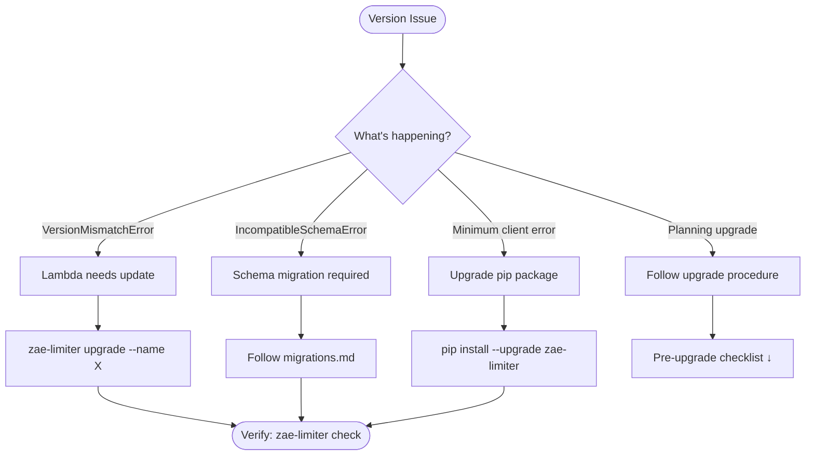
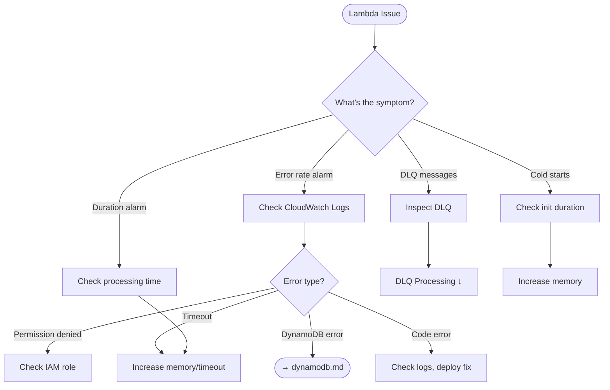
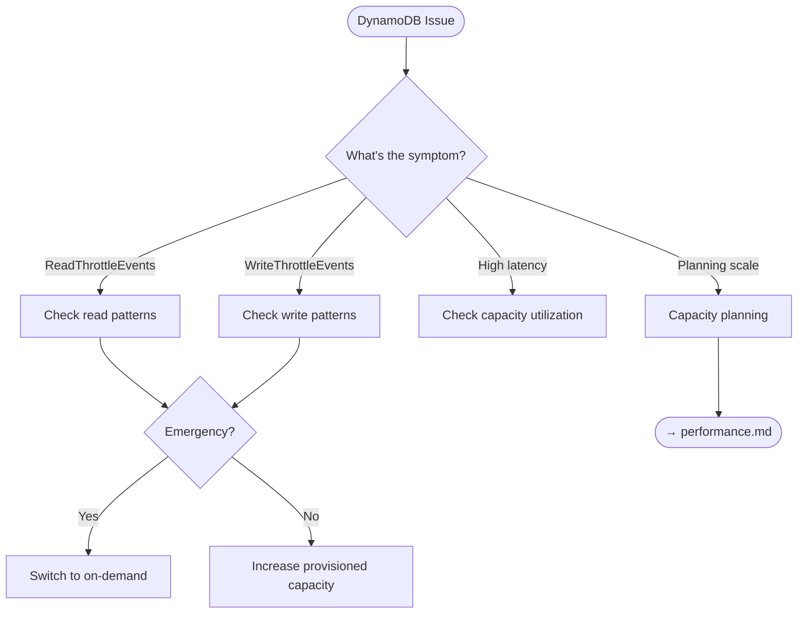

# Plan: Issue #37 - Create Operational Runbooks

**Issue**: [#37 - docs: create operational runbooks](https://github.com/zeroae/zae-limiter/issues/37)
**Target**: `docs/operations/` directory (consolidated with troubleshooting)
**Estimated Effort**: 4-5 hours
**Dependencies**: #45 (benchmarks), #46 (E2E tests) - tracked in #68

---

## Overview

Create a consolidated operations guide that combines:
- **Troubleshooting** (reactive): "X is broken, diagnose and fix it"
- **Runbooks** (proactive): "Perform planned procedure X"

This replaces `docs/troubleshooting.md` with a component-centric `docs/operations/` directory.

## Key Decisions

1. **Consolidate by component** - Operators work on one component at a time, not one doc type
2. **Interactive index** - Markmap for collapsible navigation tree
3. **Component decision trees** - Mermaid flowcharts within each file
4. **Migration path** - Reorganize existing troubleshooting.md content, then delete it

---

## Target Structure

```
docs/operations/
├── index.md              # Markmap navigation, quick reference table
├── version.md            # Version management & upgrades
├── lambda.md             # Lambda aggregator operations
├── dynamodb.md           # DynamoDB capacity & throttling
├── rate-limits.md        # Rate limit configuration & enforcement
├── streams.md            # Stream processing & iterator age
└── recovery.md           # Backup, restore, rollback procedures
```

---

## Phase 1: Index Page (`index.md`)

### 1.1 Markmap Navigation Tree

```markmap
# Operations Guide

## Alerts & Issues
### Lambda Aggregator
- Error rate alarm → [lambda.md]
- Duration/timeout → [lambda.md]
- DLQ messages → [lambda.md]
### DynamoDB
- Read/write throttling → [dynamodb.md]
- Capacity alarms → [dynamodb.md]
### Streams
- Iterator age alarm → [streams.md]
- Processing lag → [streams.md]
### Version
- VersionMismatchError → [version.md]
- IncompatibleSchemaError → [version.md]
### Rate Limits
- Unexpected RateLimitExceeded → [rate-limits.md]
- Limits not enforcing → [rate-limits.md]

## Planned Operations
### Upgrades
- Version upgrade procedure → [version.md]
- Lambda code update → [lambda.md]
### Scaling
- Adjust rate limits → [rate-limits.md]
- DynamoDB capacity → [dynamodb.md]
### Recovery
- Emergency rollback → [recovery.md]
- Backup/restore → [recovery.md]
- PITR recovery → [recovery.md]
```

### 1.2 Quick Reference Table

| Symptom | Go To |
|---------|-------|
| `RateLimitExceeded` unexpected | [rate-limits.md] |
| `ProvisionedThroughputExceededException` | [dynamodb.md] |
| DLQ messages accumulating | [lambda.md] |
| `VersionMismatchError` | [version.md] |
| High `IteratorAge` | [streams.md] |
| Need to rollback | [recovery.md] |

---

## Phase 2: Version Management (`version.md`)

**Source**: `troubleshooting.md` §4 + NEW upgrade runbook

### Content Structure

```markdown
# Version Management

## Decision Tree
[Mermaid flowchart]

## Troubleshooting
### VersionMismatchError
### IncompatibleSchemaError
### Minimum Client Version Error

## Procedures
### Pre-upgrade Checklist
### Upgrade Execution
### Post-upgrade Verification
### Rollback (link to recovery.md)
```

### Mermaid Decision Tree



### NEW: Upgrade Procedure Runbook

1. **Pre-upgrade checklist**
   - [ ] Check current version: `zae-limiter version --name X`
   - [ ] Check compatibility: `zae-limiter check --name X`
   - [ ] Review release notes
   - [ ] Verify PITR enabled for rollback
   - [ ] Schedule maintenance window
   - [ ] Notify stakeholders

2. **Execution steps**
   ```bash
   # Upgrade client
   pip install --upgrade zae-limiter

   # Update infrastructure
   zae-limiter upgrade --name X --region us-east-1

   # Verify
   zae-limiter check --name X
   ```

3. **Post-upgrade verification**
   - Run smoke tests
   - Monitor error rates for 15 minutes
   - Verify usage snapshots updating

---

## Phase 3: Lambda Aggregator (`lambda.md`)

**Source**: `troubleshooting.md` §3

### Content Structure

```markdown
# Lambda Aggregator Operations

## Decision Tree
[Mermaid flowchart]

## Health Indicators
- Link to monitoring.md for metrics/dashboards

## Troubleshooting
### Error Rate Issues
### Duration/Timeout Issues
### Permission Errors
### Cold Start Issues

## Procedures
### DLQ Processing Runbook
### Lambda Redeployment
### Memory/Timeout Adjustment
```

### Mermaid Decision Tree



---

## Phase 4: DynamoDB & Capacity (`dynamodb.md`)

**Source**: `troubleshooting.md` §2 + NEW scaling runbook

### Content Structure

```markdown
# DynamoDB Operations

## Decision Tree
[Mermaid flowchart]

## Troubleshooting
### Read Throttling
### Write Throttling
### Hot Partitions

## Procedures
### Emergency Capacity Increase
### Planned Capacity Scaling
### Switch to On-Demand
```

### Mermaid Decision Tree



---

## Phase 5: Rate Limit Configuration (`rate-limits.md`)

**Source**: `troubleshooting.md` §1 + NEW runtime adjustment runbook

### Content Structure

```markdown
# Rate Limit Operations

## Decision Tree
[Mermaid flowchart]

## Troubleshooting
### Unexpected RateLimitExceeded
### Limits Not Enforcing
### Cascade Not Working

## Procedures
### Adjust Limits at Runtime
### Verify Limit Configuration
### Debug Bucket State
```

### NEW: Runtime Limit Adjustment

```python
# Programmatic limit adjustment
from zae_limiter import RateLimiter, Limit

limiter = RateLimiter(name="my-app", region="us-east-1")

# Update stored limits for an entity
await limiter.update_entity(
    entity_id="api-key-123",
    limits=[
        Limit.per_minute("rpm", 1000),  # Increase from 500
        Limit.per_minute("tpm", 100000),
    ],
)
```

---

## Phase 6: Stream Processing (`streams.md`)

**Source**: `troubleshooting.md` §5

### Content Structure

```markdown
# Stream Processing Operations

## Decision Tree
[Mermaid flowchart]

## Troubleshooting
### High Iterator Age
### Lambda Throttling

## Procedures
### Increase Lambda Concurrency
### Adjust Batch Size
### Shard Scaling
```

---

## Phase 7: Recovery & Rollback (`recovery.md`)

**Source**: `troubleshooting.md` §6 + NEW emergency rollback decision tree

### Content Structure

```markdown
# Recovery & Rollback

## Decision Tree
[Markmap - complex hierarchy]

## Procedures
### Emergency Rollback Decision Matrix
### DynamoDB Backup/Restore
### PITR Recovery
### Migration Rollback
### Stack Redeployment
### Data Reconciliation
```

### Markmap Decision Tree

```markmap
# Recovery Decision Tree

## What went wrong?
### Bad deployment
- CloudFormation failed → Stack rollback
- Lambda broken → Redeploy Lambda
- Config wrong → Update stack
### Bad migration
- Reversible → Run rollback function
- Non-reversible → Restore from backup
### Data corruption
- Recent → PITR recovery
- Old → On-demand backup restore
### Complete failure
- Table exists → Stack redeployment
- Table gone → Restore + redeploy
```

### NEW: Emergency Rollback Decision Matrix

| Situation | Action | Time to Recovery |
|-----------|--------|------------------|
| Lambda errors after upgrade | `zae-limiter upgrade --lambda-only` with previous version | ~2 min |
| Schema migration failed | Restore from pre-migration backup | ~10-30 min |
| Stack update failed | CloudFormation auto-rollback | ~5 min |
| Data corruption (recent) | PITR restore | ~15-30 min |
| Complete stack failure | Delete + redeploy (if deletion protection on) | ~10 min |

---

## Phase 8: Cleanup

### 8.1 Delete `docs/troubleshooting.md`

All content migrated to `docs/operations/` files.

### 8.2 Update Cross-references

| File | Update |
|------|--------|
| `docs/monitoring.md` | Change "Troubleshooting Guide" link to "Operations Guide" |
| `docs/cli.md` | Link to relevant operations sections |
| `docs/migrations.md` | Link to `operations/version.md` |
| `docs/index.md` | Update navigation |
| `mkdocs.yml` | Add operations/ nav section |

### 8.3 Update `mkdocs.yml` Navigation

```yaml
nav:
  - Home: index.md
  - Getting Started: getting-started.md
  - User Guide:
      - guide/basic-usage.md
      - guide/hierarchical.md
      - guide/llm-integration.md
      - guide/failure-modes.md
  - Operations:
      - operations/index.md
      - operations/version.md
      - operations/lambda.md
      - operations/dynamodb.md
      - operations/rate-limits.md
      - operations/streams.md
      - operations/recovery.md
  - Infrastructure:
      - infra/deployment.md
      - infra/cloudformation.md
      - infra/localstack.md
  - Reference:
      - cli.md
      - monitoring.md
      - performance.md
      - migrations.md
      - api/index.md
```

---

## Acceptance Criteria

- [ ] `docs/operations/index.md` with Markmap navigation
- [ ] 6 component files with Mermaid decision trees
- [ ] All content from `troubleshooting.md` migrated
- [ ] `troubleshooting.md` deleted
- [ ] Cross-references updated
- [ ] `mkdocs.yml` navigation updated
- [ ] Each procedure has verification steps
- [ ] Warning callouts for destructive operations

---

## Implementation Order

1. Create `docs/operations/` directory
2. Create `index.md` with Markmap
3. Create component files (can be done in parallel):
   - `version.md`
   - `lambda.md`
   - `dynamodb.md`
   - `rate-limits.md`
   - `streams.md`
   - `recovery.md`
4. Update cross-references
5. Update `mkdocs.yml`
6. Delete `troubleshooting.md`
7. Test all links and diagrams render correctly

---

## Notes

- **MkDocs plugins required**: `mkdocs-markmap` for interactive mind maps
- **Mermaid**: Built into MkDocs Material, no extra plugin needed
- **Dependencies**: Some metrics thresholds reference #45 (benchmarks) data
- **Limitations to document**: Lambda versioning not implemented, migrations are forward-only
