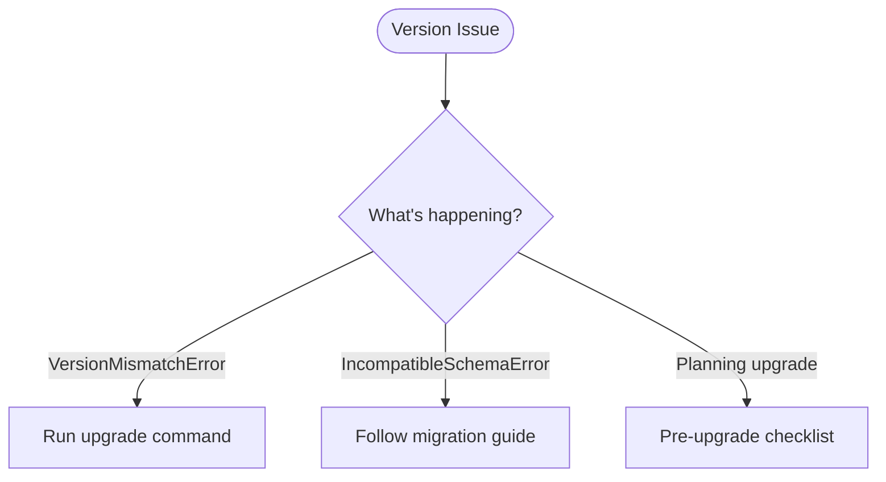
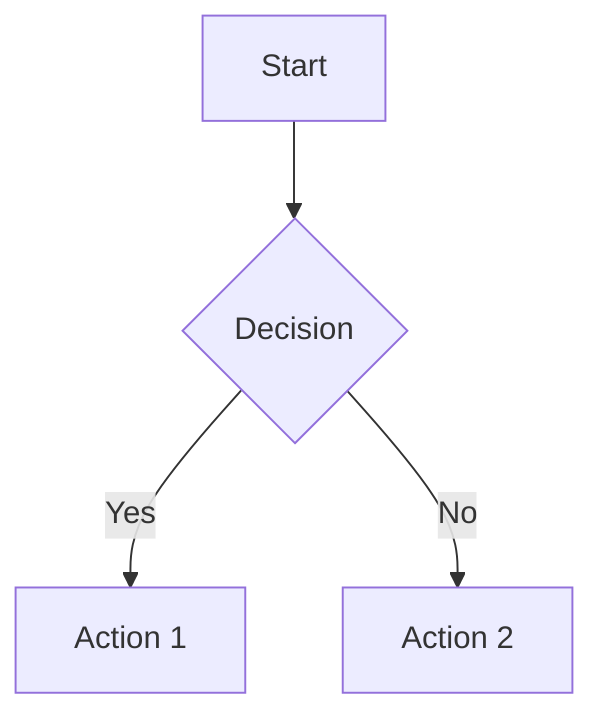

# Plan: Issue #37 - Create Operational Runbooks

**Issue**: [#37 - docs: create operational runbooks](https://github.com/zeroae/zae-limiter/issues/37)
**Target**: `docs/operations/` directory (consolidated with troubleshooting)
**Estimated Effort**: 4-5 hours
**Dependencies**: #45 (benchmarks), #46 (E2E tests) - tracked in #68

## Overview

Create a consolidated operations guide that combines troubleshooting (reactive) and runbooks (proactive) into a component-centric structure. This replaces the current `docs/troubleshooting.md` with a more comprehensive `docs/operations/` directory.

## Key Decisions

1. **Consolidate troubleshooting + runbooks** - Operators shouldn't jump between files for the same component
2. **Split by component** - Each component gets its own file for manageable size
3. **Interactive navigation** - Use Markmap for collapsible/expandable decision trees
4. **Mermaid for flowcharts** - Use within component files for specific decision flows

---

## File Structure

```
docs/operations/
├── index.md              # Markmap interactive overview, quick reference
├── version.md            # Version management & upgrades
├── lambda.md             # Lambda aggregator operations
├── dynamodb.md           # DynamoDB capacity & throttling
├── rate-limits.md        # Rate limit configuration
├── streams.md            # Stream processing & lag
└── recovery.md           # Backup, restore, rollback
```

**Migration**: Content from `docs/troubleshooting.md` will be reorganized into these files, then the original file deleted.

---

## Implementation Plan

### Phase 1: Setup and Index Page

**Task 1.1**: Create `docs/operations/` directory structure

**Task 1.2**: Create `docs/operations/index.md` with Markmap decision tree

```markmap
# Operations Guide

## Alerts & Issues
### Lambda Aggregator
- Error rate alarm → [lambda.md]
- Duration/timeout → [lambda.md]
- DLQ messages → [lambda.md]
### DynamoDB
- Read/write throttling → [dynamodb.md]
- Capacity planning → [dynamodb.md]
### Streams
- Iterator age alarm → [streams.md]
- Processing lag → [streams.md]
### Version
- Compatibility errors → [version.md]
- Migration required → [version.md]

## Planned Operations
### Upgrades
- Version upgrade → [version.md]
- Lambda update → [lambda.md]
### Scaling
- Adjust rate limits → [rate-limits.md]
- DynamoDB capacity → [dynamodb.md]
### Recovery
- Emergency rollback → [recovery.md]
- Backup/restore → [recovery.md]
- PITR recovery → [recovery.md]
```

**Task 1.3**: Add quick reference table linking to each section

---

### Phase 2: Version Management (version.md)

**Source**: `troubleshooting.md` §4 (Version Compatibility Errors) + NEW runbook content

**Task 2.1**: Mermaid decision tree for version issues


**Task 2.2**: Troubleshooting section (from existing troubleshooting.md)
- VersionMismatchError resolution
- IncompatibleSchemaError resolution
- Minimum client version errors

**Task 2.3**: Upgrade procedure runbook (NEW)
- Pre-upgrade checklist
- Step-by-step upgrade execution
- Post-upgrade verification
- Rollback if failed (link to recovery.md)

---

### Phase 3: Lambda Aggregator (lambda.md)

**Source**: `troubleshooting.md` §3 (Lambda Aggregator Malfunctions)

**Task 3.1**: Mermaid decision tree for Lambda issues

**Task 3.2**: Health indicators and monitoring (link to monitoring.md)

**Task 3.3**: Troubleshooting section
- Error rate issues
- Timeout/duration issues
- Permission errors
- DynamoDB throttling (link to dynamodb.md)

**Task 3.4**: DLQ processing runbook
- Inspect DLQ messages
- Reprocessing strategy
- Purging after resolution

**Task 3.5**: Redeployment runbook
- `zae-limiter upgrade --lambda-only`
- Full redeployment scenarios

---

### Phase 4: DynamoDB & Capacity (dynamodb.md)

**Source**: `troubleshooting.md` §2 (DynamoDB Throttling)

**Task 4.1**: Mermaid decision tree for DynamoDB issues

**Task 4.2**: Troubleshooting section
- Read throttling resolution
- Write throttling resolution
- Capacity analysis

**Task 4.3**: Scaling procedures runbook (NEW)
- Capacity planning (link to performance.md)
- On-demand vs provisioned considerations
- Monitoring after scaling changes

---

### Phase 5: Rate Limit Configuration (rate-limits.md)

**Source**: `troubleshooting.md` §1 (Rate Limit Enforcement Issues) + NEW runbook content

**Task 5.1**: Mermaid decision tree for rate limit issues

**Task 5.2**: Troubleshooting section
- Unexpected RateLimitExceeded
- Limits not enforcing
- Cascade behavior issues

**Task 5.3**: Runtime limit adjustment runbook (NEW)
- Programmatic updates via RateLimiter API
- Stored vs default limit precedence
- Verification after changes

---

### Phase 6: Stream Processing (streams.md)

**Source**: `troubleshooting.md` §5 (DynamoDB Stream Processing Issues)

**Task 6.1**: Mermaid decision tree for stream issues

**Task 6.2**: Troubleshooting section
- Iterator age alarm response
- Processing lag diagnosis

**Task 6.3**: Concurrency tuning runbook
- Batch size configuration
- Concurrent execution tuning

---

### Phase 7: Recovery & Rollback (recovery.md)

**Source**: `troubleshooting.md` §6 (Recovery Procedures) + NEW runbook content

**Task 7.1**: Markmap decision tree for recovery scenarios
```markmap
# Recovery Decision Tree

## What happened?
### Bad deployment
- CloudFormation rollback
- Lambda rollback
### Bad migration
- Migration rollback
- Data reconciliation
### Data loss/corruption
- PITR recovery
- Manual backup restore
### Complete failure
- Stack redeployment
- Data reconciliation
```

**Task 7.2**: Emergency rollback decision matrix (NEW)
- When to rollback vs fix forward
- Stakeholder notification checklist

**Task 7.3**: Backup & restore procedures
- PITR restoration steps
- Manual backup options

**Task 7.4**: Migration rollback procedures
- Current limitation: forward-only migrations
- Manual cleanup procedures
- When to engage support

**Task 7.5**: Data reconciliation procedures

---

### Phase 8: Cleanup and Cross-references

**Task 8.1**: Delete `docs/troubleshooting.md` (content migrated)

**Task 8.2**: Update cross-references in other docs
- `docs/monitoring.md` → link to `docs/operations/`
- `docs/cli.md` → link to relevant operations sections
- `docs/migrations.md` → link to `docs/operations/version.md`

**Task 8.3**: Update CLAUDE.md with documentation guidelines

---

## Acceptance Criteria

- [ ] All six requested runbook sections documented
- [ ] Interactive Markmap navigation in index.md
- [ ] Mermaid decision trees in each component file
- [ ] Content from troubleshooting.md fully migrated
- [ ] troubleshooting.md deleted
- [ ] Cross-references updated throughout docs/
- [ ] Each procedure has verification steps
- [ ] Warning callouts for destructive operations

---

## Diagram Guidelines

### Markmap (Interactive Mind Maps)
Use for:
- Top-level navigation (index.md)
- Complex hierarchical decision trees
- Overview/orientation diagrams

```markmap
# Topic
## Branch 1
- Leaf 1
- Leaf 2
## Branch 2
- Leaf 3
```

### Mermaid Flowcharts
Use for:
- Linear decision flows within a component
- Step-by-step procedures
- Simple yes/no decision trees



---

## Notes

- **MkDocs Material + mkdocs-markmap plugin** required for interactive diagrams
- **Dependency on #45/#46**: Some metrics thresholds depend on benchmark data
- **Future enhancements**: Lambda versioning, automated rollback not yet implemented
