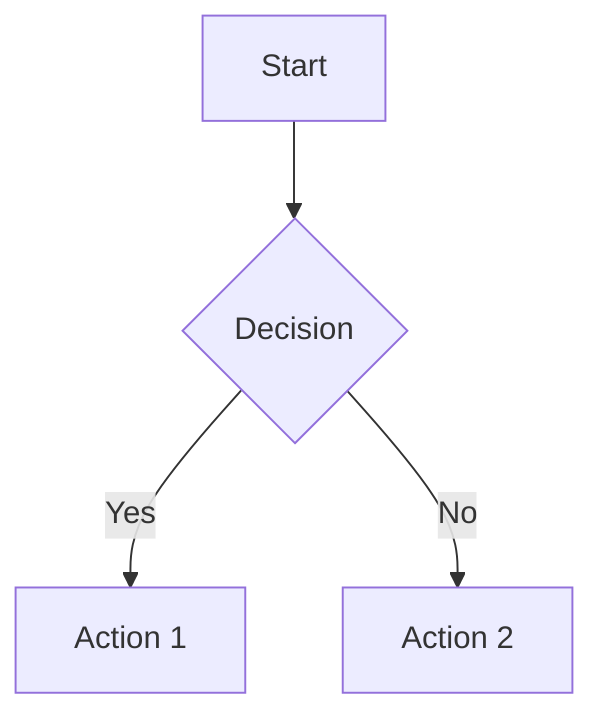

# CLAUDE.md - Instructions for AI Assistants

This file provides context for AI assistants working on the zae-limiter codebase.

## Project Overview

zae-limiter is a rate limiting library backed by DynamoDB using the token bucket algorithm. It excels at scenarios where:
- Multiple limits are tracked per call (rpm, tpm)
- Consumption is unknown upfront (adjust after the operation completes)
- Hierarchical limits exist (API key → project, tenant → user)
- Cost matters (~$1/1M requests)

## Build & Development

### Using uv (preferred)

```bash
# Setup (one-time)
git submodule update --init --recursive
uv sync --all-extras

# Deploy infrastructure (CloudFormation)
# Uses ZAEL- prefix: "limiter" becomes "ZAEL-limiter" resources
uv run zae-limiter deploy --name limiter --region us-east-1

# Run tests
uv run pytest

# Type check
uv run mypy src/zae_limiter

# Lint
uv run ruff check --fix .
uv run ruff format .
```

### Using conda

```bash
# Setup (one-time)
git submodule update --init --recursive
conda create -n zae-limiter python=3.12
conda activate zae-limiter
pip install -e ".[dev]"
pytest
```

## Development Workflow

### Pull Request Process

All changes to the codebase must go through pull requests. Direct commits to the `main` branch are not allowed.

**Workflow:**

1. Create a feature branch from main:
   ```bash
   git checkout main
   git pull origin main
   git checkout -b feat/your-feature-name
   ```

2. Make your changes following the project conventions
   - Follow commit message conventions (see Commit Messages section below)
   - Add tests for new functionality
   - Update documentation as needed

3. Push your branch and create a pull request:
   ```bash
   git push origin feat/your-feature-name
   ```

4. Wait for CI checks to pass:
   - **Lint**: Code style and formatting (ruff)
   - **Type Check**: Static type checking (mypy)
   - **Tests**: Unit tests with coverage (pytest on Python 3.11 & 3.12)

5. Address review feedback if needed

6. Once approved and CI passes, the PR will be merged to main

**Important:** Never force-push to main or bypass CI checks.

### Release Planning

See `.claude/rules/zeroae/github.md` for issue types, labels, milestone queries, and workflow.

**Milestone assignment:** Every issue MUST be assigned to a milestone. Before assigning, query milestone descriptions to find the best thematic fit:

```bash
gh api repos/zeroae/zae-limiter/milestones --jq '.[] | "\(.title): \(.description)"'
```

Choose the milestone whose description best matches the issue - don't just pick the next version number. If no existing milestone fits the issue's theme, suggest a new milestone topic and ask the user before creating it.

**Project scopes (for commits and area labels):**
- `limiter` / `area/limiter` - Core rate limiting logic
- `cli` / `area/cli` - Command line interface
- `infra` / `area/infra` - CloudFormation, IAM, infrastructure
- `aggregator` / `area/aggregator` - Lambda aggregator function
- `ci` / `area/ci` - CI/CD workflows

## Infrastructure Deployment

### CloudFormation Stack

The library uses CloudFormation for infrastructure deployment. The `deploy` command automatically:
1. Creates CloudFormation stack with DynamoDB table, streams, and Lambda function
2. Packages and deploys the Lambda aggregator code from the installed package

```bash
# Deploy stack with CLI (includes Lambda deployment)
# Name is prefixed with ZAEL-: "my-app" becomes "ZAEL-my-app" resources
zae-limiter deploy --name my-app --region us-east-1

# Deploy to LocalStack (for local development)
zae-limiter deploy --name my-app --endpoint-url http://localhost:4566 --region us-east-1

# Deploy without aggregator Lambda
zae-limiter deploy --name my-app --no-aggregator

# Deploy with custom log retention (90 days)
zae-limiter deploy --name my-app --log-retention-days 90

# Deploy with custom Lambda settings
zae-limiter deploy --name my-app --lambda-timeout 120 --lambda-memory 512

# Deploy with alarms and SNS notifications
zae-limiter deploy --name my-app --alarm-sns-topic arn:aws:sns:us-east-1:123456789012:my-topic

# Deploy with custom duration threshold (90% of timeout)
zae-limiter deploy --name my-app --lambda-duration-threshold-pct 90

# Disable CloudWatch alarms
zae-limiter deploy --name my-app --no-alarms

# Deploy with permission boundary (for restricted IAM environments)
zae-limiter deploy --name my-app --permission-boundary MyBoundaryPolicy

# Deploy with custom role name format (for organizational naming policies)
zae-limiter deploy --name my-app --role-name-format "app-{}"

# Enterprise deployment with both options
zae-limiter deploy --name my-app \
  --permission-boundary arn:aws:iam::aws:policy/PowerUserAccess \
  --role-name-format "pb-{}-PowerUser"

# Export template for custom deployment
zae-limiter cfn-template > template.yaml

# Export Lambda package for custom deployment
zae-limiter lambda-export --output lambda.zip

# Show Lambda package info without building
zae-limiter lambda-export --info

# Check stack status (use the full prefixed name or short name)
zae-limiter status --name ZAEL-my-app --region us-east-1

# Check stack status (LocalStack)
zae-limiter status --name my-app --endpoint-url http://localhost:4566 --region us-east-1

# Delete stack
zae-limiter delete --name my-app --yes
```

**Lambda Deployment Details:**
- The CLI automatically builds a deployment package from the installed `zae_limiter` package
- Lambda code is updated via AWS Lambda API after stack creation
- No S3 bucket required - deployment package (~30KB) is uploaded directly
- Lambda only depends on `boto3` (provided by AWS Lambda runtime)

### Declarative Infrastructure (Recommended)

The library uses declarative infrastructure management. Pass `StackOptions` to declare the desired state:

```python
from zae_limiter import RateLimiter, StackOptions

# Production - declare desired infrastructure state
# "my-app" becomes "ZAEL-my-app" (all AWS resources use this name)
limiter = RateLimiter(
    name="my-app",  # ZAEL-my-app resources
    region="us-east-1",
    stack_options=StackOptions(),  # CloudFormation ensures state matches
)

# With custom configuration
limiter = RateLimiter(
    name="my-app",
    region="us-east-1",
    stack_options=StackOptions(
        lambda_memory=512,
        retention_days=30,
        enable_alarms=True,
        alarm_sns_topic="arn:aws:sns:us-east-1:123456789012:alerts",
    ),
)

# Enterprise deployment with permission boundary and custom role naming
limiter = RateLimiter(
    name="my-app",
    region="us-east-1",
    stack_options=StackOptions(
        permission_boundary="arn:aws:iam::aws:policy/PowerUserAccess",
        role_name_format="pb-{}-PowerUser",
    ),
)
```

**When to use `StackOptions` vs CLI:**
- **StackOptions**: Self-contained apps, serverless deployments, minimal onboarding friction
- **CLI**: Strict infra/app separation, audit requirements, Terraform/CDK integration


### Local Development with LocalStack

LocalStack provides full AWS service emulation (CloudFormation, DynamoDB, Streams, Lambda). Use the provided `docker-compose.yml` at the project root (preferred method):

```bash
# Start LocalStack with docker compose (preferred)
docker compose up -d

# Deploy infrastructure with CLI
zae-limiter deploy --name my-app --endpoint-url http://localhost:4566 --region us-east-1

# Or declare infrastructure in code (recommended)
limiter = RateLimiter(
    name="my-app",  # ZAEL-my-app resources
    endpoint_url="http://localhost:4566",
    region="us-east-1",
    stack_options=StackOptions(),  # Declare desired state
)

# Stop LocalStack when done
docker compose down
```

**Important:** The Docker socket mount is required for LocalStack to spawn Lambda functions as Docker containers. The `docker-compose.yml` is pre-configured with this mount. Without it, CloudFormation stack creation will fail when the aggregator Lambda is enabled.

**Note:** CloudFormation is used for all deployments, including LocalStack. The `endpoint_url` parameter configures the AWS endpoint for all services.

## Project Structure

```
src/zae_limiter/
├── __init__.py        # Public API exports
├── models.py          # Limit, Entity, LimitStatus, BucketState, StackOptions, AuditEvent, AuditAction, UsageSnapshot, UsageSummary
├── exceptions.py      # RateLimitExceeded, RateLimiterUnavailable, StackCreationError, VersionError, ValidationError
├── naming.py          # Resource name validation and ZAEL- prefix logic
├── bucket.py          # Token bucket math (integer arithmetic)
├── schema.py          # DynamoDB key builders
├── repository.py      # DynamoDB operations
├── lease.py           # Lease context manager
├── limiter.py         # RateLimiter, SyncRateLimiter
├── cli.py             # CLI commands (deploy, delete, status, cfn-template, version, upgrade, check, audit, usage)
├── version.py         # Version tracking and compatibility
├── migrations/        # Schema migration framework
│   ├── __init__.py    # Migration registry and runner
│   └── v1_0_0.py      # Initial schema baseline
├── aggregator/        # Lambda for usage snapshots
│   ├── handler.py     # Lambda entry point
│   └── processor.py   # Stream processing logic
└── infra/
    ├── stack_manager.py    # CloudFormation stack operations
    ├── lambda_builder.py   # Lambda deployment package builder
    └── cfn_template.yaml   # CloudFormation template
```

## Naming Convention

### Resource Name and ZAEL- Prefix

Users provide a short identifier (e.g., `my-app`), and the system automatically prefixes it with `ZAEL-`:

| User Provides | AWS Resources |
|---------------|---------------|
| `limiter` | `ZAEL-limiter` (stack, table, Lambda, etc.) |
| `my-app` | `ZAEL-my-app` (stack, table, Lambda, etc.) |

**Key points:**
- All AWS resources use the same name pattern: `ZAEL-{identifier}`
- The `name` parameter is cloud-agnostic (not tied to CloudFormation terminology)
- Names must use **hyphens** (not underscores) due to CloudFormation rules
- Names must start with a letter and contain only alphanumeric characters and hyphens
- Maximum identifier length: 38 characters (IAM role name constraints)

**Invalid names (rejected by validation):**
- `rate_limits` ❌ (underscores not allowed)
- `my.app` ❌ (periods not allowed)
- `123app` ❌ (must start with letter)

## Key Design Decisions

### Integer Arithmetic for Precision
- All token values stored as **millitokens** (×1000)
- Refill rates stored as fraction: `refill_amount / refill_period_seconds`
- Avoids floating point precision issues in distributed systems

### Token Bucket Algorithm
- Buckets can go **negative** for post-hoc reconciliation
- Refill is calculated lazily on each access
- `burst >= capacity` allows controlled bursting

### DynamoDB Single Table Design
- All entities, buckets, limits, usage in one table
- GSI1: Parent → Children lookups
- GSI2: Resource aggregation (capacity tracking)
- Uses TransactWriteItems for atomicity

### Exception Design
- `RateLimitExceeded` includes **ALL** limit statuses
- Both `violations` (exceeded) and `passed` (ok) are available
- `retry_after_seconds` calculated from primary bottleneck

## Common Tasks

### Adding a New Limit Type
1. No code changes needed - `Limit.custom()` supports any configuration
2. For convenience, add factory method to `Limit` class in `models.py`

### Modifying the Schema
1. Update key builders in `schema.py`
2. Update serialization in `repository.py`
3. Update CloudFormation template in `infra/cfn_template.yaml`
4. Be careful with backwards compatibility

### Adding New Exception Fields
1. Update `LimitStatus` in `models.py`
2. Update `RateLimitExceeded.as_dict()` in `exceptions.py`
3. Update tests in `test_limiter.py`

## Testing

Tests are organized by execution environment and scope:

```
tests/
├── conftest.py                  # Shared config (--run-aws flag)
├── unit/                        # Fast tests with mocked AWS (moto)
│   ├── test_limiter.py
│   ├── test_repository.py
│   └── test_sync_limiter.py
├── integration/                 # LocalStack tests (repository-level)
│   └── test_repository.py
├── e2e/                         # Full workflow tests (LocalStack + AWS)
│   ├── test_localstack.py
│   └── test_aws.py
└── benchmark/                   # Performance benchmarks (pytest-benchmark)
    ├── test_operations.py       # Mocked benchmarks
    └── test_localstack.py       # LocalStack benchmarks
```

### Test Categories

| Category | Directory | Backend | What to Test | Speed |
|----------|-----------|---------|--------------|-------|
| **Unit** | `tests/unit/` | moto (mocked) | Business logic, bucket math, schema, exceptions | Fast (~seconds) |
| **Integration** | `tests/integration/` | LocalStack | Repository operations, transactions, GSI queries, optimistic locking | Medium |
| **E2E** | `tests/e2e/` | LocalStack or AWS | Full workflows: CLI, rate limiting, hierarchical limits, aggregator | Slow |
| **Benchmark** | `tests/benchmark/` | moto or LocalStack | Latency (p50/p95/p99), throughput, cascade overhead | Variable |

### When to Add Tests

- **New business logic** (bucket calculations, limit validation) → `unit/`
- **New DynamoDB operations** (queries, transactions, GSI) → `integration/`
- **New user-facing features** (CLI commands, rate limiting workflows) → `e2e/`
- **AWS-specific behavior** (alarms, DLQ, CloudWatch metrics) → `e2e/test_aws.py`
- **Performance-sensitive code** (new operations, optimizations) → `benchmark/`

### Pytest Markers

| Marker | Description | How to Run |
|--------|-------------|------------|
| (none) | Unit tests | `pytest tests/unit/` |
| `@pytest.mark.integration` | Requires LocalStack | `pytest -m integration` (with LocalStack env vars) |
| `@pytest.mark.e2e` | End-to-end workflows | `pytest -m e2e` (with LocalStack env vars) |
| `@pytest.mark.aws` | Real AWS (requires `--run-aws`) | `pytest -m aws --run-aws` |
| `@pytest.mark.benchmark` | Performance benchmarks | `pytest -m benchmark` |
| `@pytest.mark.slow` | Tests with >30s waits | Skip with `-m "not slow"` |
| `@pytest.mark.monitoring` | CloudWatch/DLQ verification | Skip with `-m "not monitoring"` |
| `@pytest.mark.snapshots` | Usage snapshot verification | Skip with `-m "not snapshots"` |

### Running Tests

```bash
# Unit tests only (fast, no Docker)
uv run pytest tests/unit/ -v

# Start LocalStack using docker compose (preferred)
docker compose up -d

# Set environment variables for LocalStack
export AWS_ENDPOINT_URL=http://localhost:4566
export AWS_ACCESS_KEY_ID=test
export AWS_SECRET_ACCESS_KEY=test
export AWS_DEFAULT_REGION=us-east-1

# Integration tests (requires LocalStack)
uv run pytest tests/integration/ -v

# E2E tests with LocalStack
uv run pytest tests/e2e/test_localstack.py -v

# E2E tests with real AWS (costs money!)
uv run pytest tests/e2e/test_aws.py --run-aws -v

# Benchmarks (mocked - fast)
uv run pytest tests/benchmark/test_operations.py -v

# Benchmarks (LocalStack - realistic latency)
uv run pytest tests/benchmark/test_localstack.py -v

# Export benchmark results to JSON
uv run pytest tests/benchmark/ -v --benchmark-json=benchmark.json

# Stop LocalStack when done
docker compose down
```

**Note:** The `docker-compose.yml` is pre-configured with the Docker socket mount required for Lambda execution in LocalStack.

### Test Coverage

```bash
pytest --cov=zae_limiter --cov-report=html
open htmlcov/index.html
```

## Code Style

- Use `ruff` for linting and formatting
- Use `mypy` for type checking (strict mode)
- All public APIs must have docstrings
- Async is primary, sync is wrapper

## Documentation

### Docs Framework

The project uses **MkDocs Material** for documentation. Configuration is in `mkdocs.yml`.

### Diagrams

Use **Mermaid** for all diagrams. MkDocs Material has built-in Mermaid support.

**Use cases:**
- Decision trees and flowcharts
- Navigation overviews
- Step-by-step procedures



**Guidelines:**
- Never use external image files for diagrams that can be expressed as code
- Keep diagrams focused - split complex diagrams into multiple smaller ones
- Use `click` directives to make nodes clickable links

### Docs Structure

Documentation is organized by **audience** with 4 top-level sections:

```
docs/
├── index.md                 # Landing page
├── getting-started.md       # Installation, first deployment
│
├── guide/                   # User Guide (library users)
│   ├── basic-usage.md       # Rate limiting patterns, error handling
│   ├── hierarchical.md      # Parent/child entities, cascade mode
│   ├── llm-integration.md   # Token estimation and reconciliation
│   └── unavailability.md    # Error handling strategies
│
├── infra/                   # Operator Guide (ops/platform teams)
│   ├── deployment.md        # CLI deployment, declarative infrastructure
│   ├── production.md        # Security, multi-region, cost
│   ├── cloudformation.md    # Template customization
│   └── auditing.md          # Audit logging and compliance
├── operations/              # Troubleshooting runbooks
├── monitoring.md            # Dashboards, alerts, Logs Insights
├── performance.md           # Capacity planning, optimization
├── migrations.md            # Schema migrations
│
├── cli.md                   # Reference: CLI commands
├── api/                     # Reference: API documentation
│
└── contributing/            # Contributors (developers)
    ├── index.md             # Quick start, links to CLAUDE.md
    ├── development.md       # Environment setup, code quality
    ├── localstack.md        # Local AWS development (developer-only)
    ├── testing.md           # Test organization, pytest fixtures
    └── architecture.md      # DynamoDB schema, token bucket
```

**Key organization decisions:**
- **LocalStack is developer-only** - lives in `contributing/`, not `infra/`
- **User Guide** = how to use the library (rate limiting, hierarchies, LLM integration)
- **Operator Guide** = how to run in production (deployment, monitoring, performance)
- **Contributing** = how to develop the library (setup, testing, architecture)
- **CLAUDE.md remains the authoritative dev reference** - Contributing docs are lightweight entry points

## Code Review Guidelines

When reviewing PRs, check the following based on files changed:

### Test Coverage (changes to src/)
- Verify corresponding tests exist in appropriate test directory (unit/integration/e2e)
- Check edge cases: negative values, empty collections, None
- Ensure async tests have sync counterparts
- Flag if new public methods lack tests

### Async/Sync Parity (changes to limiter.py, lease.py, repository.py)
- Verify SyncRateLimiter has matching sync methods
- Check SyncLease matches AsyncLease functionality
- Ensure error handling is consistent
- Confirm both unit test files updated (tests/unit/)

### Infrastructure (changes to infra/, aggregator/)
- Validate CloudFormation template syntax
- Check IAM follows least privilege
- Verify Lambda handler signature
- **Prefer fixes that preserve existing schema** (see Schema Preservation below)
- Only update version.py if schema change is unavoidable

### Schema Preservation (DynamoDB changes)
When fixing DynamoDB-related bugs, prefer solutions that preserve the existing schema:
- Use `if_not_exists()` to initialize nested maps instead of flattening structure
- Use conditional expressions to handle missing attributes
- Avoid changing attribute names or moving data between top-level and nested paths
- Schema changes require version bumps, migrations, and careful rollout planning
- Only change schema when there's no viable alternative

**Exception: Usage Snapshots use FLAT schema** (see DynamoDB Schema section below)

### Migrations (changes to migrations/)
- Verify migration follows protocol (async, Repository param)
- Check backward compatibility
- Validate CURRENT_VERSION in version.py matches
- Flag breaking changes needing major version bump

### DynamoDB Schema (changes to schema.py, repository.py)
- Verify key builders follow single-table patterns
- Check GSI usage matches access patterns
- Validate transaction limits (max 100 items)
- Ensure patterns documented in CLAUDE.md

### API Documentation (changes to __init__.py, models.py)
- Verify docstrings exist and are accurate
- Check type hints match descriptions
- Flag public API changes without changelog entry

### Design Validation (new features with derived data)
When implementing features that derive data from state changes (like consumption from token deltas), use the `design-validator` agent to validate the approach before implementation. See issue #179 for an example where the snapshot aggregator failed because `old_tokens - new_tokens` doesn't work when refill rate exceeds consumption rate.

## Commit Messages

Follow the ZeroAE [commit conventions](https://github.com/zeroae/.github/blob/main/docs/commits.md).

**Project scopes:** `limiter`, `bucket`, `cli`, `infra`, `ci`, `aggregator`, `models`, `schema`, `repository`, `lease`, `exceptions`, `test`, `benchmark`

**Examples:**
```bash
✨ feat(limiter): add hierarchical rate limiting support
🐛 fix(bucket): prevent integer overflow in refill calculation
📝 docs(readme): add CloudFormation deployment guide
♻️ refactor(schema): simplify DynamoDB key structure
```

## Important Invariants

1. **Lease commits only on success**: If any exception occurs in the context, changes are rolled back
2. **Bucket can go negative**: `lease.adjust()` never throws, allows debt
3. **Cascade is optional**: Parent is only checked if `cascade=True`
4. **Stored limits override defaults**: When `use_stored_limits=True`
5. **Transactions are atomic**: Multi-entity updates succeed or fail together

## DynamoDB Access Patterns

| Pattern | Query |
|---------|-------|
| Get entity | `PK=ENTITY#{id}, SK=#META` |
| Get buckets | `PK=ENTITY#{id}, SK begins_with #BUCKET#` |
| Get children | GSI1: `GSI1PK=PARENT#{id}` |
| Resource capacity | GSI2: `GSI2PK=RESOURCE#{name}, SK begins_with BUCKET#` |
| Get version | `PK=SYSTEM#, SK=#VERSION` |
| Get audit events | `PK=AUDIT#{entity_id}, SK begins_with #AUDIT#` |
| Get usage snapshots (by entity) | `PK=ENTITY#{id}, SK begins_with #USAGE#` |
| Get usage snapshots (by resource) | GSI2: `GSI2PK=RESOURCE#{name}, GSI2SK begins_with USAGE#` |

### Schema Design Notes

**Most record types use nested `data.M` maps:**
- Entity metadata: `data: {name, parent_id, metadata, created_at}`
- Bucket state: `data: {resource, limit_name, tokens_milli, ...}`
- Audit events: `data: {action, principal, details, ...}`

**Bucket records have a hybrid schema:** Most fields are nested in `data.M`, but
`total_consumed_milli` is stored as a **flat top-level attribute** to enable
accurate consumption tracking by the aggregator Lambda. See issue #179.

```python
# Bucket item structure (HYBRID):
{
    "PK": "ENTITY#user-1",
    "SK": "#BUCKET#gpt-4#tpm",
    "entity_id": "user-1",
    "data": {
        "M": {
            "resource": "gpt-4",
            "limit_name": "tpm",
            "tokens_milli": 9500000,
            # ... other bucket fields
        }
    },
    "total_consumed_milli": 500000,  # FLAT - net consumption counter (issue #179)
    "GSI2PK": "RESOURCE#gpt-4",
    "ttl": 1234567890
}
```

**Exception: Usage snapshots use FLAT schema (no nested `data` map):**

```python
# Snapshot item structure (FLAT):
{
    "PK": "ENTITY#user-1",
    "SK": "#USAGE#gpt-4#2024-01-01T14:00:00Z",
    "entity_id": "user-1",
    "resource": "gpt-4",        # Top-level, not data.resource
    "window": "hourly",         # Top-level, not data.window
    "window_start": "...",      # Top-level
    "tpm": 5000,                # Counter at top-level
    "total_events": 10,         # Counter at top-level
    "GSI2PK": "RESOURCE#gpt-4",
    "ttl": 1234567890
}
```

**Why snapshots are flat:** DynamoDB has a limitation where you cannot SET a map path
(`#data = if_not_exists(#data, :map)`) AND ADD to paths within it (`#data.counter`)
in the same UpdateExpression - it fails with "overlapping document paths" error.
Snapshots require atomic upsert with ADD counters, so they use a flat structure
to enable single-call atomic updates. See: https://github.com/zeroae/zae-limiter/issues/168

## Dependencies

- `aioboto3`: Async DynamoDB client
- `boto3`: Sync DynamoDB (for Lambda aggregator)
- `moto`: DynamoDB mocking for tests

## Releasing

Releases are fully automated via GitHub Actions. No manual build or publish steps are required.

### Release Process

1. **Ensure main is ready**: All PRs merged, CI passing, CHANGELOG expectations met

2. **Create and push a version tag**:
   ```bash
   git checkout main
   git pull origin main
   git tag v0.1.0
   git push origin v0.1.0
   ```

3. **GitHub Actions automatically**:
   - Builds the package (wheel + sdist)
   - Generates changelog using git-cliff from conventional commits
   - Creates GitHub Release with changelog and distribution files
   - Publishes to PyPI using OIDC authentication

4. **Verify the release**:
   - Check GitHub Releases page for the new release
   - Verify PyPI: https://pypi.org/project/zae-limiter/
   - Confirm changelog accuracy

### Version Management

- Versions are **automatically generated** from git tags using `hatch-vcs`
- No manual version updates needed in `pyproject.toml` or `__init__.py`
- Tag format: `v{major}.{minor}.{patch}` (e.g., `v0.1.0`, `v1.2.3`)

### Changelog Generation

- Uses `git-cliff` with configuration in `cliff.toml`
- Parses conventional commits since the last tag
- Groups by: Features, Bug Fixes, Documentation, Performance, Refactoring, etc.
- Removes emoji prefixes automatically (e.g., `✨ feat(scope):` → `feat(scope):`)

### Release Workflow Details

See `.github/workflows/release.yml` for the complete automation:
- **Build job**: Creates distribution packages
- **Publish job**: Uploads to PyPI (requires `pypi` environment approval if configured)
- **Release job**: Creates GitHub release with generated changelog

**Note:** The PyPI publish step uses OpenID Connect (OIDC) for authentication, eliminating the need for API tokens in secrets.
