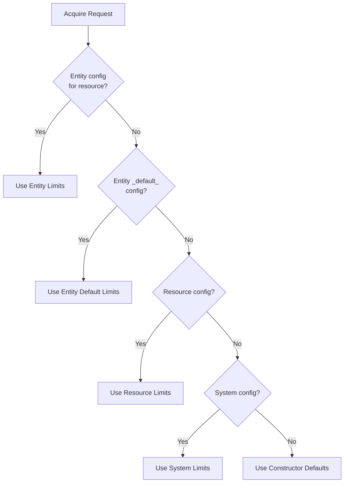

# Configuration Hierarchy

zae-limiter supports a four-level configuration hierarchy for rate limits, allowing you to set defaults at the system level and override them at the resource, entity default, or entity-resource level.

## Overview



**Precedence order (highest to lowest):**

1. **Entity limits (resource-specific)** - Per-entity + specific resource overrides (e.g., premium user on gpt-4)
2. **Entity default limits** - Per-entity `_default_` config (applies to all resources for that entity)
3. **Resource defaults** - Per-resource limits (e.g., all users on gpt-4)
4. **System defaults** - Global limits for all resources
5. **Constructor defaults** - Fallback from code

!!! info "Namespace Scoping"
    All config levels (system, resource, entity) are scoped to a single namespace. Each namespace has its own independent configuration hierarchy. Changing system defaults in one namespace does not affect other namespaces.

## When to Use Each Level

| Level | Use Case | Example |
|-------|----------|---------|
| **System** | Universal defaults across all resources | 100 RPM baseline for all models |
| **Resource** | Per-model or per-API limits | gpt-4 gets 50 RPM, claude-3 gets 200 RPM |
| **Entity Default** | Per-user/tenant defaults for ALL resources | Premium user gets 500 RPM on any model |
| **Entity (resource-specific)** | Per-user + specific model overrides | Enterprise customer gets 10x only on gpt-4 |

## Python API

### System Defaults

System defaults apply to **all resources** unless overridden:

```python
from zae_limiter import Repository, RateLimiter, Limit, OnUnavailable

repo = await Repository.open(stack="my-app", region="us-east-1")
limiter = RateLimiter(repository=repo)

# Set system-wide defaults (no resource parameter)
await limiter.set_system_defaults(
    limits=[
        Limit.per_minute("rpm", 100),
        Limit.per_minute("tpm", 10_000),
    ],
    on_unavailable=OnUnavailable.ALLOW,  # Optional: behavior on DynamoDB failure
)

# Get system defaults
limits, on_unavailable = await limiter.get_system_defaults()
print(f"on_unavailable: {on_unavailable}")
for limit in limits:
    print(f"  {limit.name}: {limit.capacity}/min")

# Delete system defaults
await limiter.delete_system_defaults()
```

### Resource Defaults

Resource defaults override system defaults for a specific resource:

```python
# Set resource-specific defaults (overrides system)
await limiter.set_resource_defaults(
    resource="gpt-4",
    limits=[
        Limit.per_minute("rpm", 50),       # Lower RPM for expensive model
        Limit.per_minute("tpm", 100_000),  # Higher TPM
    ],
)

# Get resource defaults
defaults = await limiter.get_resource_defaults("gpt-4")

# List all resources with configured defaults
resources = await limiter.list_resources_with_defaults()
# ['gpt-4', 'claude-3', ...]

# Delete resource defaults
await limiter.delete_resource_defaults("gpt-4")
```

### Entity Default Limits

Entity default limits apply to **all resources** for a specific entity unless overridden by a resource-specific entity config:

```python
# Set entity-level defaults (applies to ALL resources for this entity)
await limiter.set_limits(
    entity_id="user-premium",
    # resource defaults to "_default_" when omitted
    limits=[
        Limit.per_minute("rpm", 500),       # 10x normal on any model
        Limit.per_minute("tpm", 100_000),
    ],
)

# Get entity default limits
limits = await limiter.get_limits(entity_id="user-premium")

# Delete entity default limits
await limiter.delete_limits(entity_id="user-premium")
```

### Entity Limits (Resource-Specific)

Entity limits override entity defaults, resource defaults, and system defaults for a specific entity+resource pair:

```python
# Set entity-specific limits for a particular resource (highest precedence)
await limiter.set_limits(
    entity_id="user-premium",
    resource="gpt-4",  # Only applies to gpt-4
    limits=[
        Limit.per_minute("rpm", 1000),      # Even higher for this specific model
        Limit.per_minute("tpm", 1_000_000),
    ],
)

# Get entity limits for specific resource
limits = await limiter.get_limits(
    entity_id="user-premium",
    resource="gpt-4",
)

# Delete entity limits for specific resource
await limiter.delete_limits(
    entity_id="user-premium",
    resource="gpt-4",
)
```

## CLI Commands

### System Defaults

```bash
# Set system-wide defaults (applies to ALL resources)
zae-limiter system set-defaults -l rpm:100 -l tpm:10000 --on-unavailable allow

# Get system defaults
zae-limiter system get-defaults

# Delete system defaults
zae-limiter system delete-defaults --yes
```

### Resource Defaults

```bash
# Set resource-specific defaults
zae-limiter resource set-defaults gpt-4 -l rpm:50 -l tpm:100000

# Get resource defaults
zae-limiter resource get-defaults gpt-4

# List resources with defaults
zae-limiter resource list

# Delete resource defaults
zae-limiter resource delete-defaults gpt-4 --yes
```

### Entity Default Limits

```bash
# Set entity default limits (applies to ALL resources)
zae-limiter entity set-limits user-premium -l rpm:500 -l tpm:100000

# Get entity default limits
zae-limiter entity get-limits user-premium

# Delete entity default limits
zae-limiter entity delete-limits user-premium --yes
```

### Entity Limits (Resource-Specific)

```bash
# Set entity-specific limits for a particular resource
zae-limiter entity set-limits user-premium --resource gpt-4 -l rpm:1000 -l tpm:1000000

# Get entity limits for specific resource
zae-limiter entity get-limits user-premium --resource gpt-4

# Delete entity limits for specific resource
zae-limiter entity delete-limits user-premium --resource gpt-4 --yes
```

## Example: Multi-Tier Pricing

Here's how to implement a typical SaaS pricing model:

```python
async def setup_rate_limits(limiter: RateLimiter):
    # 1. System defaults: Free tier baseline (all resources)
    await limiter.set_system_defaults(
        limits=[
            Limit.per_minute("rpm", 10),
            Limit.per_minute("tpm", 1_000),
        ],
        on_unavailable=OnUnavailable.BLOCK,
    )

    # 2. Resource defaults: Different limits per model
    await limiter.set_resource_defaults(
        resource="gpt-4",
        limits=[
            Limit.per_minute("rpm", 5),    # Expensive model: lower limits
            Limit.per_minute("tpm", 500),
        ],
    )

    await limiter.set_resource_defaults(
        resource="gpt-3.5-turbo",
        limits=[
            Limit.per_minute("rpm", 20),   # Cheap model: higher limits
            Limit.per_minute("tpm", 5_000),
        ],
    )

    # 3. Entity default limits: Premium tier (applies to ALL models)
    await limiter.set_limits(
        entity_id="premium-user",
        # resource defaults to "_default_" - applies to all resources
        limits=[
            Limit.per_minute("rpm", 100),  # 10x free tier on any model
            Limit.per_minute("tpm", 10_000),
        ],
    )

    # 4. Entity resource-specific limits: Enterprise customer on specific model
    await limiter.set_limits(
        entity_id="enterprise-customer",
        resource="gpt-4",  # Only gpt-4
        limits=[
            Limit.per_minute("rpm", 500),  # 50x free tier
            Limit.per_minute("tpm", 100_000),
        ],
    )
```

With this setup:

| User | Resource | RPM | TPM | Source |
|------|----------|-----|-----|--------|
| Free user | gpt-4 | 5 | 500 | Resource default |
| Free user | gpt-3.5-turbo | 20 | 5,000 | Resource default |
| Free user | any other | 10 | 1,000 | System default |
| Premium user | gpt-4 | 100 | 10,000 | Entity default |
| Premium user | gpt-3.5-turbo | 100 | 10,000 | Entity default |
| Premium user | any other | 100 | 10,000 | Entity default |
| Enterprise | gpt-4 | 500 | 100,000 | Entity resource-specific |
| Enterprise | gpt-3.5-turbo | 20 | 5,000 | Resource default |

## System Config: on_unavailable

The `on_unavailable` setting controls behavior when DynamoDB is unreachable:

| Value | Behavior | Use Case |
|-------|----------|----------|
| `ALLOW` | Allow requests (fail open) | High availability is critical |
| `BLOCK` | Block requests (fail closed) | Rate limiting is critical |

```python
# Set at system level
await limiter.set_system_defaults(
    limits=[Limit.per_minute("rpm", 100), Limit.per_minute("tpm", 10_000)],
    on_unavailable=OnUnavailable.ALLOW,
)
```

```bash
# Or via CLI
zae-limiter system set-defaults -l rpm:100 --on-unavailable allow
```

!!! note
    `on_unavailable` is only configurable at the system level, not per-resource or per-entity.

## Replacement Semantics

When you set limits at any level, the new limits **completely replace** the previous ones:

```python
# Initial: rpm=100, tpm=10000
await limiter.set_system_defaults([
    Limit.per_minute("rpm", 100),
    Limit.per_minute("tpm", 10_000),
])

# After this: rpm is GONE, only tpm=20000 exists
await limiter.set_system_defaults([
    Limit.per_minute("tpm", 20_000),
])
```

To add or update a single limit while preserving others, read first:

```python
# Read existing
current, on_unavail = await limiter.get_system_defaults()

# Modify
current_dict = {l.name: l for l in current}
current_dict["rpm"] = Limit.per_minute("rpm", 200)

# Write back
await limiter.set_system_defaults(list(current_dict.values()))
```

## Next Steps

- [Basic Usage](basic-usage.md) - Rate limiting patterns
- [Hierarchical Limits](hierarchical.md) - Parent/child entity relationships
- [Unavailability Handling](unavailability.md) - Handling DynamoDB outages
