# Scheduled (Cron) Limits

Rate limits that change with the clock — halve throughput during business hours, raise it
overnight, close a maintenance window, or reset a daily quota at local midnight.

Without scheduling, a limit holds until someone calls `set_limits()`. The usual workaround is an
external cron job that swaps capacity at each tick, which means extra infrastructure, no
atomicity, and a window at every boundary where the old limit is still in force. Scheduled limits
move that into the library: the schedule travels with the limit, and every reader works out the
effective value for the current instant.

!!! info "Added in v0.14.0"
    `ScheduleEntry`, `Limit.with_schedule()` and `Limit.with_reset_schedule()` are new in v0.14.0.

## When to use it

| Pattern | Example |
|---------|---------|
| **Peak / off-peak** | Half the throughput 9–5 on weekdays, full rate overnight |
| **Maintenance window** | Drop to a trickle during a nightly batch job |
| **Daily quota** | 10,000 requests per day, back to full at local midnight |
| **Weekend capacity** | Raise limits Saturday and Sunday when traffic is lighter |

## The mental model: a pattern, not a timer

This is the one thing worth reading twice.

In a cron *daemon*, `* 9-17 * * MON-FRI` means "fire every minute between 9 and 5 on weekdays" —
it is a list of instants. Here it means something different: **an entry is active for as long as
the current minute matches the pattern.** It describes a *window*, not a firing.

```mermaid
gantt
    title  "* 9-17 * * MON-FRI" with scale 0.5
    dateFormat HH:mm
    axisFormat %H:%M
    section Tuesday
    base limit (1000/min)   :done, a1, 00:00, 09:00
    scaled to 500/min       :crit, a2, 09:00, 18:00
    base limit (1000/min)   :done, a3, 18:00, 24:00
```



So `* 9-17 * * MON-FRI` covers every minute of the nine-hour span, and `0 9 * * MON-FRI` — which a
cron daemon would fire once a day — describes a window exactly **one minute long**. That is almost
never what you want for a limit. As a rule of thumb, leave the minute field as `*` unless you
genuinely mean a sub-hour window.

The one place a single instant *is* what you want is a quota reset, which has its own field —
see [Daily quotas](#daily-quotas-reset_schedule).

## Scaling a limit during a window

The common case. `scale` is a multiplier on the base limit:

```python
from zae_limiter import Limit, RateLimiter, Repository, ScheduleEntry

repo = await Repository.open()
limiter = RateLimiter(repository=repo)

await limiter.set_limits(
    "user-123",
    limits=[
        Limit.per_minute("rpm", 1000).with_schedule((
            ScheduleEntry(
                cron="* 9-17 * * MON-FRI",
                tz="America/New_York",
                scale=0.5,
            ),
        )),
    ],
    resource="gpt-4",
)
```

Outside the window the limit is 1000/min. Inside it, 500/min.

!!! note "`scale` moves capacity and refill together"
    A scale of `0.5` halves **both** the bucket ceiling and the refill amount, so the time to
    refill from empty is unchanged. Halving only the ceiling would double the refill speed
    relative to bucket size, which is not what "half the limit" means to anyone.

## Absolute values

When a window should have its own number rather than a multiple of the base, set `capacity`
directly. `refill_amount` and `refill_period_seconds` are optional and fall back to the base:

```python
Limit.per_minute("rpm", 1000).with_schedule((
    ScheduleEntry(cron="* 0-6 * * *", tz="America/New_York", capacity=2000),
))
```

An entry sets **either** `scale` **or** the absolute fields — never both. Mixing them raises
`ValueError` at construction.

## Several windows: first match wins

Entries are checked in order and the first one matching the current minute supplies the limit.
Nothing merges, and nothing accumulates:

```python
Limit.per_minute("rpm", 1000).with_schedule((
    # Weekends are quiet — most specific first.
    ScheduleEntry(cron="* * * * SAT,SUN", tz="America/New_York", scale=2.0),
    # Business hours on the remaining days.
    ScheduleEntry(cron="* 9-17 * * MON-FRI", tz="America/New_York", scale=0.5),
    # Everything else falls through to the base limit.
))
```

If no entry matches, the base limit applies. Order the specific before the general.

## Timezones

Every entry carries its own IANA timezone, defaulting to `UTC`:

```python
ScheduleEntry(cron="* 9-17 * * MON-FRI", tz="Europe/Berlin", scale=0.5)
```

!!! warning "The default is UTC, not your local time"
    `tz` defaults to `"UTC"`. "Business hours" almost never means business hours in UTC — set it
    explicitly unless you really mean UTC.

Daylight saving is handled for you. A `9-17 America/New_York` window stays 9 a.m. to 5 p.m. local
on both sides of a transition; only the corresponding UTC instant shifts. You do not need to
adjust anything twice a year, and the 23-hour and 25-hour days are counted correctly.

## Daily quotas: `reset_schedule`

A token bucket refills *continuously*. That is right for a rate, and wrong for a quota. With
`Limit.per_day("rpd", 10_000)`, a caller who burns the whole allowance at 00:01 earns it back a
fraction at a time over the following 24 hours — not all at once at the next midnight.

`reset_schedule` is the second, separate field for that:

```python
from zae_limiter import Limit, ScheduleEntry

await limiter.set_limits(
    "user-123",
    limits=[
        Limit.per_day("rpd", 10_000).with_reset_schedule((
            ScheduleEntry.reset(cron="0 0 * * *", tz="America/New_York"),
        )),
    ],
    resource="gpt-4",
)
```

Read it as: **at midnight New York, put the balance back to the limit, whatever it was a second
earlier.**

Two differences from `schedule` worth knowing:

- **It fires on an edge, not across a window.** A `schedule` entry is active *while* it matches;
  a reset fires on the transition *into* matching. That is why `0 0 * * *` is correct here, and
  why the one-minute-window caveat above does not apply.
- **Reset entries carry `cron` and `tz` only.** They set no capacity or refill — a reset changes
  the balance, not the limit. Use `ScheduleEntry.reset()` to build them; passing an entry with a
  modifier to `with_reset_schedule()` raises `ValueError`.

!!! note "Idle buckets reset when they wake"
    A reset applies on the first request after its edge, not at the edge itself. A bucket idle
    from 18:00 to 09:00 the next morning gets its reset on that 09:00 request. Two missed
    midnights apply once — setting the balance to the limit is idempotent.

!!! tip "Usage history is unaffected"
    A reset restores tokens without touching the total-consumed counter, so
    [usage snapshots](usage-snapshots.md) stay continuous across it. Resets do not create gaps or
    resets in your usage reporting.

## Precedence: override, not merge

Schedules travel with the limit they belong to, through the normal
[configuration hierarchy](config-hierarchy.md). The level that wins supplies **everything** —
numbers and schedule together.

That has one consequence people trip over: an entity-level `rpm` with **no** schedule *removes*
the resource-level schedule for that entity, exactly as it already replaces the numbers.

```python
# Resource level: everyone gets the business-hours reduction.
await limiter.set_resource_defaults("gpt-4", limits=[
    Limit.per_minute("rpm", 1000).with_schedule((
        ScheduleEntry(cron="* 9-17 * * MON-FRI", tz="America/New_York", scale=0.5),
    )),
])

# This entity is now UNSCHEDULED at 2000/min — the resource schedule does not carry over.
await limiter.set_limits("enterprise-1", limits=[Limit.per_minute("rpm", 2000)],
                         resource="gpt-4")

# To keep a schedule for this entity, state it.
await limiter.set_limits("enterprise-1", resource="gpt-4", limits=[
    Limit.per_minute("rpm", 2000).with_schedule((
        ScheduleEntry(cron="* 9-17 * * MON-FRI", tz="America/New_York", scale=0.5),
    )),
])
```

## Declarative configuration

Schedules round-trip through [YAML manifests](../infra/deployment.md) and the
`Custom::ZaeLimiterLimits` CloudFormation resource:

```yaml
namespace: default
resources:
  gpt-4:
    limits:
      rpm:
        capacity: 1000
        schedule:
          - cron: "* 9-17 * * MON-FRI"
            tz: America/New_York
            scale: 0.5
          - cron: "* 0-6 * * *"
            tz: America/New_York
            capacity: 2000
      rpd:
        capacity: 10000
        refill_period: 86400
        reset_schedule:
          - cron: "0 0 * * *"
            tz: America/New_York
```

```bash
zae-limiter limits plan -n my-app -f limits.yaml    # preview
zae-limiter limits apply -n my-app -f limits.yaml
```

Invalid cron expressions and unknown timezones are rejected at **parse** time, so `limits plan`
catches them before anything is written.

## Viewing a schedule

The CLI shows schedules but does not set them — use the Python API or a manifest:

```console
$ zae-limiter entity get-limits user-123 --resource gpt-4
Limits for user-123 (gpt-4):
  rpm: 1000 capacity, 1000/60s refill
    Schedule:
      * 9-17 * * MON-FRI  America/New_York  → 50%
      * 0-6 * * *         America/New_York  → capacity 2000
  rpd: 10000 capacity, 10000/86400s refill
    Reset:
      0 0 * * *           America/New_York  → refill to capacity
```

!!! note "Weekdays and months display as names"
    A schedule written as `1-5` comes back as `MON-FRI`, and `1,7` as `JAN,JUL`. The meaning is
    identical — the stored form is canonical and renders with names for readability.

## What happens at a boundary

Normal requests are unaffected by scheduling: the cost and latency of an `acquire()` inside a
window are exactly what they are without one.

At the moment a window opens or closes, the **first** request to arrive pays one extra round trip
while the bucket is brought up to date. Requests already in flight at that instant pay it too.
After that the cost returns to normal until the next boundary. For a typical peak/off-peak
schedule that is a handful of extra round trips per bucket per day.

Idle buckets do nothing at a boundary, correctly — they update on their next request.

`RateLimitExceeded.retry_after_seconds` accounts for boundaries. If a limit rises in ten minutes,
the wait reflects that rather than assuming the current, lower rate holds forever; and for a daily
quota it reports the time until the reset rather than a long drip-refill.

## Limitations

- **One time-varying mechanism per bucket.** A bucket uses cron scheduling or another dynamic
  mechanism, not both. This keeps "why is my limit this number" answerable.
- **Extended cron syntax is not supported.** `L` (last), `W` (weekday) and `#` (nth weekday) are
  rejected at construction. Standard ranges, lists, steps and names — `1-5`, `1,3`, `*/15`,
  `MON-FRI`, `JAN,JUL` — all work. Sunday may be written `0`, `7` or `SUN`; all three are
  equivalent and store identically, so they never read back as two different schedules.
- **Seconds are not addressable, and a six-field expression is rejected.** Cron's finest
  granularity here is one minute. Schedulers such as Quartz and Spring accept an extra leading
  *seconds* field, and `cronsim` will parse one — but nothing in this library is finer than a
  minute, so a six-field expression would silently widen to the whole of the minute it names.
  `ScheduleEntry(cron="30 5 9 * * *", ...)` therefore raises `ValueError` at construction,
  naming the five required fields, rather than quietly covering sixty times the intended window.
- **Resource- and system-level schedule changes reach existing buckets when those buckets expire**
  rather than immediately, consistent with how default-derived limits already behave. Entity-level
  changes take effect immediately.

## See also

- [Configuration Hierarchy](config-hierarchy.md) — how schedules resolve across levels
- [Token Bucket Algorithm](token-bucket.md) — why a quota reset is not the same as a refill
- [Basic Usage](basic-usage.md) — `acquire()`, leases, and handling `RateLimitExceeded`
