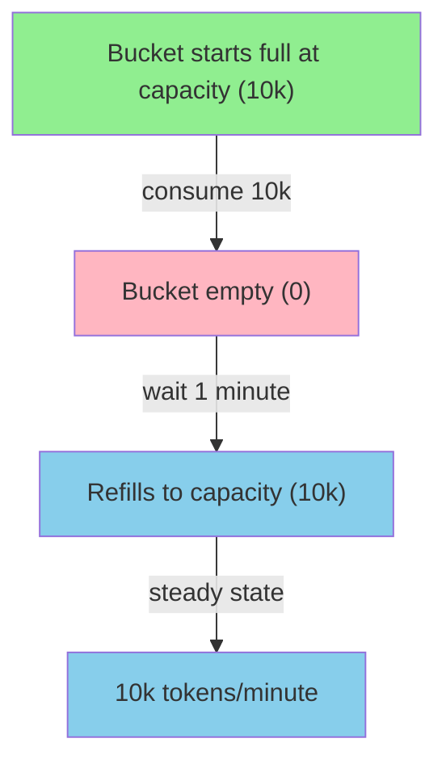

# Token Bucket Algorithm

Understanding how rate limiting works helps you choose the right limits for your application. This page explains the token bucket algorithm and how zae-limiter implements it.

## The Classic Algorithm

The token bucket algorithm controls request rates using a simple metaphor: imagine a bucket that holds tokens.

- **Tokens accumulate** over time at a fixed rate (the refill rate)
- **Requests consume** tokens from the bucket
- **Requests are allowed** if enough tokens are available
- **Requests are rejected** if the bucket is empty


This creates a natural rate limit: requests can consume up to the bucket's capacity, but sustained traffic is limited by the refill rate.

## How zae-limiter Implements It

zae-limiter uses a modified token bucket optimized for distributed systems. Here's how it differs from the classic algorithm:

| Aspect | Classic Algorithm | zae-limiter |
|--------|-------------------|-------------|
| Token storage | Floating-point numbers | Integers (millitokens x1000) |
| Refill timing | Continuous background process | Lazy (calculated on-demand) |
| Minimum tokens | 0 (never negative) | Can go negative (debt) |
| Precision | May drift due to float errors | Drift-compensated integers |

These modifications enable:

- **Distributed precision**: Integer math produces identical results across all nodes
- **Efficiency**: No background timers or processes needed
- **Estimate-then-reconcile**: Negative buckets allow post-hoc cost adjustment

## Key Concepts

### Capacity

Every limit has a **capacity** -- the maximum number of tokens the bucket can hold (the ceiling). The bucket starts full at capacity and refills at the configured rate.

```python
# 10,000 tokens/minute -- bucket holds up to 10k tokens
Limit.per_minute("tpm", capacity=10_000)
```



**Key insight**: The bucket holds up to `capacity` tokens and refills at `refill_amount / refill_period_seconds`. With `Limit.per_minute("tpm", 10_000)`, both capacity and refill amount are 10,000, so a fully depleted bucket refills in exactly 1 minute.

### Lazy Refill

Unlike traditional implementations that continuously add tokens, zae-limiter calculates refills on-demand:

```
When a request arrives:
1. Calculate elapsed time since last refill
2. Add tokens based on elapsed time
3. Check if enough tokens are available
4. Consume tokens if allowed
```

**Why this matters:**

- **Accurate `retry_after`**: Time calculations are exact, not approximations
- **No drift**: Integer math with drift compensation prevents accumulated errors
- **Efficient**: No background processes consuming resources

The refill formula:

```
tokens_to_add = elapsed_time × refill_rate
             = elapsed_ms × refill_amount / refill_period
```

### Negative Buckets (Debt)

zae-limiter allows buckets to go negative, creating a "debt" that must be repaid before more tokens are available. This enables the **estimate-then-reconcile** pattern for operations with unknown cost.


**Why allow negative tokens?**

Many operations have costs that are unknown until completion:

| Domain | Unknown cost |
|--------|--------------|
| Database queries | Rows scanned, data returned |
| File transfers | Bytes transferred after compression |
| Batch processing | Items processed per batch |
| API calls | Metered usage calculated after |

Negative buckets let you:

1. **Estimate** cost upfront (consume)
2. **Execute** the operation
3. **Reconcile** based on actual cost (adjust)

The debt is automatically repaid as tokens refill over time.

```python
async with limiter.acquire(
    entity_id="user-123",
    resource="api",
    limits=[Limit.per_minute("rpm", 100)],
    consume={"rpm": 5},  # Estimate 5 units
) as lease:
    result = await execute_operation()
    actual = result.units_consumed  # 12
    await lease.adjust(rpm=actual - 5)  # Add 7 to debt
```

See [LLM Integration](llm-integration.md) for a specific application of this pattern.

## Practical Implications

### Why estimates can be wrong

Because buckets can go negative, your initial estimate doesn't need to be perfect. Underestimate and adjust later:

- Estimate too low? Adjust adds to consumption
- Estimate too high? Adjust can return tokens (negative adjustment)

### Why `retry_after` is accurate

The lazy refill with drift compensation means `retry_after` tells you exactly when tokens will be available:

```python
try:
    async with limiter.acquire(
        entity_id="user-123",
        resource="api",
        limits=[Limit.per_minute("tpm", 10_000)],
        consume={"tpm": 1000},
    ):
        pass
except RateLimitExceeded as e:
    # This is the exact time to wait
    await asyncio.sleep(e.retry_after_seconds)
    # Now the request will succeed
```

### Choosing the right limits

| Scenario | Capacity | Rationale |
|----------|----------|-----------|
| Steady API traffic | 100 rpm | Consistent rate for API endpoints |
| LLM tokens | 10k tpm | Handle variable response sizes |
| Database queries | 1k rows/min | Allow periodic large result sets |
| New user onboarding | 50 rpm | Let users explore, then limit |

## Next Steps

- [Basic Usage](basic-usage.md) - Common rate limiting patterns
- [LLM Integration](llm-integration.md) - Token estimation strategies
- [Architecture](../contributing/architecture.md#token-bucket-implementation) - Implementation details for contributors
