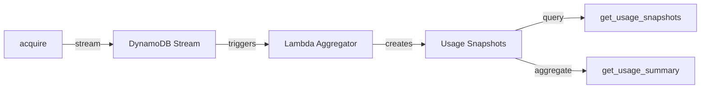

# Usage Snapshots

Usage snapshots provide historical consumption data for billing, reporting, and capacity planning. This guide explains how to query and use snapshot data.

## What Are Usage Snapshots?

Usage snapshots are time-aggregated consumption records created by the Lambda aggregator from DynamoDB stream events. When you call `acquire()` and consume tokens, the aggregator automatically records this consumption into hourly and daily snapshots.

**Key characteristics:**

- **Automatic**: Created by the Lambda aggregator without additional API calls
- **Aggregated**: Consumption is summed within time windows (hourly, daily)
- **Retroactive**: Data is available after the Lambda processes stream events
- **Queryable**: Access via API or CLI for reporting and analysis

## When to Use Usage Snapshots

| Use Case | Feature |
|----------|---------|
| **Billing reports** | Query consumption by entity/resource for a billing period |
| **Usage dashboards** | Display consumption trends over time |
| **Capacity planning** | Analyze usage patterns to inform limit adjustments |
| **Audit compliance** | Historical record of resource consumption |

!!! note "Snapshots vs Real-time Limits"
    Use `get_usage_snapshots()` for historical analysis. For real-time limit status, use `get_status()` or check the `LimitStatus` returned by `acquire()`.

## Querying Snapshots

### Python API

Query snapshots for an entity:

```python
from datetime import datetime
from zae_limiter import Repository, RateLimiter

repo = await Repository.open(stack="my-app", region="us-east-1")
limiter = RateLimiter(repository=repo)

# Get hourly snapshots for a user
snapshots, next_key = await limiter.get_usage_snapshots(
    entity_id="user-123",
    resource="gpt-4",
    window_type="hourly",
    start_time=datetime(2024, 1, 1),
    end_time=datetime(2024, 1, 31),
)

for snap in snapshots:
    print(f"{snap.window_start}: {snap.counters}")
```

Query snapshots across all entities for a resource:

```python
# Get all consumption for gpt-4 across all users
snapshots, _ = await limiter.get_usage_snapshots(
    resource="gpt-4",
    window_type="daily",
)
```

### Pagination

For large result sets, use the `next_key` cursor:

```python
all_snapshots = []
next_key = None

while True:
    snapshots, next_key = await limiter.get_usage_snapshots(
        entity_id="user-123",
        next_key=next_key,
    )
    all_snapshots.extend(snapshots)
    if next_key is None:
        break
```

!!! warning "Pagination Behavior"
    The `limit` parameter controls the DynamoDB query batch size, not the guaranteed result count. Client-side filters (`window_type`, `start_time`, `end_time`) are applied after fetching, so the returned count may be less than `limit`. Always use `next_key` to ensure you retrieve all matching results.

### Usage Summary

For aggregated statistics, use `get_usage_summary()`:

```{.python .lint-only}
summary = await limiter.get_usage_summary(
    entity_id="user-123",
    resource="gpt-4",
    window_type="hourly",
    start_time=datetime(2024, 1, 1),
    end_time=datetime(2024, 1, 31),
)

print(f"Total snapshots: {summary.snapshot_count}")
print(f"Total tokens: {summary.total['tpm']}")
print(f"Average per hour: {summary.average['tpm']}")
print(f"Time range: {summary.min_window_start} to {summary.max_window_start}")
```

### CLI Commands

List snapshots:

```bash
# Query by entity
zae-limiter usage list --name my-app --entity-id user-123 --resource gpt-4

# Query by resource across all entities
zae-limiter usage list --name my-app --resource gpt-4 --window-type hourly

# Filter by time range
zae-limiter usage list --name my-app --entity-id user-123 \
    --start-time 2024-01-01T00:00:00Z --end-time 2024-01-31T23:59:59Z
```

Get summary:

```bash
zae-limiter usage summary --name my-app --entity-id user-123 --resource gpt-4
```

### ASCII Chart Visualization

Display usage trends as ASCII charts with the `--plot` flag:

```bash
# Install the plot extra
pip install 'zae-limiter[plot]'

# Display usage as ASCII charts
zae-limiter usage list --entity-id user-123 --plot

# With resource filter
zae-limiter usage list --entity-id user-123 --resource gpt-4 --plot
```

Example output:

```
Usage Plot: gpt-4 (hourly)
Entity: user-123
================================================================================

RPM                             TPM
----------------------------    -------------------------------
51  ┤        ╭─╮                5,141  ┤        ╭╮
47  ┤        │ ╰╮               4,719  ┤        │╰─╮
43  ┤        │  ╰─────╮         4,297  ┤       ╭╯  ╰─────╮
38  ┤       ╭╯        ╰╮        3,875  ┤       │         ╰╮
34  ┤       │          │        3,453  ┤       │          │
30  ┤      ╭╯          ╰╮       3,031  ┤      ╭╯          ╰╮
26  ┤     ╭╯            ╰──     2,610  ┤     ╭╯            ╰──
 5  ┼─────╯                       500  ┼─────╯

Time range: 2024-01-15T00:00:00Z to 2024-01-15T23:00:00Z
Data points: 24

Total: 24 snapshots
```

**Features:**

- **Side-by-side layout**: Multiple counters displayed in pairs for compact viewing
- **Context header**: Shows resource, window type, and entity ID
- **Auto-downsampling**: Large datasets (>60 points) are automatically averaged to fit terminal width
- **Right-aligned Y-axis**: Proper alignment for values with thousands separators

This is useful for quickly spotting usage trends and patterns directly in the terminal.

## Snapshot Data Model

Each snapshot contains:

| Field | Description |
|-------|-------------|
| `entity_id` | The entity that consumed tokens |
| `resource` | The resource being rate limited |
| `window_start` | Start of the time window (ISO timestamp) |
| `window_end` | End of the time window (ISO timestamp) |
| `window_type` | "hourly" or "daily" |
| `counters` | Dict of limit_name → total consumption |
| `total_events` | Number of rate limit events in the window |

Example snapshot:

```python
UsageSnapshot(
    entity_id="user-123",
    resource="gpt-4",
    window_start="2024-01-15T10:00:00Z",
    window_end="2024-01-15T10:59:59.999999Z",
    window_type="hourly",
    counters={"tpm": 5000, "rpm": 25},
    total_events=25,
)
```

## Query Modes

### Entity-Scoped Queries

Provide `entity_id` to query snapshots for a specific entity:

```python
# Uses primary key (PK) - most efficient
snapshots, _ = await limiter.get_usage_snapshots(
    entity_id="user-123",
    resource="gpt-4",  # Optional: filter by resource
)
```

### Resource-Scoped Queries

Provide only `resource` to query across all entities:

```python
# Uses GSI2 - aggregates across entities
snapshots, _ = await limiter.get_usage_snapshots(
    resource="gpt-4",
)
```

This is useful for:

- Total consumption reports per resource
- Comparing usage across users/projects
- Capacity planning at the resource level

## Relationship to Other Features



| Feature | Purpose | Data |
|---------|---------|------|
| `acquire()` | Real-time rate limiting | Current token state |
| `get_status()` | Check current limits | Live bucket state |
| `get_audit_events()` | Security audit trail | Who changed what |
| `get_usage_snapshots()` | Historical consumption | Aggregated usage over time |

## Best Practices

1. **Use window_type filtering**: Query hourly vs daily based on your reporting needs
2. **Paginate large queries**: Always handle `next_key` for complete results
3. **Use summary for totals**: `get_usage_summary()` is more efficient than summing snapshots client-side
4. **Consider time ranges**: Narrow your queries with `start_time`/`end_time` for better performance
