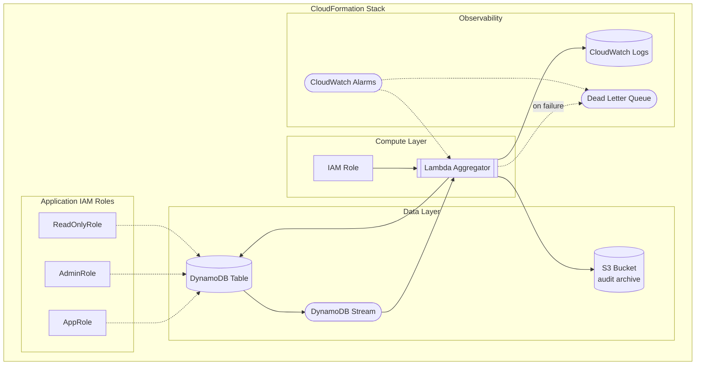

# CloudFormation Template

This guide covers the CloudFormation template used by zae-limiter and how to customize it.

## Template Overview

The template creates:



## Export Template

```bash
# Export to file
zae-limiter cfn-template > template.yaml

# View template
zae-limiter cfn-template | less
```

## Template Parameters

The DynamoDB table name is automatically derived from the CloudFormation stack name using the `AWS::StackName` pseudo-parameter. This ensures consistency between stack and resource names.

| Parameter | Type | Default | Description |
|-----------|------|---------|-------------|
| `BaseName` | String | _(stack name)_ | Base name for resources (defaults to stack name) |
| `SnapshotWindows` | String | `hourly,daily` | Comma-separated list of snapshot windows |
| `SnapshotRetentionDays` | Number | `90` | Days to retain usage snapshots (1-3650) |
| `LambdaMemorySize` | Number | `256` | Memory for aggregator Lambda (128-3008 MB) |
| `LambdaTimeout` | Number | `60` | Timeout for aggregator Lambda (1-900 seconds) |
| `LambdaDurationThreshold` | Number | `54000` | Duration alarm threshold in ms (90% of timeout) |
| `EnableAggregator` | String | `true` | Whether to deploy the aggregator Lambda |
| `SchemaVersion` | String | `1.0.0` | Schema version for infrastructure |
| `PITRRecoveryPeriodDays` | String | _(empty)_ | PITR period (1-35 days, empty for AWS default) |
| `EnableAlarms` | String | `true` | Whether to deploy CloudWatch alarms |
| `AlarmSNSTopicArn` | String | _(empty)_ | SNS topic ARN for alarm notifications |
| `LogRetentionDays` | Number | `30` | CloudWatch log retention (standard periods) |
| `PermissionBoundary` | String | _(empty)_ | IAM permission boundary (ARN or policy name) |
| `RoleName` | String | _(empty)_ | Custom IAM role name (use `{}` as placeholder for base name) |
| `EnableAuditArchival` | String | `true` | Archive expired audit events to S3 |
| `AuditArchiveGlacierDays` | Number | `90` | Days before Glacier IR transition (1-3650) |
| `EnableTracing` | String | `false` | Enable AWS X-Ray tracing for Lambda |
| `EnableIAMRoles` | String | `true` | Create App/Admin/ReadOnly IAM roles |

## DynamoDB Table

### Schema

```yaml
AttributeDefinitions:
  - AttributeName: PK
    AttributeType: S
  - AttributeName: SK
    AttributeType: S
  - AttributeName: GSI1PK
    AttributeType: S
  - AttributeName: GSI1SK
    AttributeType: S
  - AttributeName: GSI2PK
    AttributeType: S
  - AttributeName: GSI2SK
    AttributeType: S

KeySchema:
  - AttributeName: PK
    KeyType: HASH
  - AttributeName: SK
    KeyType: RANGE
```

### Global Secondary Indexes

**GSI1** - Parent to children lookups:

```yaml
GlobalSecondaryIndexes:
  - IndexName: GSI1
    KeySchema:
      - AttributeName: GSI1PK  # PARENT#{parent_id}
        KeyType: HASH
      - AttributeName: GSI1SK  # CHILD#{child_id}
        KeyType: RANGE
```

**GSI2** - Resource aggregation:

```yaml
  - IndexName: GSI2
    KeySchema:
      - AttributeName: GSI2PK  # RESOURCE#{resource}
        KeyType: HASH
      - AttributeName: GSI2SK  # BUCKET#{entity_id}#{limit_name}
        KeyType: RANGE
```

### Stream Configuration

```yaml
StreamSpecification:
  StreamViewType: NEW_AND_OLD_IMAGES
```

## S3 Audit Archive Bucket

When `EnableAuditArchival` is `true`, the template creates an S3 bucket to store expired audit events.

```yaml
AuditArchiveBucket:
  Type: AWS::S3::Bucket
  Condition: DeployAuditArchive
  Properties:
    BucketName: !Sub "zael-${BaseName}-data"
    BucketEncryption:
      ServerSideEncryptionConfiguration:
        - ServerSideEncryptionByDefault:
            SSEAlgorithm: AES256
    PublicAccessBlockConfiguration:
      BlockPublicAcls: true
      BlockPublicPolicy: true
      IgnorePublicAcls: true
      RestrictPublicBuckets: true
    LifecycleConfiguration:
      Rules:
        - Id: GlacierTransition
          Status: Enabled
          Prefix: audit/
          Transitions:
            - StorageClass: GLACIER_IR
              TransitionInDays: !Ref AuditArchiveGlacierDays
```

### Object Structure

Archived audit events are stored as gzip-compressed JSONL files:

```
s3://zael-{name}-data/
  audit/
    year=2024/
      month=01/
        day=15/
          audit-{request_id}-{timestamp}.jsonl.gz
```

### Lifecycle Policy

Objects transition to Glacier Instant Retrieval after `AuditArchiveGlacierDays` (default: 90 days) for cost-effective long-term storage while maintaining millisecond retrieval times.

## Lambda Aggregator

The aggregator Lambda processes DynamoDB Stream events to maintain usage snapshots and archive expired audit events.

!!! tip "Performance Tuning"
    For guidance on memory tuning, concurrency management, and error handling configuration, see the [Performance Tuning Guide](../performance.md#2-lambda-concurrency-settings).

### Function Configuration

```yaml
AggregatorFunction:
  Type: AWS::Lambda::Function
  Properties:
    Runtime: python3.12
    Handler: zae_limiter.aggregator.handler.lambda_handler
    MemorySize: 256
    Timeout: 60
    Environment:
      Variables:
        TABLE_NAME: !Ref AWS::StackName
        SNAPSHOT_WINDOWS: !Ref SnapshotWindows
        SNAPSHOT_TTL_DAYS: !Ref SnapshotRetentionDays
        # When audit archival is enabled:
        ENABLE_ARCHIVAL: "true"
        ARCHIVE_BUCKET_NAME: !Ref AuditArchiveBucket
```

### Event Source Mapping

```yaml
StreamEventMapping:
  Type: AWS::Lambda::EventSourceMapping
  Properties:
    EventSourceArn: !GetAtt Table.StreamArn
    FunctionName: !Ref AggregatorFunction
    StartingPosition: LATEST
    BatchSize: 100
    MaximumBatchingWindowInSeconds: 5
```

## IAM Permissions

### Lambda Execution Role

```yaml
AggregatorRole:
  Type: AWS::IAM::Role
  Properties:
    AssumeRolePolicyDocument:
      Statement:
        - Effect: Allow
          Principal:
            Service: lambda.amazonaws.com
          Action: sts:AssumeRole
    Policies:
      - PolicyName: DynamoDBAccess
        PolicyDocument:
          Statement:
            - Effect: Allow
              Action:
                - dynamodb:GetItem
                - dynamodb:PutItem
                - dynamodb:UpdateItem
                - dynamodb:Query
              Resource: !GetAtt Table.Arn
            - Effect: Allow
              Action:
                - dynamodb:GetRecords
                - dynamodb:GetShardIterator
                - dynamodb:DescribeStream
                - dynamodb:ListStreams
              Resource: !Sub "${Table.Arn}/stream/*"
            # When audit archival is enabled:
            - Effect: Allow
              Action:
                - s3:PutObject
              Resource: !Sub "${AuditArchiveBucket.Arn}/*"
```

## Application IAM Roles

When `EnableIAMRoles` is `true` (default), the template creates three IAM roles for different access patterns. These roles allow applications, administrators, and monitoring systems to assume least-privilege access to the DynamoDB table.

### Role Summary

| Role | Use Case | DynamoDB Permissions |
|------|----------|---------------------|
| `AppRole` | Applications calling `acquire()` | GetItem, Query, TransactWriteItems |
| `AdminRole` | Ops teams managing config | App + PutItem, DeleteItem, UpdateItem, BatchWriteItem |
| `ReadOnlyRole` | Monitoring and dashboards | GetItem, Query, Scan, DescribeTable |

### Trust Policy

All roles trust the same AWS account root principal, allowing any IAM entity in the account to assume the role (subject to their own permissions):

```yaml
AssumeRolePolicyDocument:
  Version: '2012-10-17'
  Statement:
    - Effect: Allow
      Principal:
        AWS: !Sub arn:${AWS::Partition}:iam::${AWS::AccountId}:root
      Action: sts:AssumeRole
```

### Role Naming

- Default: `${StackName}-{app,admin,readonly}-role`
- With custom `RoleName`: `${RoleName}-{app,admin,readonly}`

Roles respect `PermissionBoundary` if configured.

### Usage Example

```python
import boto3

# Assume the AppRole for rate limiting operations
sts = boto3.client('sts')
credentials = sts.assume_role(
    RoleArn='arn:aws:iam::123456789012:role/ZAEL-my-app-app-role',
    RoleSessionName='my-app'
)['Credentials']

# Use assumed credentials
session = boto3.Session(
    aws_access_key_id=credentials['AccessKeyId'],
    aws_secret_access_key=credentials['SecretAccessKey'],
    aws_session_token=credentials['SessionToken']
)
```

## Customization

### Add Dead Letter Queue

```yaml
Parameters:
  EnableDLQ:
    Type: String
    Default: "false"
    AllowedValues: ["true", "false"]

Conditions:
  CreateDLQ: !Equals [!Ref EnableDLQ, "true"]

Resources:
  DeadLetterQueue:
    Type: AWS::SQS::Queue
    Condition: CreateDLQ
    Properties:
      QueueName: !Sub "${AWS::StackName}-aggregator-dlq"
      MessageRetentionPeriod: 1209600  # 14 days

  StreamEventMapping:
    Properties:
      DestinationConfig:
        OnFailure:
          Destination: !If
            - CreateDLQ
            - !GetAtt DeadLetterQueue.Arn
            - !Ref AWS::NoValue
```

### Add CloudWatch Alarms

```yaml
ReadThrottleAlarm:
  Type: AWS::CloudWatch::Alarm
  Properties:
    AlarmName: !Sub "${AWS::StackName}-read-throttle"
    AlarmDescription: Alert when DynamoDB read requests are throttled
    MetricName: ReadThrottleEvents
    Namespace: AWS/DynamoDB
    Statistic: Sum
    Period: 300  # 5 minutes
    EvaluationPeriods: 2
    Threshold: 1
    ComparisonOperator: GreaterThanThreshold
    Dimensions:
      - Name: TableName
        Value: !Ref RateLimitsTable
    TreatMissingData: notBreaching
    AlarmActions: !If
      - HasSNSTopic
      - [!Ref AlarmSNSTopicArn]
      - !Ref AWS::NoValue
```

### Enable Encryption with CMK

```yaml
Parameters:
  KmsKeyArn:
    Type: String
    Default: ""

Conditions:
  UseCustomKey: !Not [!Equals [!Ref KmsKeyArn, ""]]

Resources:
  Table:
    Properties:
      SSESpecification:
        SSEEnabled: true
        SSEType: !If [UseCustomKey, "KMS", "AWS_OWNED_KEY"]
        KMSMasterKeyId: !If [UseCustomKey, !Ref KmsKeyArn, !Ref AWS::NoValue]
```

## Deployment Examples

### Basic Deployment

```bash
aws cloudformation deploy \
    --template-file template.yaml \
    --stack-name zae-limiter \
    --capabilities CAPABILITY_NAMED_IAM
```

### With Custom Parameters

```bash
aws cloudformation deploy \
    --template-file template.yaml \
    --stack-name ZAEL-prod \
    --parameter-overrides \
        PITRRecoveryPeriodDays=35 \
        SnapshotRetentionDays=365 \
        LogRetentionDays=90 \
        EnableAlarms=true \
    --capabilities CAPABILITY_NAMED_IAM
```

Note: The DynamoDB table name is automatically set to match the stack name (e.g., `ZAEL-prod`).

### Using SAM

```yaml
# samconfig.toml
[default.deploy.parameters]
stack_name = "ZAEL-limiter"
capabilities = "CAPABILITY_NAMED_IAM"
```

```bash
sam deploy --guided
```

## Outputs

The template exports:

| Output | Description |
|--------|-------------|
| `TableArn` | DynamoDB table ARN |
| `StreamArn` | DynamoDB stream ARN |
| `FunctionArn` | Lambda function ARN |
| `AuditArchiveBucketName` | S3 bucket for audit archives (when enabled) |
| `AuditArchiveBucketArn` | S3 bucket ARN (when enabled) |
| `AppRoleArn` | IAM role ARN for applications (when IAM roles enabled) |
| `AppRoleName` | IAM role name for applications |
| `AdminRoleArn` | IAM role ARN for administrators |
| `AdminRoleName` | IAM role name for administrators |
| `ReadOnlyRoleArn` | IAM role ARN for read-only access |
| `ReadOnlyRoleName` | IAM role name for read-only access |

Access outputs:

```bash
aws cloudformation describe-stacks \
    --stack-name zae-limiter \
    --query "Stacks[0].Outputs"
```

## Next Steps

- [Deployment](deployment.md) - Deployment guide
- [LocalStack](../contributing/localstack.md) - Local development
