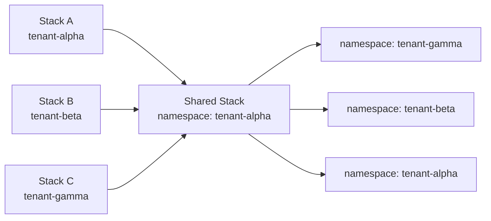

# Namespace-Prefixed Keys Migration (v0.10.0)

This guide walks you through migrating an existing zae-limiter deployment from bare DynamoDB keys (`ENTITY#user-123`) to namespace-prefixed keys (`a7x3kq/ENTITY#user-123`), as introduced in v0.10.0.

## Overview

### What Changed

v0.10.0 introduces **namespace-prefixed DynamoDB keys** to enable multi-tenant isolation within a single table. Every partition key and GSI key is now prefixed with an opaque namespace ID:

```
# Before (v0.9.x and earlier)
PK = ENTITY#user-123

# After (v0.10.0)
PK = a7x3kq/ENTITY#user-123
```

A new **namespace registry** tracks the mapping between human-readable names (e.g., `default`, `tenant-alpha`) and opaque IDs used in keys. The **reserved namespace** `_` is used for system-wide records like the version record.

### Why

- **Multi-tenant isolation**: Each tenant's data lives under a distinct namespace prefix, enabling IAM-level access control via `dynamodb:LeadingKeys` conditions
- **Opaque IDs**: Namespace IDs are random strings, preventing tenants from guessing other tenants' key prefixes
- **GSI4**: A new Global Secondary Index enables efficient per-namespace item discovery

See [#364](https://github.com/zeroae/zae-limiter/issues/364) for the full schema design.

## Key Format Mapping

The table below shows how each record type's keys change:

### Partition Keys (PK)

| Record Type | Old Format | New Format |
|-------------|-----------|------------|
| Entity | `ENTITY#user-123` | `a7x3kq/ENTITY#user-123` |
| System config | `SYSTEM#` | `a7x3kq/SYSTEM#` |
| Resource config | `RESOURCE#gpt-4` | `a7x3kq/RESOURCE#gpt-4` |
| Audit | `AUDIT#user-123` | `a7x3kq/AUDIT#user-123` |
| Version | `SYSTEM#` (SK=`#VERSION`) | `_/SYSTEM#` (reserved namespace) |

### GSI Keys

| GSI | Old Format | New Format |
|-----|-----------|------------|
| GSI1PK (parent lookup) | `PARENT#parent-1` | `a7x3kq/PARENT#parent-1` |
| GSI2PK (resource agg.) | `RESOURCE#gpt-4` | `a7x3kq/RESOURCE#gpt-4` |
| GSI3PK (entity config) | `ENTITY_CONFIG#gpt-4` | `a7x3kq/ENTITY_CONFIG#gpt-4` |
| **GSI4PK** (new) | *(did not exist)* | `a7x3kq` (namespace ID) |
| **GSI4SK** (new) | *(did not exist)* | Same as PK |

!!! note
    Sort keys (SK) are **unchanged** -- only partition keys and GSI hash keys gain the namespace prefix.

## Prerequisites

Before starting the migration:

- [ ] **Minimum client version**: Install `zae-limiter >= 0.10.0`
- [ ] **Backup**: Enable Point-in-Time Recovery (PITR) on your DynamoDB table
- [ ] **Connectivity**: Verify CLI access to your stack

```bash
# Verify PITR is enabled
aws dynamodb describe-continuous-backups \
  --table-name my-app

# Or create an on-demand backup
aws dynamodb create-backup \
  --table-name my-app \
  --backup-name "pre-namespace-migration-$(date +%Y%m%d)"

# Verify CLI can reach the stack
zae-limiter check --name my-app --region us-east-1
```

## Step 1: Deploy / Upgrade the Stack

Update the CloudFormation stack to add GSI4 and namespace-scoped IAM policies:

```bash
# Upgrade an existing stack
zae-limiter upgrade --name my-app --region us-east-1

# Or redeploy (also works)
zae-limiter deploy --name my-app --region us-east-1
```

This stack update:

1. Adds **GSI4** (`GSI4PK` / `GSI4SK` attribute definitions and index)
2. Creates **namespace-scoped IAM policies** (`NamespaceAcquirePolicy`, `NamespaceFullAccessPolicy`, `NamespaceReadOnlyPolicy`)
3. Registers the **"default" namespace** with a random opaque ID in the namespace registry

!!! warning "GSI4 creation time and empty backfill"
    DynamoDB builds the new GSI by backfilling existing items. However, existing items have **no `GSI4PK` attribute**, so **GSI4 starts empty** after backfill completes -- this is expected. The migration in Step 3 adds `GSI4PK`/`GSI4SK` to every item, which populates the index.

    On large tables (millions of items), backfill can take **minutes to hours**. During this time the table enters `UPDATING` state: reads and writes continue normally, but other schema changes (adding another GSI, modifying attribute definitions) are blocked until the table leaves `UPDATING`. Monitor progress via:

    ```bash
    aws dynamodb describe-table --table-name my-app \
      --query 'Table.GlobalSecondaryIndexes[?IndexName==`GSI4`].IndexStatus'
    ```

## Step 2: Discover the Namespace ID

After the stack update completes, find the opaque ID assigned to the `default` namespace:

=== "CLI"

    ```bash
    # Show default namespace details
    zae-limiter namespace show default --name my-app

    # Or list all namespaces
    zae-limiter namespace list --name my-app
    ```

    Example output:
    ```
    Namespace:    default
    Namespace ID: a7x3kq
    Status:       active
    Created At:   2025-06-15T10:30:00Z
    ```

=== "Python"

    ```python
    import asyncio
    from zae_limiter import Repository

    async def main():
        repo = Repository("my-app", "us-east-1", None)
        namespaces = await repo.list_namespaces()
        for ns in namespaces:
            print(f"{ns['name']}: {ns['namespace_id']}")
        await repo.close()

    asyncio.run(main())
    ```

!!! note
    DynamoDB keys use the **opaque ID** (e.g., `a7x3kq`), not the human-readable name `"default"`. The namespace registry maps between them.

## Step 3: Migrate Existing Items

This is the core migration step. It rewrites every existing (unprefixed) item with the new namespace-prefixed keys.

!!! danger "Aggregator Lambda deployment ordering"
    The aggregator Lambda's archiver (`archiver.py`) calls `parse_namespace(pk)` **without** a try/except guard. If the Lambda is updated to v0.10.0 code while unprefixed items still exist, the archiver will **crash** on every TTL-deleted audit record.

    **You must migrate data BEFORE updating the Lambda code.** If you used `zae-limiter upgrade`, the Lambda code is updated automatically -- so run this migration script **immediately** after the upgrade completes, before any audit TTL deletions occur.

    The stream processor (`processor.py`) handles this gracefully by catching the `ValueError` and skipping pre-migration records. Only the archiver path is affected.

### Migration Script

Save the following as `migrate_namespace_keys.py` and run it against your table:

```python
"""
Namespace key migration script for zae-limiter v0.10.0.

Migrates existing unprefixed DynamoDB items to namespace-prefixed keys.
Idempotent -- safe to run multiple times.

Usage:
    python migrate_namespace_keys.py --name my-app --region us-east-1
    python migrate_namespace_keys.py --name my-app --region us-east-1 --delete
"""

from __future__ import annotations

import argparse
import asyncio
import logging

import aioboto3

from zae_limiter import schema

logging.basicConfig(level=logging.INFO, format="%(asctime)s %(message)s")
logger = logging.getLogger(__name__)

# GSI PK attributes that need namespace prefixing
GSI_PK_ATTRS = ("GSI1PK", "GSI2PK", "GSI3PK")

# Known PK prefixes (used to detect unprefixed items)
KNOWN_PK_PREFIXES = (
    schema.ENTITY_PREFIX,   # "ENTITY#"
    schema.SYSTEM_PREFIX,   # "SYSTEM#"
    schema.RESOURCE_PREFIX, # "RESOURCE#"
    schema.AUDIT_PREFIX,    # "AUDIT#"
)

# Known GSI PK prefixes
KNOWN_GSI_PREFIXES = (
    schema.PARENT_PREFIX,        # "PARENT#"
    schema.RESOURCE_PREFIX,      # "RESOURCE#"
    schema.ENTITY_CONFIG_PREFIX, # "ENTITY_CONFIG#"
)


def is_unprefixed(pk: str) -> bool:
    """Check if a PK lacks a namespace prefix (no '/' before the first '#')."""
    slash_idx = pk.find("/")
    hash_idx = pk.find("#")
    if slash_idx < 0:
        return True  # No slash at all
    if hash_idx >= 0 and slash_idx > hash_idx:
        return True  # Slash comes after hash -- not a namespace prefix
    return False


def determine_namespace(
    pk: str, sk: str, default_ns_id: str
) -> str:
    """Determine the target namespace ID for an item.

    Version records (SYSTEM# + #VERSION) go to the reserved namespace '_'.
    Everything else goes to the default namespace.
    """
    if pk.startswith(schema.SYSTEM_PREFIX) and sk == schema.SK_VERSION:
        return schema.RESERVED_NAMESPACE
    return default_ns_id


def prefix_key(namespace_id: str, key: str) -> str:
    """Add namespace prefix to a key."""
    return f"{namespace_id}/{key}"


def build_new_item(
    item: dict, namespace_id: str
) -> dict:
    """Build a new item with namespace-prefixed keys and GSI4 attributes."""
    new_item = dict(item)
    old_pk = item["PK"]["S"]

    # Prefix the PK
    new_item["PK"] = {"S": prefix_key(namespace_id, old_pk)}

    # Prefix GSI PK attributes (if present)
    for gsi_attr in GSI_PK_ATTRS:
        if gsi_attr in item:
            old_val = item[gsi_attr]["S"]
            new_item[gsi_attr] = {"S": prefix_key(namespace_id, old_val)}

    # Add GSI4 attributes for namespace discovery
    new_item["GSI4PK"] = {"S": namespace_id}
    new_item["GSI4SK"] = {"S": new_item["PK"]["S"]}

    return new_item


async def scan_unprefixed_items(
    client, table_name: str
) -> list[dict]:
    """Scan all items and return those with unprefixed PKs."""
    items = []
    params: dict = {"TableName": table_name}

    while True:
        response = await client.scan(**params)
        for item in response.get("Items", []):
            pk = item.get("PK", {}).get("S", "")
            if is_unprefixed(pk):
                items.append(item)

        if "LastEvaluatedKey" not in response:
            break
        params["ExclusiveStartKey"] = response["LastEvaluatedKey"]

    return items


async def write_prefixed_items(
    client,
    table_name: str,
    items: list[dict],
    default_ns_id: str,
    batch_size: int = 25,
    throttle_seconds: float = 0.1,
) -> int:
    """Write namespace-prefixed items using conditional puts (idempotent).

    Returns the number of items successfully written.
    """
    written = 0

    for i in range(0, len(items), batch_size):
        batch = items[i : i + batch_size]

        for item in batch:
            old_pk = item["PK"]["S"]
            sk = item["SK"]["S"]
            ns_id = determine_namespace(old_pk, sk, default_ns_id)
            new_item = build_new_item(item, ns_id)

            try:
                await client.put_item(
                    TableName=table_name,
                    Item=new_item,
                    ConditionExpression="attribute_not_exists(PK)",
                )
                written += 1
            except client.exceptions.ConditionalCheckFailedException:
                # Item already exists (idempotent)
                logger.debug(
                    "Skipping existing item: PK=%s SK=%s",
                    new_item["PK"]["S"],
                    sk,
                )

        logger.info(
            "Progress: %d / %d items written",
            min(i + batch_size, len(items)),
            len(items),
        )
        await asyncio.sleep(throttle_seconds)

    return written


async def delete_unprefixed_items(
    client,
    table_name: str,
    items: list[dict],
    batch_size: int = 25,
    throttle_seconds: float = 0.1,
) -> int:
    """Delete old unprefixed items after migration is verified.

    Returns the number of items deleted.
    """
    deleted = 0

    for i in range(0, len(items), batch_size):
        batch = items[i : i + batch_size]

        # Use BatchWriteItem for efficient deletes
        delete_requests = [
            {
                "DeleteRequest": {
                    "Key": {"PK": item["PK"], "SK": item["SK"]}
                }
            }
            for item in batch
        ]

        if delete_requests:
            response = await client.batch_write_item(
                RequestItems={table_name: delete_requests}
            )
            # Handle unprocessed items
            unprocessed = (
                response.get("UnprocessedItems", {})
                .get(table_name, [])
            )
            deleted += len(delete_requests) - len(unprocessed)

            if unprocessed:
                logger.warning(
                    "%d unprocessed deletes in batch %d",
                    len(unprocessed),
                    i // batch_size,
                )

        logger.info(
            "Delete progress: %d / %d items",
            min(i + batch_size, len(items)),
            len(items),
        )
        await asyncio.sleep(throttle_seconds)

    return deleted


async def get_default_namespace_id(client, table_name: str) -> str:
    """Look up the default namespace ID from the registry."""
    response = await client.get_item(
        TableName=table_name,
        Key={
            "PK": {"S": f"{schema.RESERVED_NAMESPACE}/{schema.SYSTEM_PREFIX}"},
            "SK": {"S": schema.sk_namespace("default")},
        },
    )
    item = response.get("Item")
    if not item:
        raise RuntimeError(
            "Default namespace not found. "
            "Run 'zae-limiter upgrade' first to register the default namespace."
        )
    return item["namespace_id"]["S"]


async def migrate(
    name: str,
    region: str,
    endpoint_url: str | None = None,
    delete: bool = False,
) -> None:
    """Run the namespace key migration."""
    session = aioboto3.Session()
    async with session.client(
        "dynamodb", region_name=region, endpoint_url=endpoint_url
    ) as client:
        table_name = name

        # 1. Discover default namespace ID
        ns_id = await get_default_namespace_id(client, table_name)
        logger.info("Default namespace ID: %s", ns_id)

        # 2. Scan for unprefixed items
        logger.info("Scanning for unprefixed items...")
        items = await scan_unprefixed_items(client, table_name)
        logger.info("Found %d unprefixed items", len(items))

        if not items:
            logger.info("No unprefixed items found. Migration complete.")
            return

        # 3. Write prefixed copies
        logger.info("Writing namespace-prefixed items...")
        written = await write_prefixed_items(
            client, table_name, items, ns_id
        )
        logger.info("Wrote %d new prefixed items", written)

        # 4. Optionally delete old items
        if delete:
            logger.info("Deleting old unprefixed items...")
            deleted = await delete_unprefixed_items(
                client, table_name, items
            )
            logger.info("Deleted %d unprefixed items", deleted)
        else:
            logger.info(
                "Skipping deletion (run with --delete to remove old items). "
                "%d unprefixed items remain.",
                len(items),
            )


def main() -> None:
    parser = argparse.ArgumentParser(
        description="Migrate zae-limiter DynamoDB items to namespace-prefixed keys"
    )
    parser.add_argument(
        "--name", required=True, help="Stack/table name"
    )
    parser.add_argument(
        "--region", required=True, help="AWS region"
    )
    parser.add_argument(
        "--endpoint-url", default=None,
        help="AWS endpoint URL (for LocalStack)",
    )
    parser.add_argument(
        "--delete", action="store_true",
        help="Delete old unprefixed items after writing prefixed copies",
    )
    args = parser.parse_args()

    asyncio.run(
        migrate(
            name=args.name,
            region=args.region,
            endpoint_url=args.endpoint_url,
            delete=args.delete,
        )
    )


if __name__ == "__main__":
    main()
```

### Running the Migration

```bash
# Install the new version
pip install "zae-limiter>=0.10.0"

# Step 1: Write prefixed copies (non-destructive)
python migrate_namespace_keys.py --name my-app --region us-east-1

# Step 2: Verify (see Step 7 below)

# Step 3: Delete old unprefixed items
python migrate_namespace_keys.py --name my-app --region us-east-1 --delete
```

!!! tip "Dry-run approach"
    Run without `--delete` first. This writes prefixed copies alongside the originals, so you can verify the migration before removing old items. The script is idempotent -- running it again skips items that already exist.

### Cost and Time Estimation

| Table Size | Scan Cost | Write Cost | Estimated Time |
|------------|-----------|------------|----------------|
| 10,000 items | ~1,250 RCU | ~10,000 WCU | < 1 minute |
| 100,000 items | ~12,500 RCU | ~100,000 WCU | ~5 minutes |
| 1,000,000 items | ~125,000 RCU | ~1,000,000 WCU | ~50 minutes |

With on-demand pricing: scan = $0.125/M RCU, writes = $0.625/M WCU. A 1M-item migration costs approximately $0.64.

## Step 4: Update Application Config

Update your application code to use the namespace-aware API. For existing single-tenant deployments, the default namespace is used automatically -- no code changes are required if you're already using the latest client.

=== "Async"

    ```python
    from zae_limiter import RateLimiter, Repository

    # v0.10.0 automatically uses the "default" namespace
    repo = Repository("my-app", "us-east-1", None)
    limiter = RateLimiter(repository=repo)

    # Explicit namespace (optional)
    ns_repo = await repo.namespace("default")
    limiter = RateLimiter(repository=ns_repo)
    ```

=== "Sync"

    ```python
    from zae_limiter import SyncRateLimiter, SyncRepository

    repo = SyncRepository("my-app", "us-east-1", None)
    limiter = SyncRateLimiter(repository=repo)

    # Explicit namespace (optional)
    ns_repo = repo.namespace("default")
    limiter = SyncRateLimiter(repository=ns_repo)
    ```

=== "CLI"

    ```bash
    # Most commands use --namespace / -N flag (default: "default")
    zae-limiter audit list user-123 --name my-app -N default

    # Namespace management commands
    zae-limiter namespace list --name my-app
    zae-limiter namespace show default --name my-app
    ```

## Step 5: Attach Namespace IAM Policies

For deployments that use IAM access control, attach the new namespace-scoped policies and tag principals.

### Get Policy ARNs

The stack outputs the policy ARNs:

```bash
# List namespace-scoped policy outputs
aws cloudformation describe-stacks --stack-name my-app \
  --query 'Stacks[0].Outputs[?contains(OutputKey,`Namespace`)].{Key:OutputKey,Value:OutputValue}' \
  --output table
```

| Output Key | Description |
|------------|-------------|
| `NamespaceAcquirePolicyArn` | For tenant apps calling `acquire()` |
| `NamespaceFullAccessPolicyArn` | Full access within a namespace |
| `NamespaceReadOnlyPolicyArn` | Read-only monitoring within a namespace |

### Attach to Roles and Tag

```bash
# 1. Get the default namespace ID
NS_ID=$(zae-limiter namespace show default --name my-app \
  | grep "Namespace ID:" | awk '{print $3}')

# 2. Attach namespace-scoped policy to your app role
aws iam attach-role-policy --role-name my-app-role \
  --policy-arn arn:aws:iam::123456789012:policy/my-app-ns-acq

# 3. Tag the role with the namespace ID
aws iam tag-role --role-name my-app-role \
  --tags Key=zael_namespace_id,Value=$NS_ID
```

The `zael_namespace_id` tag on the IAM principal controls which namespace's items the role can access via `dynamodb:LeadingKeys` conditions.

For detailed TBAC setup including multi-namespace access and admin roles, see [Production Guide: Namespace-Scoped Access Control](../infra/production.md#namespace-scoped-access-control).

## Step 6: Decommission Old Stacks (Optional)

If you're consolidating multiple single-tenant stacks into one multi-tenant table:



1. **Register namespaces** for each tenant in the shared table:

    ```bash
    zae-limiter namespace register tenant-alpha --name shared-table
    zae-limiter namespace register tenant-beta --name shared-table
    ```

2. **Export and re-import** data from each old stack into the shared table under the appropriate namespace (adapt the migration script above to read from one table and write to another).

3. **Update application config** to point to the shared table with the appropriate namespace.

4. **Delete old stacks** once verified:

    ```bash
    zae-limiter delete --name old-stack-alpha --yes
    ```

## Rollback Procedures

### Per-Step Rollback

| Step | Rollback Action |
|------|----------------|
| **Step 1** (stack upgrade) | CloudFormation does not remove GSI4 on rollback. Use PITR to restore if needed. |
| **Step 3** (data migration) | If `--delete` was not used, old items still exist -- simply revert the client to v0.9.x. If `--delete` was used, restore from PITR backup. |
| **Step 4** (app config) | Revert application to previous version: `pip install "zae-limiter<0.10.0"` |
| **Step 5** (IAM policies) | Detach namespace policies, re-attach table-level policies. |

### Full Rollback

If the migration must be completely reversed:

```bash
# 1. Revert client to pre-namespace version
pip install "zae-limiter<0.10.0"

# 2. Restore table from PITR (if unprefixed items were deleted)
aws dynamodb restore-table-to-point-in-time \
  --source-table-name my-app \
  --target-table-name my-app-restored \
  --restore-date-time "2025-06-15T10:00:00Z"

# 3. Detach namespace IAM policies (if attached)
aws iam detach-role-policy --role-name my-app-role \
  --policy-arn arn:aws:iam::123456789012:policy/my-app-ns-acq
```

!!! warning "Aggregator during dual-format period"
    During the window between upgrading and completing migration, the table may contain both prefixed and unprefixed items. The stream **processor** handles this gracefully (catches `ValueError` from `parse_namespace()` and skips pre-migration records). The **archiver** does not -- see the warning in Step 3.

## Verification Checklist

After completing the migration, verify everything works:

- [ ] **Namespace registry**: `zae-limiter namespace list --name my-app` shows the default namespace
- [ ] **Compatibility check**: `zae-limiter check --name my-app --region us-east-1` reports `COMPATIBLE`
- [ ] **Sample acquire**: Run a test `acquire()` call and verify it succeeds
- [ ] **Unprefixed items removed**: Scan the table and confirm no items have bare (unprefixed) PKs
- [ ] **GSI4 active**: Verify `GSI4` status is `ACTIVE` in the DynamoDB console
- [ ] **Aggregator healthy**: Check CloudWatch Logs for the aggregator Lambda -- no `ValueError` exceptions

```bash
# Quick smoke test
python -c "
import asyncio
from zae_limiter import RateLimiter, Repository, Limit

async def test():
    repo = Repository('my-app', 'us-east-1', None)
    limiter = RateLimiter(repository=repo)
    await limiter.create_entity('migration-test')
    async with await limiter.acquire(
        'migration-test', 'test-resource',
        limits=[Limit.per_minute('rpm', 100)],
    ) as lease:
        print(f'Acquired: {lease.entity_id}')
    await limiter.delete_entity('migration-test')
    await repo.close()
    print('Migration verified successfully!')

asyncio.run(test())
"
```
