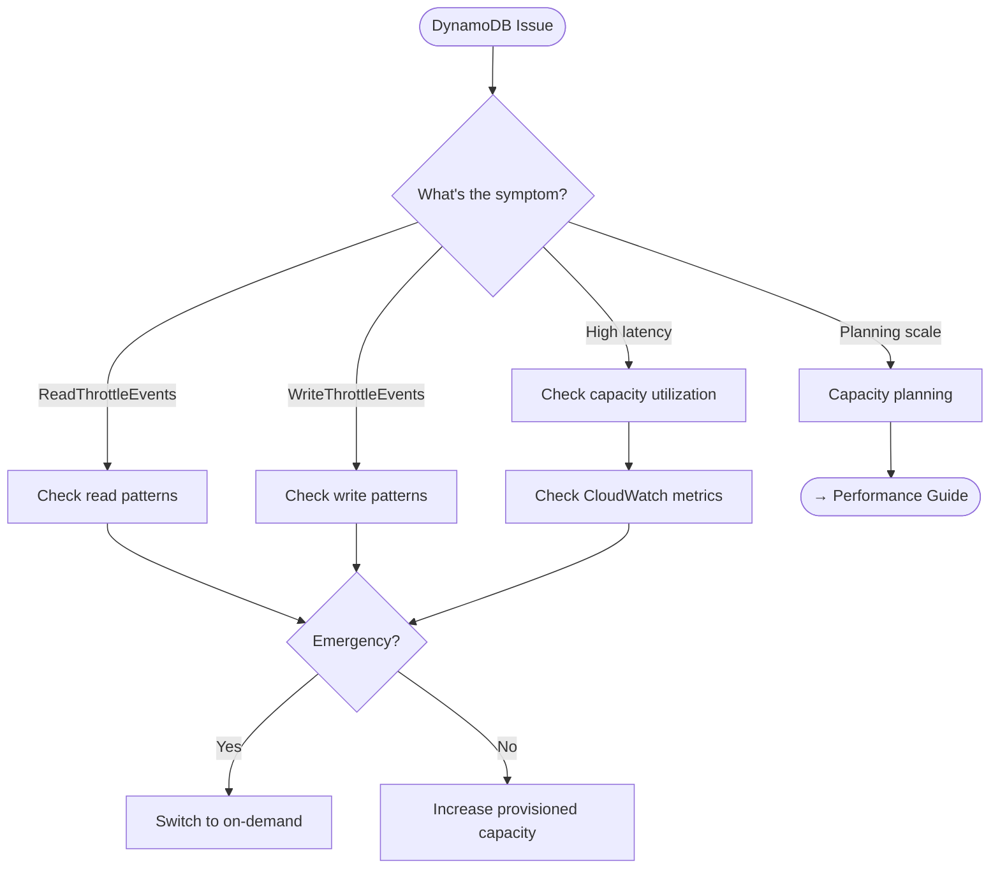

# DynamoDB Operations

This guide covers troubleshooting and operational procedures for DynamoDB capacity management and throttling issues.

## Decision Tree



## Troubleshooting

### Symptoms

- `ProvisionedThroughputExceededException` errors
- Increased latency on rate limit checks
- CloudWatch throttle alarms triggered
- `RateLimiterUnavailable` with `FAIL_CLOSED` mode

### Diagnostic Steps

**Check CloudWatch metrics:**

```bash
# View throttle events (last hour)
aws cloudwatch get-metric-statistics \
  --namespace AWS/DynamoDB \
  --metric-name ReadThrottleEvents \
  --dimensions Name=TableName,Value=ZAEL-<name> \
  --start-time $(date -u -d '1 hour ago' +%Y-%m-%dT%H:%M:%SZ) \
  --end-time $(date -u +%Y-%m-%dT%H:%M:%SZ) \
  --period 300 \
  --statistics Sum
```

**Check capacity utilization:**

```bash
aws cloudwatch get-metric-statistics \
  --namespace AWS/DynamoDB \
  --metric-name ConsumedReadCapacityUnits \
  --dimensions Name=TableName,Value=ZAEL-<name> \
  --start-time $(date -u -d '1 hour ago' +%Y-%m-%dT%H:%M:%SZ) \
  --end-time $(date -u +%Y-%m-%dT%H:%M:%SZ) \
  --period 300 \
  --statistics Sum
```

**Identify hot partitions (if Contributor Insights enabled):**

```bash
aws dynamodb describe-contributor-insights \
  --table-name ZAEL-<name>
```

### Throttling

#### Common Causes and Solutions

| Cause | Solution |
|-------|----------|
| **Provisioned capacity too low** | Increase RCU/WCU or switch to on-demand |
| **Hot partition** | Distribute entity IDs more evenly |
| **Burst traffic** | Enable auto-scaling or use on-demand |
| **GSI throttling** | Check GSI capacity separately |

#### Read Throttling

**Check which operations are throttling:**

```bash
aws cloudwatch get-metric-statistics \
  --namespace AWS/DynamoDB \
  --metric-name ThrottledRequests \
  --dimensions Name=TableName,Value=ZAEL-<name> Name=Operation,Value=GetItem \
  --start-time $(date -u -d '1 hour ago' +%Y-%m-%dT%H:%M:%SZ) \
  --end-time $(date -u +%Y-%m-%dT%H:%M:%SZ) \
  --period 300 \
  --statistics Sum
```

#### Write Throttling

Write throttling typically occurs during high-volume rate limiting or when the aggregator Lambda is processing many stream events.

**Check write patterns:**

```bash
aws cloudwatch get-metric-statistics \
  --namespace AWS/DynamoDB \
  --metric-name ConsumedWriteCapacityUnits \
  --dimensions Name=TableName,Value=ZAEL-<name> \
  --start-time $(date -u -d '1 hour ago' +%Y-%m-%dT%H:%M:%SZ) \
  --end-time $(date -u +%Y-%m-%dT%H:%M:%SZ) \
  --period 60 \
  --statistics Sum
```

### Capacity Planning

For detailed capacity calculations, see the [Performance Tuning Guide](../performance.md#1-dynamodb-capacity-planning).

**Quick estimates:**

| Operation | RCU | WCU |
|-----------|-----|-----|
| `acquire()` | ~2 | ~4 |
| `acquire()` with cascade | ~4 | ~8 |
| `available()` | ~2 | ~0 |
| Aggregator (per record) | ~1 | ~2 |

## Procedures

### Emergency Capacity Increase

**Switch to on-demand capacity (immediate relief):**

!!! note "Billing Impact"
    On-demand pricing is typically 5-7x more expensive than provisioned capacity at steady state, but has no throttling.

```bash
aws dynamodb update-table \
  --table-name ZAEL-<name> \
  --billing-mode PAY_PER_REQUEST
```

**Increase provisioned capacity:**

```bash
aws dynamodb update-table \
  --table-name ZAEL-<name> \
  --provisioned-throughput ReadCapacityUnits=1000,WriteCapacityUnits=500
```

### Scaling Procedures

#### Planned Capacity Scaling

**Step 1: Analyze current usage**

```bash
# Get average consumption over last 24 hours
aws cloudwatch get-metric-statistics \
  --namespace AWS/DynamoDB \
  --metric-name ConsumedReadCapacityUnits \
  --dimensions Name=TableName,Value=ZAEL-<name> \
  --start-time $(date -u -d '24 hours ago' +%Y-%m-%dT%H:%M:%SZ) \
  --end-time $(date -u +%Y-%m-%dT%H:%M:%SZ) \
  --period 3600 \
  --statistics Average
```

**Step 2: Calculate required capacity**

Use the formulas from [Performance Tuning](../performance.md):

- `RCU = (requests_per_second × 2) + (cascade_requests × 2)`
- `WCU = (requests_per_second × 4) + (cascade_requests × 4)`

Add 20% headroom for bursts.

**Step 3: Apply changes**

```bash
aws dynamodb update-table \
  --table-name ZAEL-<name> \
  --provisioned-throughput ReadCapacityUnits=<new_rcu>,WriteCapacityUnits=<new_wcu>
```

**Step 4: Verify**

```bash
aws dynamodb describe-table --table-name ZAEL-<name> \
  --query 'Table.ProvisionedThroughput'
```

#### Enable Auto-Scaling

**Create scaling targets:**

```bash
# Register read capacity target
aws application-autoscaling register-scalable-target \
  --service-namespace dynamodb \
  --resource-id "table/ZAEL-<name>" \
  --scalable-dimension "dynamodb:table:ReadCapacityUnits" \
  --min-capacity 5 \
  --max-capacity 1000

# Register write capacity target
aws application-autoscaling register-scalable-target \
  --service-namespace dynamodb \
  --resource-id "table/ZAEL-<name>" \
  --scalable-dimension "dynamodb:table:WriteCapacityUnits" \
  --min-capacity 5 \
  --max-capacity 500
```

**Create scaling policies:**

```bash
# Read capacity policy (target 70% utilization)
aws application-autoscaling put-scaling-policy \
  --service-namespace dynamodb \
  --resource-id "table/ZAEL-<name>" \
  --scalable-dimension "dynamodb:table:ReadCapacityUnits" \
  --policy-name "ZAEL-<name>-read-scaling" \
  --policy-type "TargetTrackingScaling" \
  --target-tracking-scaling-policy-configuration '{
    "TargetValue": 70.0,
    "PredefinedMetricSpecification": {
      "PredefinedMetricType": "DynamoDBReadCapacityUtilization"
    }
  }'
```

#### Switch to On-Demand

**When to use on-demand:**

- Unpredictable traffic patterns
- New deployments without baseline data
- Cost is less important than avoiding throttling

**Switch from provisioned to on-demand:**

```bash
aws dynamodb update-table \
  --table-name ZAEL-<name> \
  --billing-mode PAY_PER_REQUEST
```

**Switch back to provisioned:**

!!! warning "Cooldown Period"
    You can only switch billing modes once per 24 hours.

```bash
aws dynamodb update-table \
  --table-name ZAEL-<name> \
  --billing-mode PROVISIONED \
  --provisioned-throughput ReadCapacityUnits=100,WriteCapacityUnits=50
```

### Verification

After capacity changes, monitor for 15-30 minutes:

```bash
# Watch throttle events
watch -n 30 "aws cloudwatch get-metric-statistics \
  --namespace AWS/DynamoDB \
  --metric-name ReadThrottleEvents \
  --dimensions Name=TableName,Value=ZAEL-<name> \
  --start-time \$(date -u -d '30 minutes ago' +%Y-%m-%dT%H:%M:%SZ) \
  --end-time \$(date -u +%Y-%m-%dT%H:%M:%SZ) \
  --period 60 \
  --statistics Sum"
```

## Related

- [Performance Tuning](../performance.md) - Capacity planning formulas and optimization
- [Lambda Operations](lambda.md) - Aggregator throttling due to DynamoDB
- [Stream Processing](streams.md) - Stream processing affected by DynamoDB capacity
