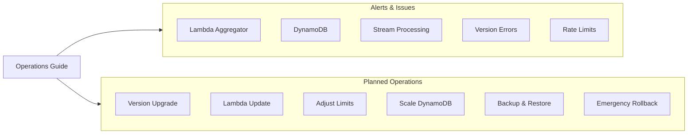

# Operations Guide

This guide consolidates troubleshooting and operational procedures for zae-limiter deployments. Navigate using the interactive map below or jump directly to a topic.

## Navigation

### Alerts & Issues

| Component | Common Issues |
|-----------|---------------|
| [Lambda](lambda/) | [Error rate](lambda/#error-rate-issues), [Duration/timeout](lambda/#high-lambda-duration), [DLQ messages](lambda/#messages-in-dead-letter-queue) |
| [DynamoDB](dynamodb/) | [Throttling](dynamodb/#throttling), [Capacity](dynamodb/#capacity-planning) |
| [Streams](streams/) | [Iterator age](streams/#high-iterator-age), [Processing lag](streams/#common-causes-and-solutions) |
| [Version](version/) | [VersionMismatchError](version/#versionmismatcherror), [IncompatibleSchemaError](version/#incompatibleschemaerror) |
| [Rate Limits](rate-limits/) | [Unexpected RateLimitExceeded](rate-limits/#unexpected-ratelimitexceeded), [Limits not enforcing](rate-limits/#limits-not-enforcing) |

### Planned Operations

| Operation | Guides |
|-----------|--------|
| Upgrades | [Version upgrade](version/#upgrade-procedure), [Lambda update](lambda/#lambda-redeployment) |
| Scaling | [Adjust rate limits](rate-limits/#adjust-limits-at-runtime), [DynamoDB capacity](dynamodb/#scaling-procedures) |
| Recovery | [Emergency rollback](recovery/#emergency-rollback-decision-matrix), [Backup/restore](recovery/#dynamodb-backup-and-restore), [PITR](recovery/#point-in-time-recovery-pitr) |

## Quick Reference

| Symptom | Go To |
|---------|-------|
| `RateLimitExceeded` unexpected | [Rate Limits](rate-limits/#unexpected-ratelimitexceeded) |
| `ProvisionedThroughputExceededException` | [DynamoDB](dynamodb/#throttling) |
| DLQ messages accumulating | [Lambda](lambda/#messages-in-dead-letter-queue) |
| `VersionMismatchError` | [Version](version/#versionmismatcherror) |
| High `IteratorAge` | [Streams](streams/#high-iterator-age) |
| Need to rollback | [Recovery](recovery/#emergency-rollback-decision-matrix) |

## CLI Diagnostic Commands

| Command | Description |
|---------|-------------|
| `zae-limiter status --name <name>` | Check stack status and resources |
| `zae-limiter version --name <name>` | Show version information |
| `zae-limiter check --name <name>` | Check client/infrastructure compatibility |

## CloudWatch Metrics Overview

| Metric | Namespace | Threshold | Guide |
|--------|-----------|-----------|-------|
| `Errors` | AWS/Lambda | > 1/5min | [Lambda](lambda/) |
| `Duration` | AWS/Lambda | > 80% timeout | [Lambda](lambda/) |
| `IteratorAge` | AWS/Lambda | > 30,000ms | [Streams](streams/) |
| `ReadThrottleEvents` | AWS/DynamoDB | > 0 | [DynamoDB](dynamodb/) |
| `WriteThrottleEvents` | AWS/DynamoDB | > 0 | [DynamoDB](dynamodb/) |
| `ApproximateNumberOfMessagesVisible` | AWS/SQS | > 0 | [Lambda](lambda/) |

## Exception Reference

| Exception | Cause | Guide |
|-----------|-------|-------|
| `RateLimitExceeded` | Rate limit violated | [Rate Limits](rate-limits/) |
| `RateLimiterUnavailable` | DynamoDB unavailable | [DynamoDB](dynamodb/) |
| `EntityNotFoundError` | Entity doesn't exist | [Rate Limits](rate-limits/) |
| `VersionMismatchError` | Client/Lambda version mismatch | [Version](version/) |
| `IncompatibleSchemaError` | Major version difference | [Version](version/) |
| `StackCreationError` | CloudFormation failed | [Recovery](recovery/) |

## Related Documentation

- [Monitoring Guide](../monitoring.md) - CloudWatch metrics, dashboards, and alerts
- [Performance Tuning](../performance.md) - Capacity planning and optimization
- [Migration Guide](../migrations.md) - Schema versioning and upgrades
- [Unavailability Handling](../guide/unavailability.md) - Configure behavior when DynamoDB is unavailable
