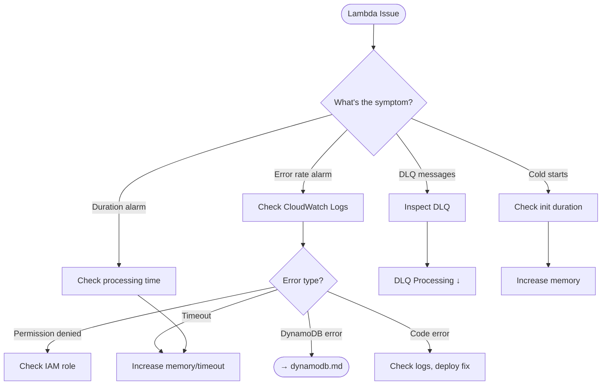

# Lambda Aggregator Operations

This guide covers troubleshooting and operational procedures for the Lambda aggregator function that processes DynamoDB stream events and maintains usage snapshots.

## Decision Tree



## Health Indicators

Monitor these metrics for Lambda health. See [Monitoring Guide](../monitoring.md) for dashboard templates.

| Metric | Healthy | Warning | Critical |
|--------|---------|---------|----------|
| Error Rate | 0% | < 1% | > 1% |
| Duration | < 50% timeout | < 80% timeout | > 80% timeout |
| Iterator Age | < 1s | < 30s | > 30s |
| DLQ Depth | 0 | 1-10 | > 10 |

## Troubleshooting

### Symptoms

- Usage snapshots not updating
- Messages accumulating in Dead Letter Queue (DLQ)
- Lambda duration alarm triggered
- CloudWatch Logs showing errors

### Diagnostic Steps

**Check Lambda errors:**

```bash
# View recent Lambda invocations
aws logs filter-log-events \
  --log-group-name /aws/lambda/ZAEL-<name>-aggregator \
  --start-time $(date -u -d '1 hour ago' +%s)000 \
  --filter-pattern "ERROR"
```

**Check DLQ message count:**

```bash
aws sqs get-queue-attributes \
  --queue-url https://sqs.<region>.amazonaws.com/<account>/ZAEL-<name>-aggregator-dlq \
  --attribute-names ApproximateNumberOfMessagesVisible
```

**Inspect DLQ messages:**

```bash
aws sqs receive-message \
  --queue-url https://sqs.<region>.amazonaws.com/<account>/ZAEL-<name>-aggregator-dlq \
  --max-number-of-messages 10 \
  --visibility-timeout 0
```

### Error Rate Issues

**CloudWatch Logs Insights query for errors:**

```sql
fields @timestamp, @message
| filter @message like /ERROR/
| sort @timestamp desc
| limit 50
```

**Common errors and solutions:**

| Error | Cause | Solution |
|-------|-------|----------|
| `AccessDeniedException` | IAM role missing permissions | Check role has DynamoDB and SQS permissions |
| `ValidationException` | Invalid DynamoDB operation | Check for schema changes |
| `ResourceNotFoundException` | Table or stream doesn't exist | Verify table name, redeploy stack |
| `ProvisionedThroughputExceededException` | DynamoDB throttling | See [DynamoDB Operations](dynamodb.md) |

### High Lambda Duration

**Symptoms:** Duration alarm triggered, `processing_time_ms` > 80% of timeout

**Diagnostic query:**

```sql
fields @timestamp, @message
| filter @message like /Batch processing completed/
| parse @message /processing_time_ms":(?<duration>[\d.]+)/
| stats avg(duration) as avg_ms,
        pct(duration, 50) as p50_ms,
        pct(duration, 95) as p95_ms,
        pct(duration, 99) as p99_ms
  by bin(1h)
| sort @timestamp desc
```

**Solutions:**

1. **Increase Lambda memory** (CPU scales with memory):
   ```bash
   aws lambda update-function-configuration \
     --function-name ZAEL-<name>-aggregator \
     --memory-size 512
   ```

2. **Reduce batch size** in event source mapping:
   ```bash
   MAPPING_UUID=$(aws lambda list-event-source-mappings \
     --function-name ZAEL-<name>-aggregator \
     --query 'EventSourceMappings[0].UUID' \
     --output text)

   aws lambda update-event-source-mapping \
     --uuid $MAPPING_UUID \
     --batch-size 50
   ```

3. **Check DynamoDB latency** - see [DynamoDB Operations](dynamodb.md)

### Messages in Dead Letter Queue

**Symptoms:** DLQ alarm triggered, messages accumulating

**Investigation:**

1. Check Lambda logs for the error that caused the failure
2. Identify if it's a transient error or persistent issue
3. Fix the root cause before reprocessing

**Reprocess DLQ messages after fix:**

```python
import boto3
import json

sqs = boto3.client('sqs')
lambda_client = boto3.client('lambda')

dlq_url = "https://sqs.<region>.amazonaws.com/<account>/ZAEL-<name>-aggregator-dlq"

while True:
    response = sqs.receive_message(
        QueueUrl=dlq_url,
        MaxNumberOfMessages=10,
        WaitTimeSeconds=5,
    )

    messages = response.get('Messages', [])
    if not messages:
        break

    for msg in messages:
        # Reprocess the failed event
        body = json.loads(msg['Body'])

        # Invoke Lambda directly with the failed records
        lambda_client.invoke(
            FunctionName='ZAEL-<name>-aggregator',
            InvocationType='Event',
            Payload=json.dumps(body),
        )

        # Delete from DLQ after successful reprocessing
        sqs.delete_message(
            QueueUrl=dlq_url,
            ReceiptHandle=msg['ReceiptHandle'],
        )

        print(f"Reprocessed message: {msg['MessageId']}")
```

**Purge DLQ (discard all messages):**

!!! warning "Data Loss"
    This permanently discards failed events. Only use after confirming data is not needed.

```bash
aws sqs purge-queue \
  --queue-url https://sqs.<region>.amazonaws.com/<account>/ZAEL-<name>-aggregator-dlq
```

### Cold Start Issues

**Diagnostic query:**

```sql
fields @timestamp, @message, @duration
| filter @type = "REPORT"
| filter @message like /Init Duration/
| parse @message /Init Duration: (?<init_duration>[\d.]+) ms/
| stats count() as cold_starts,
        avg(init_duration) as avg_init_ms
  by bin(1h)
```

**Solutions:**

1. **Increase Lambda memory** (faster initialization)
2. **Enable provisioned concurrency** for consistent latency:
   ```bash
   aws lambda put-provisioned-concurrency-config \
     --function-name ZAEL-<name>-aggregator \
     --qualifier $LATEST \
     --provisioned-concurrent-executions 2
   ```

## Procedures

### Lambda Redeployment

**Update Lambda code only:**

```bash
zae-limiter upgrade --name <name> --region <region> --lambda-only
```

**Full stack update:**

```bash
zae-limiter deploy --name <name> --region <region>
```

### Memory/Timeout Adjustment

**Via CLI (recommended):**

```bash
# Redeploy with new settings
zae-limiter deploy --name <name> --region <region> \
  --lambda-memory 512 \
  --lambda-timeout 120
```

**Direct Lambda update:**

```bash
aws lambda update-function-configuration \
  --function-name ZAEL-<name>-aggregator \
  --memory-size 512 \
  --timeout 120
```

### Verification

After any Lambda changes, verify health:

```bash
# Check function configuration
aws lambda get-function-configuration \
  --function-name ZAEL-<name>-aggregator

# Watch for errors in real-time
aws logs tail /aws/lambda/ZAEL-<name>-aggregator --follow
```

## Related

- [Stream Processing](streams.md) - Iterator age and stream lag issues
- [DynamoDB Operations](dynamodb.md) - Throttling and capacity issues
- [Monitoring Guide](../monitoring.md) - CloudWatch dashboards and alerts
