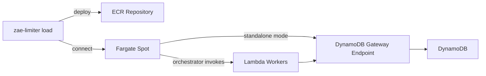

# Load Testing

Distributed load testing for zae-limiter using Locust on AWS (Fargate Spot master + Lambda workers).

## Architecture



**Two modes:**

- **Distributed** (default): Fargate runs Locust master + worker orchestrator sidecar. Orchestrator proactively invokes Lambda workers that connect to the master.
- **Standalone** (`--standalone`): Fargate runs Locust in single-process mode. No Lambda workers. Simpler but limited by single-task CPU.

## Quick Start

### 1. Deploy Infrastructure

```bash
zae-limiter load deploy --name my-limiter --region us-east-1 \
  --vpc-id vpc-xxx \
  --subnet-ids "subnet-aaa,subnet-bbb" \
  -C examples/locust/
```

The deploy command automatically:

- Creates CloudFormation stack with ECS cluster, ECR repo, Lambda function, security groups
- Discovers route tables from subnets and creates a DynamoDB VPC Gateway endpoint (free)
- Reads IAM configuration (permission boundary, role name format) from the target stack
- Builds and pushes Docker image with zae-limiter, Locust, and your locustfiles
- Packages and uploads Lambda worker code

### 2. Connect to Master

```bash
# Distributed mode (Fargate master + Lambda workers)
zae-limiter load connect --name my-limiter --region us-east-1

# Standalone mode (single process, no workers)
zae-limiter load connect --name my-limiter --region us-east-1 --standalone

# Override resources at connect time
zae-limiter load connect --name my-limiter --region us-east-1 \
  --standalone --cpu 1024 --memory 2048 --pool-connections 200
```

Opens an SSM tunnel to `http://localhost:8089` (Locust UI).

### 3. Run Test

```bash
# Start via curl
curl -X POST http://localhost:8089/swarm -d "user_count=120&spawn_rate=10"

# Monitor
curl -s http://localhost:8089/stats/requests | python3 -c "
import json, sys
d = json.load(sys.stdin)
p = d.get('current_response_time_percentiles', {})
t = [s for s in d['stats'] if s['name'] == 'api'][0]
print(f'Users: {d[\"user_count\"]}, RPS: {t[\"current_rps\"]:.1f}')
print(f'p50: {p.get(\"response_time_percentile_0.5\")}ms')
print(f'p95: {p.get(\"response_time_percentile_0.95\")}ms')
"

# Stop
curl http://localhost:8089/stop
```

### 4. Disconnect

```bash
# Ctrl+C disconnects SSM tunnel; task keeps running
# To stop the Fargate task on disconnect:
zae-limiter load connect --name my-limiter --region us-east-1 --destroy
```

## Connect Options

| Option | Description | Default |
|--------|-------------|---------|
| `--standalone` | Single-process mode (no Lambda workers) | off |
| `--force` | Stop existing task and restart with new config | off |
| `--destroy` | Stop Fargate task on disconnect | off |
| `--cpu` | Task CPU units (256, 512, 1024, 2048, 4096) | 1024 |
| `--memory` | Task memory in MB | 2048 |
| `--pool-connections` | boto3 connection pool size | 1000 |
| `-f` | Locustfile path (required) | — |
| `--max-workers` | Lambda worker cap | from deploy |
| `--min-workers` | Minimum workers | from deploy |
| `--users-per-worker` | Auto-scaling ratio | 10 |
| `--startup-lead-time` | Predictive scaling lookahead (seconds) | 20 |

## Automated Benchmarks

The `load benchmark` command runs a self-contained, headless test and reports results — no manual Locust UI interaction needed. Supports both Lambda and Fargate runtimes.

### Usage

```bash
# Lambda benchmark (default) — invokes a single Lambda worker
zae-limiter load benchmark --name my-limiter --region us-east-1 \
  -f locustfiles/max_rps.py --users 10 --duration 60

# Fargate benchmark — starts a Fargate task in standalone headless mode
zae-limiter load benchmark --name my-limiter --region us-east-1 \
  --mode fargate \
  -f locustfiles/max_rps.py --users 10 --duration 60

# Fargate with custom CPU/memory
zae-limiter load benchmark --name my-limiter --region us-east-1 \
  --mode fargate --cpu 2048 --memory 4096 \
  -f locustfiles/max_rps.py --users 10 --duration 60
```

### Benchmark Options

| Option | Description | Default |
|--------|-------------|---------|
| `--mode [lambda\|fargate]` | Runtime to benchmark | `lambda` |
| `--users` | Number of simulated users | 20 |
| `--duration` | Test duration in seconds | 60 |
| `--spawn-rate` | User spawn rate per second | 10 |
| `-f` | Override locustfile | from deploy |
| `--cpu` | Fargate task CPU units (Fargate mode only) | from task def |
| `--memory` | Fargate task memory in MB (Fargate mode only) | from task def |
| `--port` | Local port for SSM tunnel (Fargate mode only) | 8089 |

### How Each Mode Works

**Lambda mode** invokes the Lambda worker function synchronously with a headless Locust configuration. The Lambda runs the test and returns stats in the response payload. Simple and fast — no SSM tunnel needed.

**Fargate mode** starts a Fargate task with Locust in `--autostart` mode (web UI enabled, test auto-starts). An SSM tunnel is opened in the background to poll `/stats/requests` every 5 seconds. When the test completes (`--run-time` elapses), stats are collected and the task stops automatically.

### Runtime Comparison

Benchmarks run on the `load-test` stack (DynamoDB on-demand, us-east-1). Three modes compared:

- **Lambda standalone**: `load benchmark --mode lambda` — single Lambda invocation, headless
- **Distributed (1 Lambda)**: `load benchmark --mode distributed --workers 1` — Fargate master + 1 Lambda worker
- **Fargate standalone**: `load benchmark --mode fargate` — single Fargate task, no workers

**max_rps.py (zero wait between requests) — 10 users, 60s:**

| Metric | Lambda standalone | Distributed (1 Lambda) | Fargate standalone |
|--------|-------------------|------------------------|--------------------|
| Requests | 15,921 | 13,253 | 22,665 |
| RPS | 265 | 230 | 387 |
| p50 | 33ms | 39ms | 21ms |
| p95 | 41ms | 53ms | 35ms |
| p99 | 49ms | 63ms | 44ms |
| Failures | 0 | 0 | 0 |

**simple.py (wait between requests) — 10 users, 60s:**

| Metric | Lambda standalone | Distributed (1 Lambda) | Fargate standalone |
|--------|-------------------|------------------------|--------------------|
| Requests | 1,068 | 1,047 | 1,047 |
| RPS | 17.8 | 18.5 | 18.8 |
| p50 | 12ms | 12ms | 10ms |
| p95 | 16ms | 15ms | 17ms |
| p99 | 69ms | 44ms | 390ms |
| Failures | 0 | 0 | 0 |

**Key observations:**

- **Distributed matches standalone Lambda** — at low load (simple.py), the numbers are essentially identical. At saturation (max_rps.py), distributed adds ~6ms p50 overhead from the master relay.
- **Fargate has ~46% higher max throughput** (387 vs 265 RPS) and ~36% lower p50 at saturation. Fargate sits inside the VPC closer to the DynamoDB Gateway Endpoint, with no per-invocation cold path.
- **Floor latency is similar across all modes** — at low load (simple.py), all runtimes hit p50=10-12ms. The DynamoDB round trip dominates, not the runtime.
- **Fargate p99 can spike at task startup** (cold container + SSM agent initialization). Lambda amortizes cold starts across invocations.
- **Use Lambda benchmarks for quick iteration** (no task startup overhead). Use Fargate benchmarks for production-representative latency numbers. Use distributed benchmarks to validate the orchestration overhead.

### Reproducing

```bash
# Prerequisites: deployed load test stack
# zae-limiter load deploy --name <target> --region us-east-1 ...

# 1. Login
aws sso login --profile zeroae-code/AWSPowerUserAccess

# 2. Lambda standalone benchmark
AWS_PROFILE=zeroae-code/AWSPowerUserAccess \
  uv run zae-limiter load benchmark \
  --name <target> --region us-east-1 \
  -f locustfiles/max_rps.py --users 10 --duration 60

# 3. Fargate standalone benchmark
#    (don't run simultaneously — they share the same DynamoDB table)
AWS_PROFILE=zeroae-code/AWSPowerUserAccess \
  uv run zae-limiter load benchmark \
  --name <target> --region us-east-1 \
  --mode fargate \
  -f locustfiles/max_rps.py --users 10 --duration 60

# 4. Distributed benchmark (1 Lambda worker)
AWS_PROFILE=zeroae-code/AWSPowerUserAccess \
  uv run zae-limiter load benchmark \
  --name <target> --region us-east-1 \
  --mode distributed --workers 1 \
  -f locustfiles/max_rps.py --users 10 --duration 60

# 5. Repeat steps 2-4 with simple.py for floor latency
```

## Capacity Planning

### Standalone Mode

Standalone runs all Locust users in a single Fargate task. Locust uses gevent (green threads) in a single Python process, so it is **bound by the GIL to one CPU core** regardless of how many vCPUs the task has.

**GIL limitation:** Allocating 4 vCPU to a standalone task wastes 3 cores. At 500 users on 4 vCPU, only ~1024/4096 CPU units (25%) were utilized — exactly 1 core saturated. Latency degraded to p50=1100ms despite 75% idle CPU. For throughput beyond ~300 RPS, use **distributed mode** with Lambda workers (each worker is a separate process with its own GIL).

**Benchmark results (1 vCPU, 2 GB, pool=1000, simple.py locustfile):**

| Users | RPS | CPU % | Current p50 | Current p95 |
|-------|-----|-------|-------------|-------------|
| 120 | 210 | ~37% | 12ms | 21ms |
| 150 | 266 | ~50% | 14ms | 26ms |
| 180 | 314 | ~72% | 17ms | 39ms |
| 220 | 371 | ~99% | 43ms | 130ms |
| 260 | 369 | ~100% | 140ms | 230ms |

**Recommended: stay at or below 180 users (~70% CPU) for stable p95 latencies under 40ms.**

Above ~220 users, CPU saturates (>99%) and latency degrades rapidly. The `write_each()` optimization (UpdateItem at 3.5ms vs TransactWriteItems at 15.7ms) dramatically reduced per-request latency, but the faster writes mean each coroutine completes sooner and re-enters the event loop faster, causing CPU saturation at lower user counts.

**4 vCPU comparison (to demonstrate GIL bottleneck):**

| Users | RPS | CPU (used/total) | Current p50 | Current p95 |
|-------|-----|------------------|-------------|-------------|
| 500 | 292 | ~1007/4096 (25%) | 1100ms | 1200ms |

The 4 vCPU task achieves similar RPS to 1 vCPU but with much worse latency due to 500 green threads contending for one core.

**Recommended: use 1 vCPU for standalone mode. Extra vCPUs are wasted.**

**Max throughput (1 vCPU, 2 GB, pool=1000, max_rps.py — zero wait between requests):**

| Users | RPS | CPU % | Current p50 | Current p95 |
|-------|-----|-------|-------------|-------------|
| 10 | 357 | ~65% | 26ms | 36ms |
| 20 | 383 | ~75% | 47ms | 61ms |
| 30 | 386 | ~65% | 69ms | 87ms |
| 40 | 381 | ~100% | 95ms | 130ms |

With zero inter-request delay, the system peaks at **~385 RPS** on 1 vCPU. Adding users beyond 10-20 only increases latency without improving throughput — the single Python core is fully saturated. The lowest achievable latencies are **p50=26ms, p95=36ms** at 10 users / 357 RPS.

**DynamoDB metrics (on-demand capacity):**

| Scenario | RPS | Operation | Avg latency | Max latency | Throttling |
|----------|-----|-----------|-------------|-------------|------------|
| simple.py, 180 users | 314 | UpdateItem | 3.5ms | 50-100ms | Zero |
| simple.py, 180 users | 314 | GetItem | 1.2ms | 20-40ms | Zero |
| max_rps.py, 10-40 users | 385 | UpdateItem | 3.5ms | 50-100ms | Zero |
| max_rps.py, 10-40 users | 385 | GetItem | 1.2ms | 20-40ms | Zero |

Each `acquire()` performs a GetItem (read buckets) + UpdateItem (write consumption). The `write_each()` optimization uses individual UpdateItem calls instead of TransactWriteItems, reducing server-side write latency from ~15.7ms to ~3.5ms. DynamoDB on-demand handles this comfortably with no throttling.

**Latency breakdown — DynamoDB server vs Python client (max_rps.py, 10 users):**

Each `acquire()` makes **2 sequential DynamoDB round trips** on the hot path (config cached, non-cascade, single limit):

```
acquire()
 ├─ Round trip 1: GetItem     → read entity + composite bucket   (1.2ms server)
 ├─ Round trip 2: UpdateItem  → write consumption (write-on-enter) (3.5ms server)
 └─ _commit_adjustments()     → no-op (no adjust() called)
```

| Layer | Avg latency | Notes |
|-------|-------------|-------|
| **Round trip 1: GetItem** | | |
| &ensp; DynamoDB server | 1.2ms | Read composite bucket |
| &ensp; boto3 overhead | ~4-5ms | SigV4 signing, serialization, urllib3 |
| &ensp; Network RTT | ~1-1.5ms | Fargate → VPC Gateway Endpoint → DynamoDB |
| **Round trip 2: UpdateItem** | | |
| &ensp; DynamoDB server | 3.5ms | Write consumption (ADD tokens, counter) |
| &ensp; boto3 overhead | ~4-5ms | SigV4 signing, serialization, urllib3 |
| &ensp; Network RTT | ~1-1.5ms | Fargate → VPC Gateway Endpoint → DynamoDB |
| **Python logic** | ~1-2ms | Validation, cache lookup, bucket math, expression building |
| **Total (Locust p50)** | **~26ms** | End-to-end from Python |

boto3 is the dominant overhead (~8-10ms across 2 calls). Each DynamoDB call goes through SigV4 request signing (HMAC-SHA256), canonical request construction, JSON serialization/deserialization, and urllib3 HTTP handling — all in pure Python under the GIL. The business logic itself (config cache lookup, integer bucket math in `try_consume()`, UpdateExpression building) is <2ms.

The operations are inherently sequential: must read buckets → compute deltas → write results. No parallelization opportunity.

At higher concurrency the gap grows — at 30 users p50 jumps to 69ms while DynamoDB stays at 4.7ms. The extra ~64ms is pure GIL contention, not DynamoDB.

**Comparison with Redis/Valkey (ElastiCache):**

| Backend | Read (server) | Write (server) | Server total | boto3/client overhead | Est. e2e (2 RTs) |
|---------|--------------|----------------|-------------|----------------------|-------------------|
| DynamoDB | 1.2ms | 3.5ms | ~4.7ms | ~10-12ms (boto3 SigV4) | ~26ms |
| ElastiCache Redis/Valkey | ~0.2ms | ~0.3ms | ~0.5ms | ~1-2ms (redis-py) | ~5-8ms |

Redis/Valkey would be ~10x faster on server-side latency and ~5x faster end-to-end because the redis-py client is much lighter than boto3 (no SigV4 signing, simpler RESP protocol vs JSON). The real advantage of Redis is at scale — lower CPU cost per operation pushes the GIL saturation point to much higher user counts. The trade-off is operational: DynamoDB requires zero provisioning (on-demand, serverless, no cluster management), while ElastiCache requires choosing instance types, managing failover, and paying per-node.

### Connection Pool Sizing

Each concurrent DynamoDB request needs a connection from the pool. If the pool is exhausted, requests queue and latency spikes:

```
Connection pool is full, discarding connection: dynamodb.us-east-1.amazonaws.com. Connection pool size: 200
```

A larger pool also reduces CPU overhead — with pool=200, 120 users consumed ~77% CPU; with pool=1000, 120 users consumed only ~48% CPU.

**Guidelines:**

| Users | Recommended Pool |
|-------|-----------------|
| < 100 | 200 |
| 100-300 | 1000 |
| 300+ | Use distributed mode |

Override at connect time: `--pool-connections 1000`

### Distributed Mode

For higher throughput, use distributed mode with Lambda workers. Each worker runs ~10 users optimally (65% CPU at 1 vCPU):

| Target Users | Workers | Notes |
|--------------|---------|-------|
| 100 | 10 | Auto-scales based on user count |
| 500 | 50 | Auto-scales based on user count |
| 1000 | 100 | Set `--max-workers 100` at deploy |

Lambda workers have their own connection pool (50 connections each), so pool exhaustion is less of a concern.

## Monitoring

### Locust Stats

```bash
# Current percentiles (not contaminated by earlier spikes)
curl -s http://localhost:8089/stats/requests | \
  python3 -c "import json,sys; d=json.load(sys.stdin); print(d['current_response_time_percentiles'])"
```

Use `current_response_time_percentiles` for real-time monitoring. The cumulative stats (`response_time_percentile_0.95`) include all historical data and can be misleading after load changes.

### Container Insights (CPU/Memory)

```bash
aws cloudwatch get-metric-statistics \
  --namespace ECS/ContainerInsights \
  --metric-name CpuUtilized \
  --dimensions Name=ClusterName,Value=<stack>-load \
  --start-time $(date -u -v-5M +%Y-%m-%dT%H:%M:%S) \
  --end-time $(date -u +%Y-%m-%dT%H:%M:%S) \
  --period 60 --statistics Average \
  --query 'Datapoints[*].[Timestamp,Average]' --output text | sort
```

CPU is reported in CPU units (1 vCPU = 1024). Compare against the task's CPU allocation.

### DynamoDB Metrics

```bash
# Consumed capacity
aws cloudwatch get-metric-statistics \
  --namespace AWS/DynamoDB \
  --metric-name ConsumedWriteCapacityUnits \
  --dimensions Name=TableName,Value=<stack-name> \
  --start-time $(date -u -v-10M +%Y-%m-%dT%H:%M:%S) \
  --end-time $(date -u +%Y-%m-%dT%H:%M:%S) \
  --period 60 --statistics Sum --output table

# Check for throttling (should be 0)
aws cloudwatch get-metric-statistics \
  --namespace AWS/DynamoDB \
  --metric-name ThrottledRequests \
  --dimensions Name=TableName,Value=<stack-name> \
  --start-time $(date -u -v-10M +%Y-%m-%dT%H:%M:%S) \
  --end-time $(date -u +%Y-%m-%dT%H:%M:%S) \
  --period 60 --statistics Sum --output table
```

## Troubleshooting

### Task Fails to Start

```
Error: Task failed to start within 2 minutes
```

Check for stale tasks and force restart:

```bash
zae-limiter load connect --name my-limiter --force
```

### Port Already in Use

```
Cannot perform start session: listen tcp 127.0.0.1:8089: bind: address already in use
```

Kill the stale SSM session process:

```bash
lsof -ti :8089 | xargs kill
```

### SSO Session Expired

```
UnauthorizedSSOTokenError: The SSO session associated with this profile has expired
```

Re-login:

```bash
aws sso login --profile <your-profile>
```

### High p95 After Load Change

Locust cumulative stats include all historical data. After changing user count, the cumulative p95/p99 will be inflated. Use `current_response_time_percentiles` for real-time values, or reset stats via the Locust UI.
