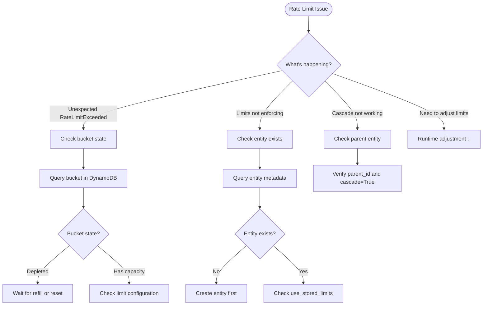

# Rate Limit Operations

This guide covers troubleshooting rate limit enforcement issues and procedures for adjusting limits at runtime.

## Decision Tree



## Troubleshooting

### Symptoms

- Requests succeed when they should be rate limited
- `RateLimitExceeded` raised unexpectedly
- Cascade to parent entity not working
- Bucket state appears incorrect

### Diagnostic Steps

**Check entity and bucket state:**

```bash
# Query entity metadata
aws dynamodb get-item --table-name ZAEL-<name> \
  --key '{"PK": {"S": "ENTITY#<entity_id>"}, "SK": {"S": "#META"}}'

# Query bucket state for a specific limit
aws dynamodb get-item --table-name ZAEL-<name> \
  --key '{"PK": {"S": "ENTITY#<entity_id>"}, "SK": {"S": "#BUCKET#<resource>#<limit_name>"}}'
```

**Verify stored limits (if using `use_stored_limits=True`):**

```bash
aws dynamodb query --table-name ZAEL-<name> \
  --key-condition-expression "PK = :pk AND begins_with(SK, :sk)" \
  --expression-attribute-values '{":pk": {"S": "ENTITY#<entity_id>"}, ":sk": {"S": "#LIMIT#"}}'
```

### Unexpected RateLimitExceeded

**Possible causes:**

| Cause | Diagnosis | Solution |
|-------|-----------|----------|
| Bucket depleted | Check bucket `tokens` value | Wait for refill or increase limit |
| Limit too restrictive | Compare limit capacity vs usage | Increase capacity |
| Cascade triggered | Check `violations` array | Increase parent limit |
| Clock skew | Compare server time with bucket `last_update` | Sync NTP |

**Check bucket state:**

```bash
aws dynamodb get-item --table-name ZAEL-<name> \
  --key '{"PK": {"S": "ENTITY#<entity_id>"}, "SK": {"S": "#BUCKET#<resource>#<limit_name>"}}' \
  --projection-expression "tokens, last_update, capacity"
```

**Interpret the response:**

- `tokens`: Current token count (in millitokens, divide by 1000)
- `last_update`: Unix timestamp of last access
- `capacity`: Maximum bucket capacity (in millitokens)

### Limits Not Enforcing

**Common causes:**

| Cause | Solution |
|-------|----------|
| **Entity not created** | Create entity before rate limiting: `await limiter.create_entity(...)` |
| **Wrong `use_stored_limits` setting** | Set `use_stored_limits=True` if limits are in DynamoDB |
| **Stale bucket state** | Bucket refills over time; tokens may have refilled |
| **Limit configuration mismatch** | Verify limit `capacity`, `burst`, and `refill_rate` match expectations |

**Verify entity exists:**

```bash
aws dynamodb get-item --table-name ZAEL-<name> \
  --key '{"PK": {"S": "ENTITY#<entity_id>"}, "SK": {"S": "#META"}}'
```

### Cascade Not Working

If cascade to parent is not enforced:

**Step 1: Verify parent entity exists:**

```bash
aws dynamodb get-item --table-name ZAEL-<name> \
  --key '{"PK": {"S": "ENTITY#<parent_id>"}, "SK": {"S": "#META"}}'
```

**Step 2: Verify child has `parent_id` set:**

```bash
aws dynamodb get-item --table-name ZAEL-<name> \
  --key '{"PK": {"S": "ENTITY#<child_id>"}, "SK": {"S": "#META"}}'
# Check the "parent_id" attribute in response
```

**Step 3: Ensure `cascade=True` in acquire call:**

```python
async with limiter.acquire(
    entity_id="child-id",
    cascade=True,  # Must be True to check parent
    ...
):
```

### Verification

Test that rate limiting is working correctly:

```python
from zae_limiter import RateLimiter, Limit, RateLimitExceeded

limiter = RateLimiter(name="<name>", region="<region>")

# Consume all capacity
for i in range(100):
    try:
        async with limiter.acquire(
            entity_id="test-entity",
            resource="test",
            limits=[Limit.per_minute("rpm", 100)],
            consume={"rpm": 1},
        ):
            pass
    except RateLimitExceeded as e:
        print(f"Rate limited after {i} requests, retry_after={e.retry_after_seconds}s")
        break
```

## Procedures

### Adjust Limits at Runtime

#### Programmatic Adjustment

Update stored limits for an entity without redeployment:

```python
from zae_limiter import RateLimiter, Limit

limiter = RateLimiter(name="<name>", region="<region>")

# Update limits for an entity
await limiter.update_entity(
    entity_id="api-key-123",
    limits=[
        Limit.per_minute("rpm", 1000),      # Requests per minute
        Limit.per_minute("tpm", 100_000),   # Tokens per minute
    ],
)

print("Limits updated successfully")
```

#### Direct DynamoDB Update

!!! warning "Advanced"
    Direct DynamoDB updates bypass validation. Use programmatic API when possible.

```bash
# Update a stored limit
aws dynamodb put-item --table-name ZAEL-<name> \
  --item '{
    "PK": {"S": "ENTITY#<entity_id>"},
    "SK": {"S": "#LIMIT#<resource>#<limit_name>"},
    "capacity": {"N": "1000000"},
    "burst": {"N": "1000000"},
    "refill_amount": {"N": "1000000"},
    "refill_period": {"N": "60"}
  }'
```

### Reset Bucket State

Reset a bucket to restore full capacity:

```bash
# Delete the bucket (will be recreated on next acquire with full capacity)
aws dynamodb delete-item --table-name ZAEL-<name> \
  --key '{"PK": {"S": "ENTITY#<entity_id>"}, "SK": {"S": "#BUCKET#<resource>#<limit_name>"}}'
```

### Debug Bucket State

Query all buckets for an entity:

```bash
aws dynamodb query --table-name ZAEL-<name> \
  --key-condition-expression "PK = :pk AND begins_with(SK, :sk)" \
  --expression-attribute-values '{":pk": {"S": "ENTITY#<entity_id>"}, ":sk": {"S": "#BUCKET#"}}' \
  --projection-expression "SK, tokens, capacity, last_update"
```

**Interpret bucket values:**

All token values are stored as **millitokens** (multiply by 1000):

| Field | Description | Example |
|-------|-------------|---------|
| `tokens` | Current available tokens × 1000 | `50000` = 50 tokens |
| `capacity` | Maximum bucket size × 1000 | `100000` = 100 tokens |
| `last_update` | Unix timestamp | `1705312800` |

### Verification After Changes

After adjusting limits, verify:

```python
# Check available capacity
available = await limiter.available(
    entity_id="<entity_id>",
    resource="<resource>",
    limits=[Limit.per_minute("<limit_name>", <capacity>)],
)

print(f"Available: {available}")
# Output: {'<limit_name>': <available_tokens>}
```

## DynamoDB Key Patterns

| Pattern | Key | Description |
|---------|-----|-------------|
| Entity metadata | `PK=ENTITY#<id>, SK=#META` | Entity configuration |
| Bucket state | `PK=ENTITY#<id>, SK=#BUCKET#<resource>#<limit>` | Token bucket |
| Stored limit | `PK=ENTITY#<id>, SK=#LIMIT#<resource>#<limit>` | Limit configuration |

## Related

- [Recovery & Rollback](recovery.md) - Reset corrupted buckets
- [Performance Tuning](../performance.md) - Capacity planning for rate limits
- [Hierarchical Limits](../guide/hierarchical.md) - Cascade configuration
