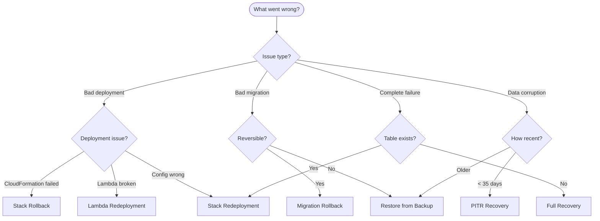

# Recovery & Rollback

This guide covers backup, restore, and rollback procedures for zae-limiter deployments.

## Decision Tree



## Emergency Rollback Decision Matrix

| Situation | Action | Time to Recovery | Data Loss Risk |
|-----------|--------|------------------|----------------|
| Lambda errors after upgrade | `zae-limiter upgrade --lambda-only` with previous version | ~2 min | None |
| Schema migration failed | Restore from pre-migration backup | ~10-30 min | Changes since backup |
| Stack update failed | CloudFormation auto-rollback | ~5 min | None |
| Data corruption (recent) | PITR restore | ~15-30 min | None (point-in-time) |
| Data corruption (old) | On-demand backup restore | ~15-30 min | Changes since backup |
| Complete stack failure | Delete + redeploy (if deletion protection on) | ~10 min | None (table retained) |

## DynamoDB Backup and Restore

### Create On-Demand Backup

**Before any risky operation:**

```bash
aws dynamodb create-backup \
  --table-name ZAEL-<name> \
  --backup-name "manual-backup-$(date +%Y%m%d-%H%M%S)"
```

**Verify backup created:**

```bash
aws dynamodb list-backups \
  --table-name ZAEL-<name> \
  --time-range-lower-bound $(date -u -d '1 hour ago' +%Y-%m-%dT%H:%M:%SZ)
```

### List Available Backups

```bash
aws dynamodb list-backups \
  --table-name ZAEL-<name>
```

### Restore from Backup

!!! warning "New Table Name"
    Restore creates a new table. You must update your application to use the new table name or rename after restore.

```bash
aws dynamodb restore-table-from-backup \
  --target-table-name ZAEL-<name>-restored \
  --backup-arn <backup-arn>
```

**Wait for restore to complete:**

```bash
aws dynamodb describe-table --table-name ZAEL-<name>-restored \
  --query 'Table.TableStatus'
```

### Point-in-Time Recovery (PITR)

PITR allows restore to any point in the last 35 days.

**Check if PITR is enabled:**

```bash
aws dynamodb describe-continuous-backups \
  --table-name ZAEL-<name>
```

**Enable PITR (if not enabled):**

```bash
aws dynamodb update-continuous-backups \
  --table-name ZAEL-<name> \
  --point-in-time-recovery-specification PointInTimeRecoveryEnabled=true
```

**Restore to specific point in time:**

```bash
aws dynamodb restore-table-to-point-in-time \
  --source-table-name ZAEL-<name> \
  --target-table-name ZAEL-<name>-restored \
  --restore-date-time "2024-01-15T10:00:00Z"
```

**Restore to latest restorable time:**

```bash
aws dynamodb restore-table-to-point-in-time \
  --source-table-name ZAEL-<name> \
  --target-table-name ZAEL-<name>-restored \
  --use-latest-restorable-time
```

## Migration Rollback

### Reversible Migrations

For migrations that support rollback:

```python
from zae_limiter.migrations import get_migrations
from zae_limiter.repository import Repository

async def rollback_migration(name: str, region: str, target_version: str):
    """Rollback a reversible migration."""
    repo = Repository(f"ZAEL-{name}", region, None)

    try:
        migrations = get_migrations()
        target = next((m for m in migrations if m.version == target_version), None)

        if target and target.reversible and target.rollback:
            await target.rollback(repo)
            print(f"Rolled back migration {target_version}")

            # Update version record
            await repo.set_version_record(
                schema_version="<previous_version>",
                updated_by="manual_rollback",
            )
        else:
            print("Migration is not reversible - restore from backup")
    finally:
        await repo.close()
```

### Non-Reversible Migrations

For migrations without rollback support:

1. **Restore from backup** taken before migration
2. **Update stack** to match restored schema version
3. **Downgrade client** to compatible version

## Stack Operations

### Stack Rollback

CloudFormation automatically rolls back failed updates. If a stack is stuck:

**Check stack status:**

```bash
aws cloudformation describe-stacks \
  --stack-name ZAEL-<name> \
  --query 'Stacks[0].StackStatus'
```

**View rollback events:**

```bash
aws cloudformation describe-stack-events \
  --stack-name ZAEL-<name> \
  --query 'StackEvents[?ResourceStatus==`UPDATE_ROLLBACK_IN_PROGRESS` || ResourceStatus==`UPDATE_ROLLBACK_COMPLETE`]'
```

**Continue rollback (if stuck):**

```bash
aws cloudformation continue-update-rollback \
  --stack-name ZAEL-<name>
```

### Stack Redeployment

**Delete and recreate stack (preserves DynamoDB data with deletion protection):**

```bash
# Step 1: Verify deletion protection is enabled
aws dynamodb describe-table --table-name ZAEL-<name> \
  --query 'Table.DeletionProtectionEnabled'

# Step 2: Delete stack (table retained if deletion protection enabled)
zae-limiter delete --name <name> --region <region> --yes

# Step 3: Wait for deletion
aws cloudformation wait stack-delete-complete --stack-name ZAEL-<name>

# Step 4: Redeploy
zae-limiter deploy --name <name> --region <region>
```

**Update existing stack:**

```bash
# Export current template
zae-limiter cfn-template > updated-template.yaml

# Update via CloudFormation
aws cloudformation update-stack \
  --stack-name ZAEL-<name> \
  --template-body file://updated-template.yaml \
  --capabilities CAPABILITY_NAMED_IAM

# Wait for update
aws cloudformation wait stack-update-complete --stack-name ZAEL-<name>
```

### Lambda Redeployment

**Redeploy Lambda with current code:**

```bash
zae-limiter upgrade --name <name> --region <region> --lambda-only
```

**Redeploy with specific version:**

```bash
# First, install the specific version
pip install zae-limiter==<version>

# Then upgrade Lambda
zae-limiter upgrade --name <name> --region <region> --lambda-only
```

## Data Reconciliation

### Reset Corrupted Bucket

Delete a specific bucket (will be recreated on next acquire):

```bash
aws dynamodb delete-item --table-name ZAEL-<name> \
  --key '{"PK": {"S": "ENTITY#<entity_id>"}, "SK": {"S": "#BUCKET#<resource>#<limit_name>"}}'
```

### Reset All Buckets for Entity

```bash
# Query all buckets
BUCKETS=$(aws dynamodb query --table-name ZAEL-<name> \
  --key-condition-expression "PK = :pk AND begins_with(SK, :sk)" \
  --expression-attribute-values '{":pk": {"S": "ENTITY#<entity_id>"}, ":sk": {"S": "#BUCKET#"}}' \
  --projection-expression "PK, SK" \
  --output json)

# Delete each bucket
echo $BUCKETS | jq -r '.Items[] | @base64' | while read item; do
  PK=$(echo $item | base64 -d | jq -r '.PK.S')
  SK=$(echo $item | base64 -d | jq -r '.SK.S')

  aws dynamodb delete-item --table-name ZAEL-<name> \
    --key "{\"PK\": {\"S\": \"$PK\"}, \"SK\": {\"S\": \"$SK\"}}"

  echo "Deleted: $SK"
done
```

### Verify Entity Integrity

```python
async def verify_entity(limiter, entity_id: str) -> bool:
    """Verify entity can perform rate limiting operations."""
    from zae_limiter import Limit

    try:
        # Check entity exists
        entity = await limiter.get_entity(entity_id)
        print(f"Entity: {entity.entity_id}, parent: {entity.parent_id}")

        # Check rate limiting works
        available = await limiter.available(
            entity_id=entity_id,
            resource="health-check",
            limits=[Limit.per_minute("test", 1000)],
        )
        print(f"Available capacity: {available}")

        return True
    except Exception as e:
        print(f"Entity verification failed: {e}")
        return False
```

## Full Recovery

Complete recovery from total failure:

### Step 1: Assess Situation

```bash
# Check if table exists
aws dynamodb describe-table --table-name ZAEL-<name> 2>/dev/null && echo "Table exists" || echo "Table missing"

# Check if stack exists
aws cloudformation describe-stacks --stack-name ZAEL-<name> 2>/dev/null && echo "Stack exists" || echo "Stack missing"
```

### Step 2: Restore Table (if needed)

```bash
# List available backups
aws dynamodb list-backups --table-name ZAEL-<name>

# Restore from backup
aws dynamodb restore-table-from-backup \
  --target-table-name ZAEL-<name> \
  --backup-arn <backup-arn>

# Wait for restore
aws dynamodb wait table-exists --table-name ZAEL-<name>
```

### Step 3: Redeploy Stack

```bash
zae-limiter deploy --name <name> --region <region>
```

### Step 4: Verify

```bash
# Check stack status
zae-limiter status --name <name> --region <region>

# Check version
zae-limiter version --name <name> --region <region>

# Check compatibility
zae-limiter check --name <name> --region <region>
```

## Prevention

### Enable Deletion Protection

```bash
aws dynamodb update-table \
  --table-name ZAEL-<name> \
  --deletion-protection-enabled
```

### Enable PITR

```bash
aws dynamodb update-continuous-backups \
  --table-name ZAEL-<name> \
  --point-in-time-recovery-specification PointInTimeRecoveryEnabled=true
```

### Schedule Regular Backups

Create a CloudWatch Events rule to backup daily:

```bash
# Create backup Lambda or use AWS Backup service
aws backup create-backup-plan \
  --backup-plan '{"BackupPlanName": "zae-limiter-daily", "Rules": [{"RuleName": "daily", "TargetBackupVaultName": "Default", "ScheduleExpression": "cron(0 5 * * ? *)", "Lifecycle": {"DeleteAfterDays": 30}}]}'
```

## Related

- [Version Management](version.md) - Version upgrade and rollback
- [DynamoDB Operations](dynamodb.md) - Capacity and throttling issues
- [Migration Guide](../migrations.md) - Schema migration procedures
