# Stream Processing Operations

This guide covers troubleshooting and operational procedures for DynamoDB Streams processing, which powers the usage aggregation feature.

## Decision Tree

```mermaid
flowchart TD
    START([Stream Issue]) --> Q1{What's the symptom?}

    Q1 -->|High IteratorAge| A1[Check processing lag]
    Q1 -->|Lambda throttling| A2[Check concurrency]
    Q1 -->|Missing snapshots| A3[Check Lambda errors]
    Q1 -->|Planning optimization| A4[Tune configuration]

    A1 --> CHECK1{Lambda healthy?}
    CHECK1 -->|No| LINK1([→ lambda.md])
    CHECK1 -->|Yes| SCALE[Increase concurrency]

    A2 --> SCALE
    A3 --> LINK1
    A4 --> TUNE[Adjust batch size / concurrency]
```



## Troubleshooting

### Symptoms

- `IteratorAge` metric growing
- Usage snapshots delayed
- Stream iterator age alarm triggered
- Lambda throttling

### Diagnostic Steps

**Check IteratorAge metric:**

```bash
aws cloudwatch get-metric-statistics \
  --namespace AWS/Lambda \
  --metric-name IteratorAge \
  --dimensions Name=FunctionName,Value=ZAEL-<name>-aggregator \
  --start-time $(date -u -d '1 hour ago' +%Y-%m-%dT%H:%M:%SZ) \
  --end-time $(date -u +%Y-%m-%dT%H:%M:%SZ) \
  --period 60 \
  --statistics Maximum
```

**Check stream status:**

```bash
aws dynamodb describe-table --table-name ZAEL-<name> \
  --query 'Table.StreamSpecification'
```

**Check Lambda event source mapping:**

```bash
aws lambda list-event-source-mappings \
  --function-name ZAEL-<name>-aggregator
```

**Check Lambda concurrent executions:**

```bash
aws cloudwatch get-metric-statistics \
  --namespace AWS/Lambda \
  --metric-name ConcurrentExecutions \
  --dimensions Name=FunctionName,Value=ZAEL-<name>-aggregator \
  --start-time $(date -u -d '1 hour ago' +%Y-%m-%dT%H:%M:%SZ) \
  --end-time $(date -u +%Y-%m-%dT%H:%M:%SZ) \
  --period 60 \
  --statistics Maximum
```

### High Iterator Age

**Common causes and solutions:**

| Cause | Solution |
|-------|----------|
| **Lambda errors** | Fix errors (check DLQ and logs) - see [Lambda Operations](lambda.md) |
| **Lambda throttling** | Increase reserved concurrency |
| **Low Lambda concurrency** | Match concurrency to shard count |
| **DynamoDB throttling** | Increase table capacity - see [DynamoDB Operations](dynamodb.md) |
| **Large batch sizes** | Reduce batch size in event source mapping |

**Understanding IteratorAge:**

- `IteratorAge` measures the delay between when a record is written to the stream and when Lambda processes it
- Healthy: < 1 second
- Warning: < 30 seconds
- Critical: > 30 seconds (default alarm threshold)

### Lambda Throttling

**Check if Lambda is being throttled:**

```bash
aws cloudwatch get-metric-statistics \
  --namespace AWS/Lambda \
  --metric-name Throttles \
  --dimensions Name=FunctionName,Value=ZAEL-<name>-aggregator \
  --start-time $(date -u -d '1 hour ago' +%Y-%m-%dT%H:%M:%SZ) \
  --end-time $(date -u +%Y-%m-%dT%H:%M:%SZ) \
  --period 300 \
  --statistics Sum
```

**Solution:** Increase reserved concurrency (see procedures below).

## Procedures

### Increase Lambda Concurrency

**Set reserved concurrency:**

```bash
aws lambda put-function-concurrency \
  --function-name ZAEL-<name>-aggregator \
  --reserved-concurrent-executions 10
```

**Check current concurrency:**

```bash
aws lambda get-function-concurrency \
  --function-name ZAEL-<name>-aggregator
```

**Remove concurrency limit (use account default):**

```bash
aws lambda delete-function-concurrency \
  --function-name ZAEL-<name>-aggregator
```

### Adjust Batch Size

**Get current mapping UUID:**

```bash
MAPPING_UUID=$(aws lambda list-event-source-mappings \
  --function-name ZAEL-<name>-aggregator \
  --query 'EventSourceMappings[0].UUID' \
  --output text)

echo "Mapping UUID: $MAPPING_UUID"
```

**Reduce batch size (process fewer records per invocation):**

```bash
aws lambda update-event-source-mapping \
  --uuid $MAPPING_UUID \
  --batch-size 50
```

**Increase batch size (higher throughput, higher latency):**

```bash
aws lambda update-event-source-mapping \
  --uuid $MAPPING_UUID \
  --batch-size 100
```

**Adjust batch window (wait for more records):**

```bash
aws lambda update-event-source-mapping \
  --uuid $MAPPING_UUID \
  --maximum-batching-window-in-seconds 5
```

### Shard Scaling

DynamoDB Streams automatically scales shards based on table throughput.

**Check shard count:**

```bash
aws dynamodbstreams describe-stream \
  --stream-arn $(aws dynamodb describe-table --table-name ZAEL-<name> \
    --query 'Table.LatestStreamArn' --output text) \
  --query 'StreamDescription.Shards | length(@)'
```

**Rule of thumb:** Lambda concurrency should be >= shard count for optimal processing.

If you have 10 shards but only 5 concurrent Lambda executions, processing will lag.

### Enable Parallelization Factor

Process multiple batches from the same shard concurrently:

```bash
aws lambda update-event-source-mapping \
  --uuid $MAPPING_UUID \
  --parallelization-factor 2
```

**Valid values:** 1-10 (default: 1)

!!! note "Ordering"
    Increasing parallelization factor may result in out-of-order processing within a shard. This is acceptable for usage aggregation but may not be suitable for all use cases.

### Verify Stream Health

**Check stream is enabled:**

```bash
aws dynamodb describe-table --table-name ZAEL-<name> \
  --query 'Table.StreamSpecification'
```

Expected output:
```json
{
    "StreamEnabled": true,
    "StreamViewType": "NEW_AND_OLD_IMAGES"
}
```

**Check event source mapping is active:**

```bash
aws lambda list-event-source-mappings \
  --function-name ZAEL-<name>-aggregator \
  --query 'EventSourceMappings[0].State'
```

Expected output: `"Enabled"`

### Monitor After Changes

After tuning, monitor for 15-30 minutes:

```bash
# Watch IteratorAge
watch -n 30 "aws cloudwatch get-metric-statistics \
  --namespace AWS/Lambda \
  --metric-name IteratorAge \
  --dimensions Name=FunctionName,Value=ZAEL-<name>-aggregator \
  --start-time \$(date -u -d '30 minutes ago' +%Y-%m-%dT%H:%M:%SZ) \
  --end-time \$(date -u +%Y-%m-%dT%H:%M:%SZ) \
  --period 60 \
  --statistics Maximum \
  --query 'Datapoints | sort_by(@, &Timestamp) | [-1].Maximum'"
```

## Tuning Guidelines

| Scenario | Batch Size | Concurrency | Parallelization |
|----------|------------|-------------|-----------------|
| Low volume (< 100 req/s) | 100 | 2 | 1 |
| Medium volume (100-1000 req/s) | 100 | 5-10 | 1 |
| High volume (> 1000 req/s) | 50-100 | 10+ | 2 |
| Real-time requirements | 10-50 | 10+ | 2-5 |

## Related

- [Lambda Operations](lambda.md) - Lambda errors and duration issues
- [DynamoDB Operations](dynamodb.md) - Throttling affecting stream processing
- [Monitoring Guide](../monitoring.md) - CloudWatch dashboards for streams
