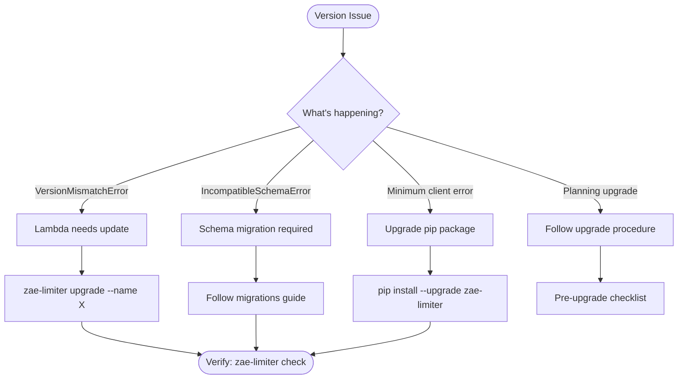

# Version Management

This guide covers version compatibility issues and upgrade procedures for zae-limiter.

## Decision Tree



## Troubleshooting

### Symptoms

- `VersionMismatchError` exception raised
- `IncompatibleSchemaError` exception raised
- CLI commands fail with version errors
- Rate limiter initialization fails

### Diagnostic Steps

**Check compatibility with CLI:**

```bash
zae-limiter check --name <name> --region <region>
```

**View detailed version information:**

```bash
zae-limiter version --name <name> --region <region>
```

**Query version record directly:**

```bash
aws dynamodb get-item --table-name <name> \
  --key '{"PK": {"S": "SYSTEM#"}, "SK": {"S": "#VERSION"}}'
```

### VersionMismatchError

**Cause:** Client library version differs from deployed Lambda version.

**Example error:**
```
VersionMismatchError: Version mismatch: client=1.2.0, schema=1.0.0, lambda=1.0.0.
Lambda update available.
```

**Solution:** Upgrade Lambda to match client:

```bash
zae-limiter upgrade --name <name> --region <region>
```

Or programmatically:

```python
from zae_limiter import RateLimiter, StackOptions

# Auto-update Lambda on initialization
limiter = RateLimiter(
    name="limiter",
    region="us-east-1",
    stack_options=StackOptions(),  # Enables auto-update
)
```

### IncompatibleSchemaError

**Cause:** Major version difference requiring schema migration.

**Example error:**
```
IncompatibleSchemaError: Incompatible schema: client 2.0.0 is not compatible
with schema 1.0.0. Migration required.
```

**Solution:** Follow the [Migration Guide](../migrations.md) to upgrade the schema:

1. Create a backup
2. Run migration
3. Update client

```bash
# Create backup before migration
aws dynamodb create-backup \
  --table-name <name> \
  --backup-name "pre-migration-$(date +%Y%m%d)"
```

Then follow the migration procedures in the [Migration Guide](../migrations.md#sample-migration-v200).

### Minimum Client Version Error

**Cause:** Infrastructure requires a newer client version.

**Solution:** Upgrade the client library:

```bash
pip install --upgrade zae-limiter
```

## Upgrade Procedure

### Pre-upgrade Checklist

Before upgrading, verify the following:

- [ ] Check current version: `zae-limiter version --name <name>`
- [ ] Check compatibility: `zae-limiter check --name <name>`
- [ ] Review release notes for breaking changes
- [ ] Verify PITR is enabled for rollback capability
- [ ] Schedule maintenance window (if major upgrade)
- [ ] Notify stakeholders

### Upgrade Execution

**Standard upgrade (Lambda + client):**

```bash
# Step 1: Upgrade client library
pip install --upgrade zae-limiter

# Step 2: Update infrastructure
zae-limiter upgrade --name <name> --region <region>

# Step 3: Verify
zae-limiter check --name <name> --region <region>
```

**Lambda-only upgrade:**

```bash
# Update Lambda without schema changes
zae-limiter upgrade --name <name> --region <region> --lambda-only
```

**Force upgrade (skip compatibility check):**

!!! warning "Use with caution"
    Only use `--force` when you understand the implications.

```bash
zae-limiter upgrade --name <name> --region <region> --force
```

### Post-upgrade Verification

After upgrading, verify the system is healthy:

1. **Check version alignment:**
   ```bash
   zae-limiter version --name <name>
   ```

2. **Run smoke tests:**
   ```python
   from zae_limiter import RateLimiter, Limit

   limiter = RateLimiter(name="limiter", region="us-east-1")

   # Test basic operation
   async with limiter.acquire(
       entity_id="test-entity",
       resource="test",
       limits=[Limit.per_minute("rpm", 100)],
       consume={"rpm": 1},
   ):
       print("Rate limiting working")
   ```

3. **Monitor for 15 minutes:**
   - Check Lambda error rate in CloudWatch
   - Verify usage snapshots are updating
   - Watch for unexpected exceptions in application logs

### Rollback

If issues occur after upgrade, see [Recovery & Rollback](recovery.md#emergency-rollback-decision-matrix).

## Related

- [Migration Guide](../migrations.md) - Schema versioning and migration procedures
- [Recovery & Rollback](recovery.md) - Emergency rollback procedures
- [CLI Reference](../cli.md) - Full CLI command documentation
