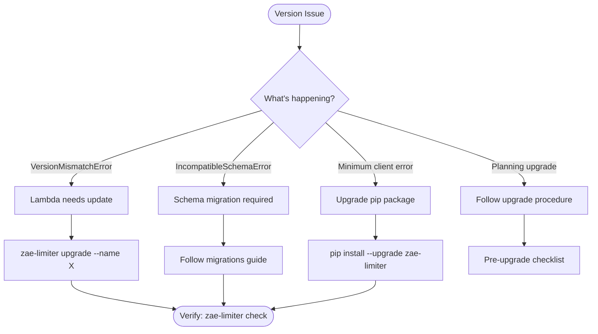

# Version Management

This guide covers version compatibility issues and upgrade procedures for zae-limiter.

## Decision Tree


```mermaid
flowchart TD
    START([Version Issue]) --> Q1{What's happening?}

    Q1 -->|VersionMismatchError| A1[Lambda needs update]
    Q1 -->|IncompatibleSchemaError| A2[Schema migration required]
    Q1 -->|Minimum client error| A3[Upgrade pip package]
    Q1 -->|Planning upgrade| A4[Follow upgrade procedure]

    A1 --> CMD1["zae-limiter upgrade --name X"]
    A2 --> CMD2[Follow migrations guide]
    A3 --> CMD3["pip install --upgrade zae-limiter"]
    A4 --> PROC[Pre-upgrade checklist]

    CMD1 --> VERIFY
    CMD2 --> VERIFY
    CMD3 --> VERIFY
    VERIFY([Verify: zae-limiter check])

    click A1 "#versionmismatcherror" "Version mismatch details"
    click A2 "#incompatibleschemaerror" "Schema error details"
    click CMD1 "#upgrade-procedure" "Upgrade steps"
    click CMD2 "../migrations/" "Migration guide"
    click A4 "#upgrade-procedure" "Upgrade checklist"
    click VERIFY "#verification" "Verify upgrade"
```

## Troubleshooting

### Symptoms

- `VersionMismatchError` exception raised
- `IncompatibleSchemaError` exception raised
- CLI commands fail with version errors
- Rate limiter initialization fails

### Diagnostic Steps

**Check compatibility with CLI:**

```bash
zae-limiter check --name <name> --region <region>
```

**View detailed version information:**

```bash
zae-limiter version --name <name> --region <region>
```

**Query version record directly:**

```bash
aws dynamodb get-item --table-name <name> \
  --key '{"PK": {"S": "SYSTEM#"}, "SK": {"S": "#VERSION"}}'
```

### VersionMismatchError

**Cause:** Client library version differs from deployed Lambda version.

**Example error:**
```
VersionMismatchError: Version mismatch: client=1.2.0, schema=1.0.0, lambda=1.0.0.
Lambda update available.
```

**Solution:** Upgrade Lambda to match client:

```bash
zae-limiter upgrade --name <name> --region <region>
```

Or programmatically:

```python
from zae_limiter import Repository, RateLimiter

# Auto-update Lambda on initialization (default behavior)
repo = await Repository.builder().build()
limiter = RateLimiter(repository=repo)
```

### IncompatibleSchemaError

**Cause:** Major version difference requiring schema migration.

**Example error:**
```
IncompatibleSchemaError: Incompatible schema: client 2.0.0 is not compatible
with schema 1.0.0. Migration required.
```

**Solution:** Follow the [Migration Guide](../migrations.md) to upgrade the schema:

1. Create a backup
2. Run migration
3. Update client

```bash
# Create backup before migration
aws dynamodb create-backup \
  --table-name <name> \
  --backup-name "pre-migration-$(date +%Y%m%d)"
```

Then follow the migration procedures in the [Migration Guide](../migrations.md#sample-migration-v200).

### Minimum Client Version Error

**Cause:** Infrastructure requires a newer client version. From v0.15.0, `Repository.open()`,
`connect()` and `builder().build()` raise `VersionMismatchError` (with `can_auto_update=False`)
when the client is below the version record's `client_min_version`. So does every CLI command
that opens the stack's repository — `status`, `upgrade`, `limits plan|apply|diff` and the
`entity`, `resource`, `system`, `namespace`, `audit` and `usage` groups — exiting 1 with the
message. `check` and `version` print their normal report instead, with the incompatibility in
it, and `check` exits 1. **`deploy` does no minimum check**, nor do `delete`, `list`,
`cfn-template` and `lambda-export`, which never open the repository:

```
VersionMismatchError: Version mismatch: client=0.15.0, schema=0.10.0, lambda=0.16.0.
Client version 0.15.0 is below minimum required version 0.16.0. Please upgrade.
```

The minimum is raised automatically: storing a `reset_after` limit raises it to 0.15.0
([Session Quotas](../guide/session-quotas.md)). `zae-limiter deploy`, `zae-limiter upgrade` and
a Lambda auto-update keep the stored minimum; they never lower it.

**Limits:**

- The check runs when a repository is opened. A process opened before the minimum was raised
  keeps running until it restarts.
- Clients older than v0.15.0 ignore the field entirely.
- A v0.15 `zae-limiter deploy` against a stack whose minimum it is below still redeploys its own
  Lambdas; it keeps the minimum, but does not refuse.

**Solution:** Upgrade the client library:

```bash
pip install --upgrade zae-limiter
```

**Lowering a minimum on purpose.** Nothing in zae-limiter lowers `client_min_version` — deploys,
upgrades and the `reset_after` ratchet only keep or raise it. When you do need an older client
back (for example after removing every `reset_after` limit), set it by hand:

```bash
aws dynamodb update-item --table-name <name> \
  --key '{"PK": {"S": "_/SYSTEM#"}, "SK": {"S": "#VERSION"}}' \
  --update-expression "SET client_min_version = :v" \
  --expression-attribute-values '{":v": {"S": "0.14.0"}}'
```

Only do this when no stored limit needs the newer readers: the minimum is what keeps older
v0.15+ clients from misreading them.

### Refused `reset_after` write

**Cause:** `set_limits()`, `set_resource_defaults()`, `set_system_defaults()`,
`zae-limiter limits apply` or `acquire(limits=[...])` was given a `reset_after` limit while the
version record cannot prove the Lambdas read it. An older aggregator would over-admit the limit,
so nothing is written. Three cases:

| Version record | Meaning | Remedy |
|----------------|---------|--------|
| `lambda_version` older than 0.15.0 (release candidates of 0.15.0 count) | Old Lambdas deployed | `zae-limiter upgrade`, or `Repository.open()` with `auto_update=True` |
| `lambda_version` unknown (`null`) | The record was initialized by a client that deployed no Lambda code while an aggregator or provisioner exists (or it could not tell) — e.g. `open()` of a stack built from an older `cfn-template` / `lambda-export` | `zae-limiter upgrade` |
| Missing | Never initialized | `zae-limiter deploy` from v0.15.0 or later |

`upgrade` works on every stack shape, including one deployed with `--no-aggregator`,
`--no-provisioner` or `--no-iam`: it pushes code only to the Lambdas the stack has (see
[Stacks without every Lambda](#stacks-without-every-lambda)).

`deploy` on an existing stack pushes code but adds and removes no functions, so it stamps its
own version only if the stack was created in this call, **or** both:

- the aggregator is current: its code was pushed in this run, or it probes absent; **and**
- the provisioner is current: its code was pushed in this run, or it probes absent.

If either probe cannot tell, `deploy` keeps the stored stamp. The probe is
`lambda:GetFunctionConfiguration`, which a deployer already holds. The provisioner matters as
much as the aggregator: a pre-v0.15 provisioner left live stores a `reset_after` manifest limit
as a dripping one, silently.

An unknown `lambda_version` also turns off Lambda auto-update: `Repository.open()` has no
version to compare, so it never pushes code. `zae-limiter upgrade` (no `--force` needed) deploys
the Lambdas and stamps the version.

```
VersionMismatchError: Version mismatch: client=0.15.0, schema=0.10.0, lambda=0.14.0.
Refusing to store a reset_after limit: the deployed Lambdas predate 0.15.0 and would
misread it (the aggregator over-admits it). Run 'zae-limiter upgrade' first, ...
```

**Solution:** apply the remedy above, then retry the write. `acquire(limits=...)` trusts the
version the repository read when it was opened, and re-reads only on a refusal, so a retry after
an upgrade succeeds without reopening.

**A refused CloudFormation update can end in `UPDATE_ROLLBACK_FAILED`.** A
`Custom::ZaeLimiterLimits` update that the gate refuses reports FAILED, and CloudFormation rolls
back by re-sending the *previous* properties. When those also carried a `reset_after` limit, the
rollback is refused too, and the stack is left in `UPDATE_ROLLBACK_FAILED`. Either run
`zae-limiter upgrade` first and then `aws cloudformation continue-update-rollback --stack-name
<stack>`, or continue the rollback while skipping the resource
(`--resources-to-skip <LogicalResourceId>`) — the table still holds the previous configuration,
because the refused update wrote nothing.

## Upgrade Procedure

### Pre-upgrade Checklist

Before upgrading, verify the following:

- [ ] Check current version: `zae-limiter version --name <name>`
- [ ] Check compatibility: `zae-limiter check --name <name>`
- [ ] Review release notes for breaking changes
- [ ] Verify PITR is enabled for rollback capability
- [ ] Schedule maintenance window (if major upgrade)
- [ ] Notify stakeholders

### Upgrade Execution

**Standard upgrade (Lambda + client):**

```bash
# Step 1: Upgrade client library
pip install --upgrade zae-limiter

# Step 2: Update infrastructure
zae-limiter upgrade --name <name> --region <region>

# Step 3: Verify
zae-limiter check --name <name> --region <region>
```

**Lambda-only upgrade:**

```bash
# Update Lambda without schema changes
zae-limiter upgrade --name <name> --region <region> --lambda-only
```

### Stacks without every Lambda

A stack deployed with `--no-aggregator` has no aggregator function, one deployed with
`--no-provisioner` has no provisioner, and `--no-iam` has neither (both need a role). Both
`zae-limiter upgrade` and `Repository.open()`'s automatic Lambda update push new code only to the
functions that exist, skip the rest, and then record the new Lambda version:

```
[1/4] Deploying Lambda code...
      No aggregator Lambda on this stack, skipped
[2/4] Deploying provisioner code...
      Provisioner code deployed (1234.5 KB)
```

Each function is first checked with `lambda:GetFunctionConfiguration`, which a deployer already
holds (the update waits on the same call). A function Lambda reports missing is skipped. When
the check cannot tell — access denied, throttled — the push is attempted anyway, and only the
push's own `ResourceNotFoundException` counts as missing. Any other failure stops the upgrade
with exit code 1 and leaves the recorded version unchanged, so the record never claims code that
is not running; the next `upgrade` or `open()` tries again.

Before v0.15.0 the update pushed to both functions unconditionally, so these stacks could not be
upgraded at all (#644).

**Force upgrade (skip compatibility check):**

!!! warning "Use with caution"
    Only use `--force` when you understand the implications.

```bash
zae-limiter upgrade --name <name> --region <region> --force
```

### Post-upgrade Verification

After upgrading, verify the system is healthy:

1. **Check version alignment:**
   ```bash
   zae-limiter version --name <name>
   ```

2. **Run smoke tests:**
   ```python
   from zae_limiter import Repository, RateLimiter, Limit

   repo = await Repository.open()
   limiter = RateLimiter(repository=repo)

   # Test basic operation
   async with limiter.acquire(
       entity_id="test-entity",
       resource="test",
       limits=[Limit.per_minute("rpm", 100)],
       consume={"rpm": 1},
   ):
       print("Rate limiting working")
   ```

3. **Monitor for 15 minutes:**
   - Check Lambda error rate in CloudWatch
   - Verify usage snapshots are updating
   - Watch for unexpected exceptions in application logs

### Rollback

If issues occur after upgrade, see [Recovery & Rollback](recovery.md#emergency-rollback-decision-matrix).

## Related

- [Migration Guide](../migrations.md) - Schema versioning and migration procedures
- [Recovery & Rollback](recovery.md) - Emergency rollback procedures
- [CLI Reference](../cli.md) - Full CLI command documentation
